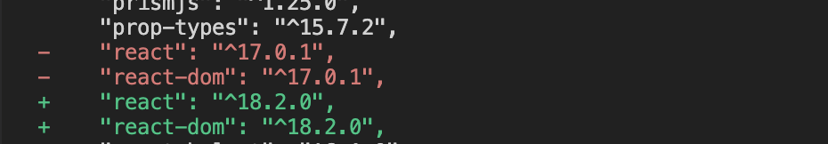
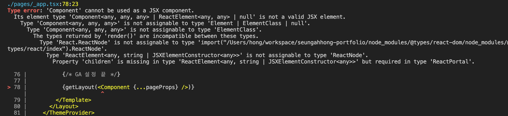
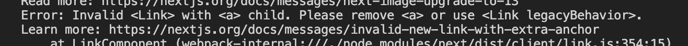
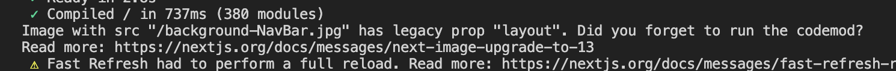
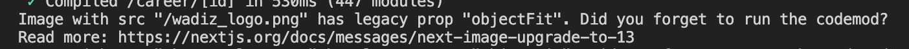
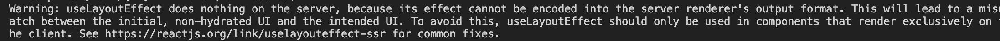
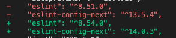

# Update React

### Installation

```tsx
yarn add react@latest react-dom@latest @types/react-dom@latest
```



### When you get the "'Component' cannot be used as a JSX component." error


This issue occurs because installing the latest version of @types/react@latest does not add the type definitions for the Next.js Component, so install a version at or below 18.0.18. (If you have already installed a newer version, roll back using the .lock file and reinstall.)

# Update Nextjs

### Installation

```tsx
yarn add next@latest
```

### Issue 1

**When you get the "Invalid \<Link> with \<a> child. Please remove \<a> or use \<Link legacyBehavior>." error**

Previously, an a tag was required when using next/link, but in version 13 the a tag is no longer needed, so please remove it.
You can fix this manually, but you can also change it automatically using codemod.
However, if you must keep using the a tag as-is, add the legacyBehavior prop.
[Upgrading: Codemods](https://nextjs.org/docs/app/building-your-application/upgrading/codemods#remove-a-tags-from-link-components)


```tsx
npx @next/codemod@latest new-link .

// 변경 전
<Link href="/">
  <a>
    <h3>홍승아 포트폴리오</h3>
  </a>
</Link>

// 변경 후
<Link href="/">
  <h3>테스트</h3>
</Link>

```

### Issue 2

**When you get the "Image with src "/A.png" has legacy prop "layout". Did you forget to run the codemod?" error**

The existing layout prop has been removed and you now inject the values directly into props, so a fix is needed.
Although you are advised to use codemod, it did not work correctly when I tried it, so I fixed it manually.


```tsx
// 변경 전
<Image
  src={image.src}
  alt={image.alt}
  layout="fill"
/>

// 변경 후
<Image
  src={image.src}
  alt={image.alt}
  fill
/>
```

### Issue 3

**When the "Image with src "/A.png" has legacy prop "objectFit". Did you forget to run the codemod?" error occurs**

The existing objectFit prop has been changed to be applied via the style prop, so a manual fix is needed.
Although you are advised to use codemod, it did not work correctly when I tried it, so I fixed it manually.


```tsx
// 변경 전
<Image
  src={image.src}
  alt={image.alt}
  objectFit={image.objectFit}
/>

// 변경 후
<Image
  src={image.src}
  alt={image.alt}
  style={{ objectFit: image.objectFit }}
/>
```

### Issue 4

**When the "Warning: useLayoutEffect does nothing on the server, because its effect cannot be encoded into the server renderer's output format. This will lead to a mismatch between the initial, non-hydrated UI and the intended UI. To avoid this, useLayoutEffect should only be used in components that render exclusively on the client." warning occurs**

Why does it happen? Unlike useEffect, useLayoutEffect runs synchronously after all DOM mutations have been applied, and once its work is complete, browser painting begins. Also, because useLayoutEffect runs at the componentDidMount and componentDidUpdate points and is therefore closely tied to React's lifecycle, the warning message appears (for useLayoutEffect only!).
How to fix: change useLayoutEffect → useEffect. If you need conditional rendering, you can handle it with useState.


```tsx
// useEffect 변경 할 경우
useLayoutEffect(() => { useEffect(() => {

// 조건부 렌더링이 해야할 경우
function Parent() {
  const [showChild, setShowChild] = useState(false)

  // Wait until after client-side hydration to show
  useEffect(() => {
    setShowChild(true)
  }, [])

  if (!showChild) {
    // You can show some kind of placeholder UI here
    return null
  }

  return <Child {...props} />
}
```

[Use useEffect instead of useLayoutEffect in SSR!](https://velog.io/@khy226/SSR에서는-UseLayoutEffect-대신-useEffect를-사용하자)

# Update ESlint

### Installation

```tsx
yarn add -D eslint-config-next@latest eslint@latest
```



After restarting VS Code, to restart the ESLint server, open the Command Palette (cmd+shift+p, ctrl+shift+p) and select ESLint: Restart ESLint Server.

# Emotion → Tailwind CSS

Since Next.js 13, the Emotion library is no longer supported, and there is an issue where styles are not applied when switching to the app directory, so we are migrating to the Tailwind CSS library.

### Installation

```tsx
yarn add -D tailwindcss postcss autoprefixer
npx tailwindcss init -p
```

### Configuring Tailwind

```tsx
// tailwind.config.js
/** @type {import('tailwindcss').Config} */
module.exports = {
  content: [
    './app/**/*.{js,ts,jsx,tsx,mdx}',
    './pages/**/*.{js,ts,jsx,tsx,mdx}',
    './components/**/*.{js,ts,jsx,tsx,mdx}',
    './templates/**/*.{js,ts,jsx,tsx,mdx}', // tailwind css 적용을 위한 디렉토리를 세팅한다.

    // Or if using `src` directory:
    './src/**/*.{js,ts,jsx,tsx,mdx}',
  ],
  theme: {
    extend: {},
  },
  plugins: [],
};
// postcss.config.js 변경을 안해도 됩니다.
```

### Importing Styles

- However, if you add a class through a layer, the VS Code Tailwind CSS plugin does not work, so autocomplete is not available. Rather than this approach, adding styles via the plugin method in tailwind.config.js is said to be more commonly used.
- However, when using @layer, styles are appended last regardless of className priority, so they stack; but if you add a class last, you need to include an !important statement.

```tsx
// ./globals.css
@tailwind base; // 리셋 규칙이나 HTML 요소 기본 스타일을 위한 레이어
@tailwind components; // 유틸리티로 재정의할 수 있는 클래스 기반 스타일을 위한 레이어
@tailwind utilities; // 다른 스타일보다 우선으로 하는 소규모 단일 목적 클래스를 위한 레이어

/*
// 특정 요소에 대한 기본 스타일을 추가할 경우
@layer base {
 ...
}

// 카드, 버튼과 같이 재사용성이 높은 유틸리티 클래스의 스타일 추가할 경우
@layer components {
 ...
}

// 테일윈드가 제공하지 않은 유틸리티 클래스를 만들 때 사용
@layer utilities {
}
*/

// using class
<h1 className="title-3 !text-[48px] lg:!text-[60px]">
  {title}
</h1>
```

Import the globals.css file with the added styles in the root component.

```tsx
import './globals.css'

function MyApp({ Component, pageProps, canonical }: AppPropsWithLayout) {
 ...
});
```

### Using Classes

```tsx
<main className="flex justify-center items-center text-xs leading-5 text-[#abb7b7] border-t-0 border-solid p-4">
  hello world
</main>
```

### Adding Custom Styles

- Customizing your theme
  When changing theme sections such as color, spacing, breakpoints, borderRadius, and fontFamily, you need to extend them in the tailwind.config.js file.
  - Changing the theme
    ```tsx
    /** @type {import('tailwindcss').Config} */
    module.exports = {
      theme: {
        screens: {
          sm: '480px',
          md: '768px',
          lg: '976px',
          xl: '1440px',
        },
        colors: {
          blue: '#1fb6ff',
          pink: '#ff49db',
          orange: '#ff7849',
          green: '#13ce66',
          'gray-dark': '#273444',
          gray: '#8492a6',
          'gray-light': '#d3dce6',
        },
        fontFamily: {
          sans: ['Graphik', 'sans-serif'],
          serif: ['Merriweather', 'serif'],
        },
        extend: {
          spacing: {
            '128': '32rem',
            '144': '36rem',
          },
          borderRadius: {
            '4xl': '2rem',
          },
        },
      },
    };
    ```
- Using arbitrary values
  When you need to use an arbitrary pixel value, add [] to use it.
  ```tsx
  <div class="bg-[#bada55] text-[22px] before:content-['Festivus']">
    <!-- ... -->
  </div>
  ```
- **Arbitrary properties**
  When you need to use an arbitrary property, you can handle it using [].
  ```tsx
  <div class="[mask-type:luminance] hover:[mask-type:alpha]">
    <!-- ... -->
  </div>
  ```
- **Handling whitespace**
  When there is a space, you need to handle it by adding an underscore (\_). However, if you need to use an underscore itself, you must use an escape character.
  ```tsx
  <div className="w-[100%] lg:w-[calc(4_/_12_*_100%)]"></div>
  ```

### Adding Custom Plugins

- You can extend Tailwind based on a reusable plugin approach.
- Using plugins, you can register new styles in Tailwind using a JS declaration method instead of CSS, and insert them into the stylesheet.
- When using the plugin approach, you can use the VS Code Tailwind CSS autocomplete feature.
- Official plugins
  Plugins officially supported by Tailwind CSS

  ```tsx
  /** @type {import('tailwindcss').Config} */
  module.exports = {
    // ...
    plugins: [
      require('@tailwindcss/typography'),
      require('@tailwindcss/forms'),
      require('@tailwindcss/aspect-ratio'),
      require('@tailwindcss/container-queries'),
    ]
  }

  // Typography
  <article class="prose lg:prose-xl">
    <h1>Garlic bread with cheese: What the science tells us</h1>
    <p>
      For years parents have espoused the health benefits of eating garlic bread with cheese to their
      children, with the food earning such an iconic status in our culture that kids will often dress
      up as warm, cheesy loaf for Halloween.
    </p>
    <p>
      But a recent study shows that the celebrated appetizer may be linked to a series of rabies cases
      springing up around the country.
    </p>
    <!-- ... -->
  </article>

  // Forms
  <!-- You can actually customize padding on a select element: -->
  <select class="px-4 py-3 rounded-full">
    <!-- ... -->
  </select>

  <!-- Or change a checkbox color using text color utilities: -->
  <input type="checkbox" class="rounded text-pink-500" />

  // Aspect ratio
  <div class="aspect-w-16 aspect-h-9">
    <iframe src="https://www.youtube.com/embed/dQw4w9WgXcQ" frameborder="0" allow="accelerometer; autoplay; clipboard-write; encrypted-media; gyroscope; picture-in-picture" allowfullscreen></iframe>
  </div>

  // Container queries
  <div class="@container">
    <div class="@lg:text-sky-400">
      <!-- ... -->
    </div>
  </div>
  ```

- Adding utilities
  Register new styles in the Tailwind Utilities layer

  ```tsx
  // Static utilities
  // 사용자가 제공한 값을 지원하지 않는 간단한 정적 유틸리티를 등록

  const plugin = require('tailwindcss/plugin');

  module.exports = {
    plugins: [
      plugin(function ({ addUtilities }) {
        addUtilities({
          '.content-auto': {
            'content-visibility': 'auto',
          },
          '.content-hidden': {
            'content-visibility': 'hidden',
          },
          '.content-visible': {
            'content-visibility': 'visible',
          },
        });
      }),
    ],
  };
  ```

- Adding components
  Register new styles in the Tailwind components layer

  ```tsx
  const plugin = require('tailwindcss/plugin');

  module.exports = {
    plugins: [
      plugin(function ({ addComponents }) {
        addComponents({
          '.btn': {
            padding: '.5rem 1rem',
            borderRadius: '.25rem',
            fontWeight: '600',
          },
          '.btn-blue': {
            backgroundColor: '#3490dc',
            color: '#fff',
            '&:hover': {
              backgroundColor: '#2779bd',
            },
          },
          '.btn-red': {
            backgroundColor: '#e3342f',
            color: '#fff',
            '&:hover': {
              backgroundColor: '#cc1f1a',
            },
          },
        });
      }),
    ],
  };
  ```

- Adding base styles
  Register new styles in the base layer, such as default typography styles, font, spacing, and color

  ```tsx
  const plugin = require('tailwindcss/plugin');

  module.exports = {
    plugins: [
      plugin(function ({ addBase, theme }) {
        addBase({
          h1: { fontSize: theme('fontSize.2xl') },
          h2: { fontSize: theme('fontSize.xl') },
          h3: { fontSize: theme('fontSize.lg') },
        });
      }),
    ],
  };
  ```

- Adding variants
  You can change the name of the property key (modifier) on an HTML element

  ```tsx
  const plugin = require('tailwindcss/plugin')

  module.exports = {
    // ...
    plugins: [
      plugin(function({ addVariant }) {
        addVariant('optional', '&:optional')
        addVariant('hocus', ['&:hover', '&:focus'])
        addVariant('inverted-colors', '@media (inverted-colors: inverted)')
      })
    ]
  }

  // 사용 시
  <form class="flex inverted-colors:outline ...">
    <input class="optional:border-gray-300 ..." />
    <button class="bg-blue-500 hocus:bg-blue-600">...</button>
  </form>
  ```

### CSS custom properties

- In scss you declare variables using $, but in Tailwind CSS you can declare variables using CSS custom properties, a common CSS spec. When using them, you can apply them via the var() function.
- **Using CSS custom properties (variables)**

  ```tsx
  :root {
    --main-bg-color: brown;
  }

  <ul className="flex flex-wrap flex-initial bg-[var(--main-bg-color)]">
  ```

### Adding Information

- **Adding selector**
  ```tsx
  // children selector
  <h3 className="mb-[12px] text-[32px] font-bold [&>em]:text-[#eb4a4c]">
    test <em>!!</em>
  </h3>
  ```
- **Condition selector**

  ```tsx
  <section
    className={`fixed left-0 right-0 top-0 bottom-0 z-[2] bg-white transition-all ease duration-1000 p-[var(--spacing-5)] ${
      isOpen ? 'translate-x-0' : 'translate-x-full'
    }`}
  >

  // before CSS-in-JS
  transform: translate(
      -${({ translateX }) => translateX}px,
      -${({ translateY }) => translateY}px
    );
  transition: ${({ transition }) => transition};

  // after
  style={{
    transform: `translate(
      -${
        verticalSwiping
          ? 0
          : !swipe.dragging
          ? listPosData.current[activeIndex]?.defaultWidth *
              activeIndex || 0
          : (listPosData.current[activeIndex]?.defaultWidth *
              activeIndex || 0) + swipe.delta
      }px,
      -${
        verticalSwiping
          ? !swipe.dragging
            ? listPosData.current[activeIndex]?.defaultHeight *
                activeIndex || 0
            : (listPosData.current[activeIndex]?.defaultHeight *
                activeIndex || 0) + swipe.delta
          : 0
      }px)`,
  transition: transition,
  ```

- **Children selector**

  ```tsx
  // before
  & * {
    word-break: break-all;
  }

  // after
  <ol className="[&_*]:break-all">

  // before
  @media (hover: hover) {
    &:hover {
      background: rgba(0, 0, 0, 0.7);

      & > figcaption {
        transform: translate(-50%, -50%);
        opacity: 1;
      }
    }
  }

  // after
  <div className="hover:bg-[rgba(0,0,0,0.7)] group">
  	<figcaption className="group-hover:-translate-x-1/2 group-hover:-translate-y-1/2 group-hover:opacity-100"></figcaption>
  </div>
  ```

  [https://stackoverflow.com/questions/73003947/access-to-child-element-in-tailwind-reactjs](https://stackoverflow.com/questions/73003947/access-to-child-element-in-tailwind-reactjs)
  [https://stackoverflow.com/questions/65471400/tailwind-css-animate-another-element-on-hover](https://stackoverflow.com/questions/65471400/tailwind-css-animate-another-element-on-hover)

- **Pseudo-elements**

  ```tsx
  //
  span {
  	display: absolute;
  	&:before {
  		content: '';
  	}
  	&:after {
  		content: '';
  	}
  }

  // after
  <span className="absolute before:absolute before:content-[''] after:content-['']" />
  ```

- **Calc function**

  ```tsx

  // before
  width: calc(60% - 3rem);

  // after
  <div className="w-[calc(60%_-_3rem)]">
  ```

- **Animation function**

  ```tsx
  // before
  @keyframes card {
    from {
      transform: translate(0, 100px);
    }
    to {
      transform: translate(0);
    }
  }

  div.card {
    animation: card 0.75s 1 ease-in-out;
  }

  <div className="card">

  // after
  // tailwind.config.js
  module.exports = {
    theme: {
      extend: {
        keyframes: {
          card: {
            from: { transform: 'translate(0, 100px)' },
            to: { transform: 'translate(0)' },
          },
        },
        animation: {
          card: 'card 0.75s 1 ease-in-out',
        },
      },
    }
  };

  <div className="animate-card">
  ```

- **Transition Function**

  ```tsx
  // before
  transition: all 0.5s;

  // after
  <figcaption className="transition-all duration-500">

  ```

### Update GA4

When the Google Search Console sitemap is not recognized

Fix it so that robots is recognized under the app directory rather than the public path

```tsx
// public/robots.xml -> app/robots.xml
# *
User-agent: *
Allow: /

# Host
Host: https://~~

# Sitemaps
Sitemap: https://~~/sitemap.xml
```

[https://pyeongdevlog.vercel.app/blog/googlesearch](https://pyeongdevlog.vercel.app/blog/googlesearch)

# References

- [Tailwind CSS - A Utility-First CSS Framework for Rapidly Building Custom Designs](https://v1.tailwindcss.com/)
- [[tailwind] custom 해서 사용하기](https://velog.io/@kcs0702/tailwind-custom-해서-사용하기)
- [tailwind css 똑똑하게 사용하기 - 이상원 기술 블로그](https://leesangwondev.vercel.app/tailwind-css-똑똑하게-사용하기)
