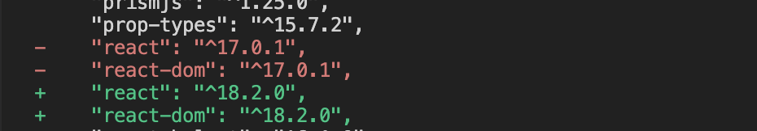
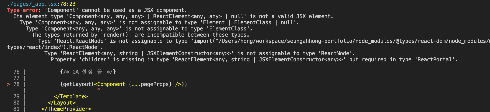
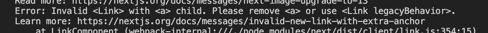
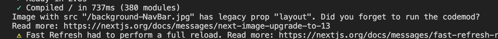
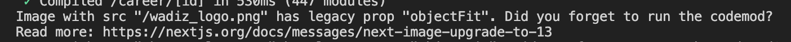
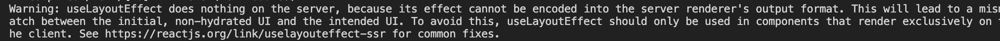
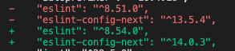

# Update React

### Installation

```tsx
yarn add react@latest react-dom@latest @types/react-dom@latest
```



### 'Component' cannot be used as a JSX component. 에러가 날 경우


@types/react@latest 최신 버전을 올릴 경우 nextJS Component에 대한 타입 추가가 되지 않아서 나온 이슈여서 18.0.18 이하 버전으로 Installation하도록 처리(혹여 Installation가 된 경우에는 .lock 파일로 다시 롤백해서 재 Installation해주시기 바랍니다.)

# Update Nextjs

### Installation

```tsx
yarn add next@latest
```

### Issue 1

**Invalid \<Link> with \<a> child. Please remove \<a> or use \<Link legacyBehavior>. 에러가 날 경우**

기존에 next/link 사용 시 a tag가 꼭 필요했었지만, 13 버전에서는 a tag를 추가하지 않아도 됨으로 a 태그를 삭제해주시기 바랍니다.
직접 수정도 가능하지만, codemod를 사용해서 자동으로 변경이 가능합니다.
단, 꼭 a tag를 그대로 사용해야하는 경우라면 legacyBehavior 속성을 추가해주시기 바랍니다.
[Upgrading: Codemods](https://nextjs.org/docs/app/building-your-application/upgrading/codemods#remove-a-tags-from-link-components)


```tsx
npx @next/codemod@latest new-link .

// 변경 전
<Link href="/">
  <a>
    <h3>홍승아 포트폴리오</h3>
  </a>
</Link>

// 변경 후
<Link href="/">
  <h3>테스트</h3>
</Link>

```

### Issue 2

**Image with src "/A.png" has legacy prop "layout". Did you forget to run the codemod? 에러가 날 경우**

기존 layout 속성이 사라지고 직접 값을 props에 주입하도록 변경 됨에 따라서 수정이 필요
단, codemod를 사용하라고 되어 있지만 직접 사용해본 결과 정상 동작하지 않아서 직접 수정하였음.


```tsx
// 변경 전
<Image
  src={image.src}
  alt={image.alt}
  layout="fill"
/>

// 변경 후
<Image
  src={image.src}
  alt={image.alt}
  fill
/>
```

### Issue 3

**Image with src "/A.png" has legacy prop "objectFit". Did you forget to run the codemod? 에러가 발생할 경우**

기존 objectFit 속성 시 style 속성으로 적용되도록 변경됨에 따라서 직접 수정이 필요
단, codemod를 사용하라고 되어 있지만 직접 사용해본 결과 정상 동작하지 않아서 직접 수정하였음.


```tsx
// 변경 전
<Image
  src={image.src}
  alt={image.alt}
  objectFit={image.objectFit}
/>

// 변경 후
<Image
  src={image.src}
  alt={image.alt}
  style={{ objectFit: image.objectFit }}
/>
```

### Issue 4

**Warning: useLayoutEffect does nothing on the server, because its effect cannot be encoded into the server renderer's output format. This will lead to a mismatch between the initial, non-hydrated UI and the intended UI. To avoid this, useLayoutEffect should only be used in components that render exclusively on the client. 경고가 발생할 경우**

왜 발생하나? useLayoutEffect는 useEffect와 달리, 모든 DOM 효과들이 실행된 이후에 동기적으로 실행되고, 작업이 완료되면 브라우저 페인팅이 시작된다. 또한, useLayouteffect는 componentDidMount와 componentDidUpdate 시점에 실행되어 리액트의 생명 주기와도 크게 관련이 있기 때문에 (useLayoutEffect만!) 경고 문구가 뜬다.
수정방안: useLayoutEffect → useEffect 변경, 조건부 렌더링을 해야하는경우라면 useState를 통해서 사용이 가능하다.


```tsx
// useEffect 변경 할 경우
useLayoutEffect(() => { useEffect(() => {

// 조건부 렌더링이 해야할 경우
function Parent() {
  const [showChild, setShowChild] = useState(false)

  // Wait until after client-side hydration to show
  useEffect(() => {
    setShowChild(true)
  }, [])

  if (!showChild) {
    // You can show some kind of placeholder UI here
    return null
  }

  return <Child {...props} />
}
```

[SSR에서는 UseLayoutEffect 대신 useEffect를 사용하자!](https://velog.io/@khy226/SSR에서는-UseLayoutEffect-대신-useEffect를-사용하자)

# Update ESlint

### Installation

```tsx
yarn add -D eslint-config-next@latest eslint@latest
```



vscode 재 실행 후 eslint 서버에 재실행을 위해서 Command Palette(cmd+shift+p, ctrl+shift+p) 실행해서 ESLint: Restart ESLint Server 선택해주세요

# Emotion → Tailwind CSS

NextJS 13 버전 이후 부터는 Emotion 라이브러리를 지원을 하고 있지 않아서 app 디렉토리로 변경 시 스타일이 적용이 안되는 이슈가 있어서 Tailwind CSS 라이브러리로 변경을 합니다.

### Installation

```tsx
yarn add -D tailwindcss postcss autoprefixer
npx tailwindcss init -p
```

### Configuring Tailwind

```tsx
// tailwind.config.js
/** @type {import('tailwindcss').Config} */
module.exports = {
  content: [
    './app/**/*.{js,ts,jsx,tsx,mdx}',
    './pages/**/*.{js,ts,jsx,tsx,mdx}',
    './components/**/*.{js,ts,jsx,tsx,mdx}',
    './templates/**/*.{js,ts,jsx,tsx,mdx}', // tailwind css 적용을 위한 디렉토리를 세팅한다.

    // Or if using `src` directory:
    './src/**/*.{js,ts,jsx,tsx,mdx}',
  ],
  theme: {
    extend: {},
  },
  plugins: [],
};
// postcss.config.js 변경을 안해도 됩니다.
```

### Importing Styles

- 단, layer를 통해서 class를 추가할 경우 vscode tailwind css plugin이 동작하지 않아서 autocomplete가 되지 않습니다. 이 방법보다는 tailwind.config.js에 plugin 방식의 스타일 추가를 많이 사용한다고 합니다.
- 단, @layer 사용 시 className 우선순위로 상관없이 마지막에 추가됨으로 중첩되지만, 마지막에 class를 추가한 경우 !important 문을 넣어주셔야 합니다.

```tsx
// ./globals.css
@tailwind base; // 리셋 규칙이나 HTML 요소 기본 스타일을 위한 레이어
@tailwind components; // 유틸리티로 재정의할 수 있는 클래스 기반 스타일을 위한 레이어
@tailwind utilities; // 다른 스타일보다 우선으로 하는 소규모 단일 목적 클래스를 위한 레이어

/*
// 특정 요소에 대한 기본 스타일을 추가할 경우
@layer base {
 ...
}

// 카드, 버튼과 같이 재사용성이 높은 유틸리티 클래스의 스타일 추가할 경우
@layer components {
 ...
}

// 테일윈드가 제공하지 않은 유틸리티 클래스를 만들 때 사용
@layer utilities {
}
*/

// using class
<h1 className="title-3 !text-[48px] lg:!text-[60px]">
  {title}
</h1>
```

스타일을 추가한 globals.css 파일을 root 컴포넌트에서 import 처리해준다.

```tsx
import './globals.css'

function MyApp({ Component, pageProps, canonical }: AppPropsWithLayout) {
 ...
});
```

### Using Classes

```tsx
<main className="flex justify-center items-center text-xs leading-5 text-[#abb7b7] border-t-0 border-solid p-4">
  hello world
</main>
```

### Adding Custom Styles

- Customizing your theme
  color, spacing, breakpoints, borderRadius, fontFamily 등의 테마(theme) 섹션 변경 시 tailwind.config.js 파일에 확장해주셔야 합니다.
  - theme 변경
    ```tsx
    /** @type {import('tailwindcss').Config} */
    module.exports = {
      theme: {
        screens: {
          sm: '480px',
          md: '768px',
          lg: '976px',
          xl: '1440px',
        },
        colors: {
          blue: '#1fb6ff',
          pink: '#ff49db',
          orange: '#ff7849',
          green: '#13ce66',
          'gray-dark': '#273444',
          gray: '#8492a6',
          'gray-light': '#d3dce6',
        },
        fontFamily: {
          sans: ['Graphik', 'sans-serif'],
          serif: ['Merriweather', 'serif'],
        },
        extend: {
          spacing: {
            '128': '32rem',
            '144': '36rem',
          },
          borderRadius: {
            '4xl': '2rem',
          },
        },
      },
    };
    ```
- Using arbitrary values
  임의에 픽셀값을 사용해아 할 경우에 [] 추가해서 사용해야 합니다.
  ```tsx
  <div class="bg-[#bada55] text-[22px] before:content-['Festivus']">
    <!-- ... -->
  </div>
  ```
- **Arbitrary properties**
  임의의 속성을 사용해야할 경우에는 [] 사용해서 처리하면 됩니다.
  ```tsx
  <div class="[mask-type:luminance] hover:[mask-type:alpha]">
    <!-- ... -->
  </div>
  ```
- **Handling whitespace**
  스페이스가 있는 경우 밑줄(\_)을 추가해서 처리해주셔야 합니다. 단, 밑줄을 사용해야할 경우 escape 문자열을 사용해야 합니다.
  ```tsx
  <div className="w-[100%] lg:w-[calc(4_/_12_*_100%)]"></div>
  ```

### Adding Custom Plugins

- 재사용 가능한 플러그인 방식을 바탕으로 tailwind 확장이 가능합니다.
- 플로그인 사용하면 css 대신 JS 선언 방식으로 tailwind에 새로운 스타일을 등록하여서 스타일 시트에 삽입 가능
- plugin 방식 사용 시 vscode tailwind css autocomplete 기능을 사용할 수 있습니다.
- Official plugins
  tailwind css에서 공식적으로 지원하는 plugin

  ```tsx
  /** @type {import('tailwindcss').Config} */
  module.exports = {
    // ...
    plugins: [
      require('@tailwindcss/typography'),
      require('@tailwindcss/forms'),
      require('@tailwindcss/aspect-ratio'),
      require('@tailwindcss/container-queries'),
    ]
  }

  // Typography
  <article class="prose lg:prose-xl">
    <h1>Garlic bread with cheese: What the science tells us</h1>
    <p>
      For years parents have espoused the health benefits of eating garlic bread with cheese to their
      children, with the food earning such an iconic status in our culture that kids will often dress
      up as warm, cheesy loaf for Halloween.
    </p>
    <p>
      But a recent study shows that the celebrated appetizer may be linked to a series of rabies cases
      springing up around the country.
    </p>
    <!-- ... -->
  </article>

  // Forms
  <!-- You can actually customize padding on a select element: -->
  <select class="px-4 py-3 rounded-full">
    <!-- ... -->
  </select>

  <!-- Or change a checkbox color using text color utilities: -->
  <input type="checkbox" class="rounded text-pink-500" />

  // Aspect ratio
  <div class="aspect-w-16 aspect-h-9">
    <iframe src="https://www.youtube.com/embed/dQw4w9WgXcQ" frameborder="0" allow="accelerometer; autoplay; clipboard-write; encrypted-media; gyroscope; picture-in-picture" allowfullscreen></iframe>
  </div>

  // Container queries
  <div class="@container">
    <div class="@lg:text-sky-400">
      <!-- ... -->
    </div>
  </div>
  ```

- Adding utilities
  Tailwind Utilities 레이어의 새로운 스타일을 등록

  ```tsx
  // Static utilities
  // 사용자가 제공한 값을 지원하지 않는 간단한 정적 유틸리티를 등록

  const plugin = require('tailwindcss/plugin');

  module.exports = {
    plugins: [
      plugin(function ({ addUtilities }) {
        addUtilities({
          '.content-auto': {
            'content-visibility': 'auto',
          },
          '.content-hidden': {
            'content-visibility': 'hidden',
          },
          '.content-visible': {
            'content-visibility': 'visible',
          },
        });
      }),
    ],
  };
  ```

- Adding components
  Tailwind components 레이어에 새 스타일을 등록

  ```tsx
  const plugin = require('tailwindcss/plugin');

  module.exports = {
    plugins: [
      plugin(function ({ addComponents }) {
        addComponents({
          '.btn': {
            padding: '.5rem 1rem',
            borderRadius: '.25rem',
            fontWeight: '600',
          },
          '.btn-blue': {
            backgroundColor: '#3490dc',
            color: '#fff',
            '&:hover': {
              backgroundColor: '#2779bd',
            },
          },
          '.btn-red': {
            backgroundColor: '#e3342f',
            color: '#fff',
            '&:hover': {
              backgroundColor: '#cc1f1a',
            },
          },
        });
      }),
    ],
  };
  ```

- Adding base styles
  기본 타이포그래피 스타일, font, spacing, color 등의 base 레이어에 새 스타일을 등록

  ```tsx
  const plugin = require('tailwindcss/plugin');

  module.exports = {
    plugins: [
      plugin(function ({ addBase, theme }) {
        addBase({
          h1: { fontSize: theme('fontSize.2xl') },
          h2: { fontSize: theme('fontSize.xl') },
          h3: { fontSize: theme('fontSize.lg') },
        });
      }),
    ],
  };
  ```

- Adding variants
  html 엘리먼트에 속성키(수정자)의 이름을 변경 가능

  ```tsx
  const plugin = require('tailwindcss/plugin')

  module.exports = {
    // ...
    plugins: [
      plugin(function({ addVariant }) {
        addVariant('optional', '&:optional')
        addVariant('hocus', ['&:hover', '&:focus'])
        addVariant('inverted-colors', '@media (inverted-colors: inverted)')
      })
    ]
  }

  // 사용 시
  <form class="flex inverted-colors:outline ...">
    <input class="optional:border-gray-300 ..." />
    <button class="bg-blue-500 hocus:bg-blue-600">...</button>
  </form>
  ```

### CSS custom properties

- scss에 변수 선언 시 $ 사용하지만, tailwind css에서는 css 공통 스펙인 css custom properies를 사용해서 변수 선언이 가능합니다. 사용 시 var() 함수를 통해서 적용이 가능합니다.
- **Using CSS custom properties (variables)**

  ```tsx
  :root {
    --main-bg-color: brown;
  }

  <ul className="flex flex-wrap flex-initial bg-[var(--main-bg-color)]">
  ```

### Adding Information

- **Adding selector**
  ```tsx
  // children selector
  <h3 className="mb-[12px] text-[32px] font-bold [&>em]:text-[#eb4a4c]">
    test <em>!!</em>
  </h3>
  ```
- **Condition selector**

  ```tsx
  <section
    className={`fixed left-0 right-0 top-0 bottom-0 z-[2] bg-white transition-all ease duration-1000 p-[var(--spacing-5)] ${
      isOpen ? 'translate-x-0' : 'translate-x-full'
    }`}
  >

  // before CSS-in-JS
  transform: translate(
      -${({ translateX }) => translateX}px,
      -${({ translateY }) => translateY}px
    );
  transition: ${({ transition }) => transition};

  // after
  style={{
    transform: `translate(
      -${
        verticalSwiping
          ? 0
          : !swipe.dragging
          ? listPosData.current[activeIndex]?.defaultWidth *
              activeIndex || 0
          : (listPosData.current[activeIndex]?.defaultWidth *
              activeIndex || 0) + swipe.delta
      }px,
      -${
        verticalSwiping
          ? !swipe.dragging
            ? listPosData.current[activeIndex]?.defaultHeight *
                activeIndex || 0
            : (listPosData.current[activeIndex]?.defaultHeight *
                activeIndex || 0) + swipe.delta
          : 0
      }px)`,
  transition: transition,
  ```

- **Children selector**

  ```tsx
  // before
  & * {
    word-break: break-all;
  }

  // after
  <ol className="[&_*]:break-all">

  // before
  @media (hover: hover) {
    &:hover {
      background: rgba(0, 0, 0, 0.7);

      & > figcaption {
        transform: translate(-50%, -50%);
        opacity: 1;
      }
    }
  }

  // after
  <div className="hover:bg-[rgba(0,0,0,0.7)] group">
  	<figcaption className="group-hover:-translate-x-1/2 group-hover:-translate-y-1/2 group-hover:opacity-100"></figcaption>
  </div>
  ```

  [https://stackoverflow.com/questions/73003947/access-to-child-element-in-tailwind-reactjs](https://stackoverflow.com/questions/73003947/access-to-child-element-in-tailwind-reactjs)
  [https://stackoverflow.com/questions/65471400/tailwind-css-animate-another-element-on-hover](https://stackoverflow.com/questions/65471400/tailwind-css-animate-another-element-on-hover)

- **Pseudo-elements**

  ```tsx
  //
  span {
  	display: absolute;
  	&:before {
  		content: '';
  	}
  	&:after {
  		content: '';
  	}
  }

  // after
  <span className="absolute before:absolute before:content-[''] after:content-['']" />
  ```

- **Calc function**

  ```tsx

  // before
  width: calc(60% - 3rem);

  // after
  <div className="w-[calc(60%_-_3rem)]">
  ```

- **Animation function**

  ```tsx
  // before
  @keyframes card {
    from {
      transform: translate(0, 100px);
    }
    to {
      transform: translate(0);
    }
  }

  div.card {
    animation: card 0.75s 1 ease-in-out;
  }

  <div className="card">

  // after
  // tailwind.config.js
  module.exports = {
    theme: {
      extend: {
        keyframes: {
          card: {
            from: { transform: 'translate(0, 100px)' },
            to: { transform: 'translate(0)' },
          },
        },
        animation: {
          card: 'card 0.75s 1 ease-in-out',
        },
      },
    }
  };

  <div className="animate-card">
  ```

- **Transition Function**

  ```tsx
  // before
  transition: all 0.5s;

  // after
  <figcaption className="transition-all duration-500">

  ```

### Update GA4

Google Search Console sitemap 인식이 안될 경우

public 패스가 아닌 app 디렉토리 하위에 robots 인식되도록 수정

```tsx
// public/robots.xml -> app/robots.xml
# *
User-agent: *
Allow: /

# Host
Host: https://~~

# Sitemaps
Sitemap: https://~~/sitemap.xml
```

[https://pyeongdevlog.vercel.app/blog/googlesearch](https://pyeongdevlog.vercel.app/blog/googlesearch)

# 참고페이지

- [Tailwind CSS - A Utility-First CSS Framework for Rapidly Building Custom Designs](https://v1.tailwindcss.com/)
- [[tailwind] custom 해서 사용하기](https://velog.io/@kcs0702/tailwind-custom-해서-사용하기)
- [tailwind css 똑똑하게 사용하기 - 이상원 기술 블로그](https://leesangwondev.vercel.app/tailwind-css-똑똑하게-사용하기)
