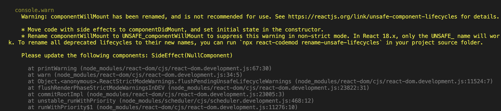
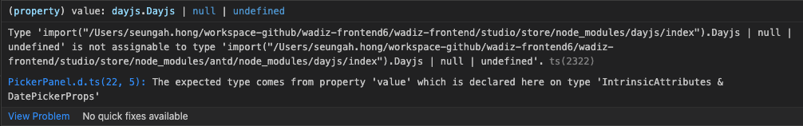

# React v16 to v18 Migration Guide (with Best Practice Code)

## Updates to Client Rendering APIs Migration

The new root API also enables the new concurrent renderer, which allows you to opt-into concurrent features.

```tsx
// Before
import { render } from 'react-dom';
const container = document.getElementById('app');
render(<App tab="home" />, container);

// After
import { createRoot } from 'react-dom/client';
const container = document.getElementById('app');
const root = createRoot(container); // createRoot(container!) if you use TypeScript
root.render(<App tab="home" />);
```

We’ve also changed unmountComponentAtNode to root.unmount:

```tsx
// Before
unmountComponentAtNode(container);

// After
root.unmount();
```

We’ve also removed the callback from render, since it usually does not have the expected result when using Suspense:

```tsx
// Before
const container = document.getElementById('app');
render(<App tab="home" />, container, () => {
  console.log('rendered');
});

// After
function AppWithCallbackAfterRender() {
  useEffect(() => {
    console.log('rendered');
  });

  return <App tab="home" />;
}

const container = document.getElementById('app');
const root = createRoot(container);
root.render(<AppWithCallbackAfterRender />);
```

## How to Upgrade for the New JSX Transform

CRA: v4.0.0 +

eslint-plugin-react

```json
{
  // ...
  "rules": {
    // ...
    "react/jsx-uses-react": "off",
    "react/react-in-jsx-scope": "off"
  }
}
```

custom babel

@babel/plugin-transform-react-jsx

```bash
# for npm users
npm update @babel/core @babel/plugin-transform-react-jsx

# for yarn users
yarn upgrade @babel/core @babel/plugin-transform-react-jsx
```

@babel/preset-react

```bash
# for npm users
npm update @babel/core @babel/preset-react

# for yarn users
yarn upgrade @babel/core @babel/preset-react
```

babel config

```json
// If you are using @babel/preset-react
{
  "presets": [
    ["@babel/preset-react", {
      "runtime": "automatic"
    }]
  ]
}

// If you're using @babel/plugin-transform-react-jsx
{
  "plugins": [
    ["@babel/plugin-transform-react-jsx", {
      "runtime": "automatic"
    }]
  ]
}
```

## Bulk-Removing Unnecessary Imports After Upgrading to v17

react-codemod

```tsx
// general react
import React from 'react';

function App() {
  return <h1>Hello World</h1>;
}

// transpile;
function App() {
  return <h1>Hello World</h1>;
}
```

```tsx
// custom hook
import React from 'react';

function App() {
  const [text, setText] = React.useState('Hello World');
  return <h1>{text}</h1>;
}

import { useState } from 'react';

function App() {
  const [text, setText] = useState('Hello World');
  return <h1>{text}</h1>;
}
```

## Trouble Shooting

### Click event using window.addEventListener is fired prematurely

```jsx
export function useOutsideClick({
  callback,
}: UseOutsideClickProps) {
  const [element, setElement] = useState<HTMLElement>();
  const ref = useCallback((el) => setElement(el), []);

  useEffect(() => {
    const handler = (event) => {
      if (element && !element.contains(event.target)) {
        callback(event);
      }
    }

    if (element) {
      document.addEventListener('click', handler);
    }

    return () => {
      document.removeEventListener('click', handler);
    };
  }, [element, callback]);

  return ref;
}

// Actual usage example
const [isPreviewTypeListVisible, setPreviewTypeListVisible] = useState(false);

// Before
useEffect(() => {
  const handleDocumentClick = () => isPreviewTypeListVisible && setPreviewTypeListVisible(false);
  document.addEventListener('click', handleDocumentClick);

  return () => document.removeEventListener('click', handleDocumentClick);
}, [isPreviewTypeListVisible]);

// After
const ref = useOutsideClick({
  callback: () => setPreviewTypeListVisible(false),
});

<div
  ref={ref}
  className={cx(styles.container, className)}
>
	<button
	  type="button"
	  onClick={() => setPreviewTypeListVisible(!isPreviewTypeListVisible)}
	>
</div>
```

### Property 'createRoot' does not exist on type '@types/react-dom/index")'. ts(2339)

1. Check the react-dom version. You need to install v18 or higher.
2. Even after installing v18 or higher, an issue can occur where an external library references a different React version.
   1. This happens when the library specifies the React version as a peerDependency.
3. In that case, pin the version using resolutions in package.json.

```tsx
"resolutions": {
  ...,
  "react": "18.2.0"
}
```

### TypeError: Cannot read properties of null (reading 'useMemo')' error Redux in my react redux

1. Install react-redux version 8 or higher.
2. Reference: [TypeError: Cannot read properties of null (reading 'useMemo')](https://stackoverflow.com/questions/72095900/typeerror-cannot-read-properties-of-null-reading-usememo)
3. Reference: [Overload 1 of 2, '(props: ProviderProps<UsersAction> | Readonly<ProviderProps<UsersAction>>): Provider<UsersAction>',](https://stackoverflow.com/questions/73212376/overload-1-of-2-props-providerpropsusersaction-readonlyproviderpropsus)
4. For now, since updating react-redux also requires updating redux, this is temporarily handled with ts-ignore.

```
<QueryClientProvider client={queryClient}>
    {/* @ts-ignore */}
    <Provider store={store}>
    </Provider>
</QueryClientProvider>
```

### 'ReactNode' is not assignable to type 'React.ReactNode'

1. This is caused by an external library dependency. As above, pin the version using resolutions.
2. Reference: [React18 : Type{} is not assignable to type 'ReactNode' 해결](https://velog.io/@hjkdw95/React18-Type-is-not-assignable-to-type-ReactNode-%ED%95%B4%EA%B2%B0)

```tsx
"resolutions": {
  "@types/react": "18.2.0"
},
```

### index.js:1 Error: createRoot(...): Target container is not a DOM element

1. This occurs when the target element is not a DOM object.

```tsx
// Operation error in useMemo, forwardRef
if (!element) return;
```

### No overload matches this call. Overload 1 of 2, '(props: ProviderProps<AnyAction> | Readonly<ProviderProps<AnyAction>>): Provider<AnyAction>', gave the following error....

- Starting from React 18, children must be declared explicitly.
- Declaring children

```tsx
// Option 1. Add the children type directly
interface Props {
  isOpened: boolean;
  handleCloseModal: () => void;
  children: ReactNode;
}
// Option 2. Use the PropsWithChildren type provided by React
function Component(props: PropsWithChildren<Props>);
```

- Reference 2 (why children was excluded from the default type in React 18):
  1. Because you cannot determine whether children exist and it is difficult to infer the type of children, it was excluded starting from version 18.
  2. [Removal of implicit children](https://solverfox.dev/writing/no-implicit-children/)

### Issues caused by automatic batching

[https://github.githubassets.com/favicon.ico](https://github.githubassets.com/favicon.ico)

```tsx
const { mutate } = usePostSettlementInfo({
  onSuccess: () => {
    if (path) { // Without wrapping in flushSync, automatic batching kicks in and the state doesn't update
      ...
    }
  },
});

const onSubmit = handleSubmit((data) => {
    ....
    mutate(data);
  });

const handleSave = async (path: string) => {
  flushSync(() => {
    setPath(path);
  });
  await onSubmit();
};
```

### Uncaught ReferenceError: React is not defined

```tsx
// If you are using @babel/preset-react
{
  "presets": [
    ["@babel/preset-react", {
      "runtime": "automatic"
    }]
  ]
}

// If you're using @babel/plugin-transform-react-jsx
{
  "plugins": [
    ["@babel/plugin-transform-react-jsx", {
      "runtime": "automatic"
    }]
  ]
}
```

### defaultProps no longer supported

Starting from version 18.3, defaultProps is deprecated. (A warning is shown.)

We are currently on version 18.2, so please be careful not to add defaultProps going forward.

Reference: [Stop using defaultProps! | Sophia Willows](https://sophiabits.com/blog/stop-using-defaultprops#why-remove-defaultprops-from-react)

[https://sophiabits.com/favicon.ico](https://sophiabits.com/favicon.ico)

## Library Issue

### Switching to the react-helmet-async library

Cause

- Starting from React 17, componentWillMount, componentWillReceiveProps, and componentWillUpdate are no longer supported, and to keep using them you need to migrate via the UNSAFE\_ prefix. Because react-helmet was using methods that are not supported in version 17, warnings were raised.
- [Update on Async Rendering – React Blog](https://legacy.reactjs.org/blog/2018/03/27/update-on-async-rendering.html)

Improvement

- Switched to a library called react-helmet-async
- [npm: react-helmet-async](https://www.npmjs.com/package/react-helmet-async)
- [How to fix "componentWillMount has been renamed"](https://benborgers.com/posts/react-helmet-async)



### react-hook-form isDirty delay update

- [[Bug]: Prompt firing when submitting with React 18BUG](https://github.com/remix-run/react-router/issues/8804)

```tsx
// Since the form data was reset after saving with react-hook-form, the state was set to true instead of false, resulting in a situation where the prompt message had to be handled (occurs from v18 onward)

<Prompt
  when={isDirty && !submited}
  message={() =>
    `You have unsaved changes, sure you want to go to leave this page? `
  }
/>
```

### Issue where the antd datepicker gets blocked when the input tag is focused in older versions

- [Bug: antd datepicker isnt work on react and react-dom 18 versionSTATUS: UNCONFIRMED](https://github.com/facebook/react/issues/24265)
- Library version upgrades
  - antd: 4.16.2 → 5.1.0
  - rc-picker: 2.5.12 → 3.7.4
  - dayjs: 1.10.5 → 1.11.7



## Jest Issue

Updating Jest after upgrading to React 18

- Encountered the error TypeError: Cannot read property 'current' of undefined
- [GitHub - testing-library/react-hooks-testing-library: 🐏 Simple and complete React hooks testing utilities that encourage good testing practices.](https://github.com/testing-library/react-hooks-testing-library?tab=readme-ov-file#a-note-about-react-18-support)
  'Change in how waitFor is used'

  ```tsx
  // Change in the declaration
  //// Before
  const { result, waitFor } = renderHook(() => useRewards(), {
    wrapper: <App />,
  });

  //// After
  import { act, renderHook, waitFor } from '@testing-library/react';

  // Add expect inside the waitFor statement
  //// Before
  await waitFor(() => result.current.isSuccess);

  //// After
  await waitFor(() => expect(result.current.isSuccess).toBe(true));
  ```

  userEvent click malfunction

  - After upgrading to React 18, userEvent click stopped working and only fireEvent works (this will likely be resolved later, but for now you need to switch to fireEvent)
  - Reference: [React 18 support · testing-library/user-event · Discussion #945](https://github.com/testing-library/user-event/discussions/945)
  - userEvent.click → fireEvent.click

  ```tsx
  // Before
  import userEvent from '@testing-library/user-event';
  userEvent.click(button);

  // After
  import { render, screen, waitFor } from '@testing-library/react';
  await waitFor(() => userEvent.click(button));
  ```

# Reference Pages

- [Glossary + Explain Like I'm Five · reactwg/react-18 · Discussion #46](https://github.com/reactwg/react-18/discussions/46)
- [How to Upgrade to React 18 – React](https://react.dev/blog/2022/03/08/react-18-upgrade-guide)
