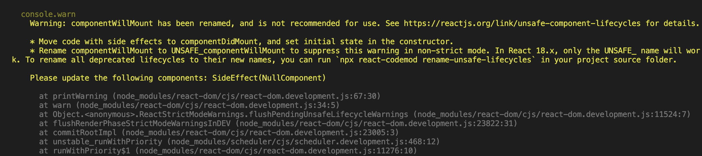
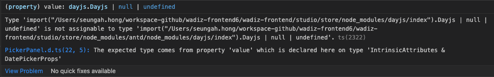

# React v16 to v18 마이그레이션 가이드(with Best Practice Code)

## Updates to Client Rendering APIs Migration

The new root API also enables the new concurrent renderer, which allows you to opt-into concurrent features.

```tsx
// Before
import { render } from 'react-dom';
const container = document.getElementById('app');
render(<App tab="home" />, container);

// After
import { createRoot } from 'react-dom/client';
const container = document.getElementById('app');
const root = createRoot(container); // createRoot(container!) if you use TypeScript
root.render(<App tab="home" />);
```

We’ve also changed unmountComponentAtNode to root.unmount:

```tsx
// Before
unmountComponentAtNode(container);

// After
root.unmount();
```

We’ve also removed the callback from render, since it usually does not have the expected result when using Suspense:

```tsx
// Before
const container = document.getElementById('app');
render(<App tab="home" />, container, () => {
  console.log('rendered');
});

// After
function AppWithCallbackAfterRender() {
  useEffect(() => {
    console.log('rendered');
  });

  return <App tab="home" />;
}

const container = document.getElementById('app');
const root = createRoot(container);
root.render(<AppWithCallbackAfterRender />);
```

## 새 JSX 변환을 위해서 업그레이드 방법

CRA: v4.0.0 +

eslint-plugin-react

```json
{
  // ...
  "rules": {
    // ...
    "react/jsx-uses-react": "off",
    "react/react-in-jsx-scope": "off"
  }
}
```

custom babel

@babel/plugin-transform-react-jsx

```bash
# for npm users
npm update @babel/core @babel/plugin-transform-react-jsx

# for yarn users
yarn upgrade @babel/core @babel/plugin-transform-react-jsx
```

@babel/preset-react

```bash
# for npm users
npm update @babel/core @babel/preset-react

# for yarn users
yarn upgrade @babel/core @babel/preset-react
```

babel config

```json
// If you are using @babel/preset-react
{
  "presets": [
    ["@babel/preset-react", {
      "runtime": "automatic"
    }]
  ]
}

// If you're using @babel/plugin-transform-react-jsx
{
  "plugins": [
    ["@babel/plugin-transform-react-jsx", {
      "runtime": "automatic"
    }]
  ]
}
```

## v17 버전 업한 이후에 불필요한 import 일괄삭제

react-codemod

```tsx
// general react
import React from 'react';

function App() {
  return <h1>Hello World</h1>;
}

// transpile;
function App() {
  return <h1>Hello World</h1>;
}
```

```tsx
// custom hook
import React from 'react';

function App() {
  const [text, setText] = React.useState('Hello World');
  return <h1>{text}</h1>;
}

import { useState } from 'react';

function App() {
  const [text, setText] = useState('Hello World');
  return <h1>{text}</h1>;
}
```

## Trouble Shooting

### Click event using window.addEventListener is fired prematurely

```jsx
export function useOutsideClick({
  callback,
}: UseOutsideClickProps) {
  const [element, setElement] = useState<HTMLElement>();
  const ref = useCallback((el) => setElement(el), []);

  useEffect(() => {
    const handler = (event) => {
      if (element && !element.contains(event.target)) {
        callback(event);
      }
    }

    if (element) {
      document.addEventListener('click', handler);
    }

    return () => {
      document.removeEventListener('click', handler);
    };
  }, [element, callback]);

  return ref;
}

// 실 사용예
const [isPreviewTypeListVisible, setPreviewTypeListVisible] = useState(false);

// 수정 전
useEffect(() => {
  const handleDocumentClick = () => isPreviewTypeListVisible && setPreviewTypeListVisible(false);
  document.addEventListener('click', handleDocumentClick);

  return () => document.removeEventListener('click', handleDocumentClick);
}, [isPreviewTypeListVisible]);

// 수정 후
const ref = useOutsideClick({
  callback: () => setPreviewTypeListVisible(false),
});

<div
  ref={ref}
  className={cx(styles.container, className)}
>
	<button
	  type="button"
	  onClick={() => setPreviewTypeListVisible(!isPreviewTypeListVisible)}
	>
</div>
```

### '@types/react-dom/index")' 형식에 'createRoot' 속성이 없습니다.ts(2339)

1. react-dom 버전 확인. v18이상 설치 필요
2. v18이상 설치 후에도 외부 라이브러리에서 다른 react 버전을 참조하는 이슈가 발생
   1. 라이브러리에서 peerDependencies로 react 버전을 명시한 경우
3. 이 때는 package.json에 resolution 으로 버전을 명시

```tsx
"resolutions": {
  ...,
  "react": "18.2.0"
}
```

### TypeError: Cannot read properties of null (reading 'useMemo')' error Redux in my react redux

1. react-redux 8버전 이상 설치
2. 참고: [TypeError: Cannot read properties of null (reading 'useMemo')](https://stackoverflow.com/questions/72095900/typeerror-cannot-read-properties-of-null-reading-usememo)
3. 참고: [Overload 1 of 2, '(props: ProviderProps<UsersAction> | Readonly<ProviderProps<UsersAction>>): Provider<UsersAction>',](https://stackoverflow.com/questions/73212376/overload-1-of-2-props-providerpropsusersaction-readonlyproviderpropsus)
4. 현재는 react-redux 업데이트 시 redux도 같이 업데이트 해야해서 ts-ignore로 임시처리

```
<QueryClientProvider client={queryClient}>
    {/* @ts-ignore */}
    <Provider store={store}>
    </Provider>
</QueryClientProvider>
```

### 'ReactNode' is not assignable to type 'React.ReactNode'

1. 외부 라이브러리 의존성으로.. 위와 같이 resolution 으로 버전을 명시
2. 참고: [React18 : Type{} is not assignable to type 'ReactNode' 해결](https://velog.io/@hjkdw95/React18-Type-is-not-assignable-to-type-ReactNode-%ED%95%B4%EA%B2%B0)

```tsx
"resolutions": {
  "@types/react": "18.2.0"
},
```

### index.js:1 Error: createRoot(...): Target container is not a DOM element

1. 대상 element가 DOM 객체가 아닌 경우 발생

```tsx
// useMemo, forwardRef 에서 동작오류
if (!element) return;
```

### No overload matches this call. Overload 1 of 2, '(props: ProviderProps<AnyAction> | Readonly<ProviderProps<AnyAction>>): Provider<AnyAction>', gave the following error....

- react18 이상부터 children을 명시적으로 선언해야 함.
- children 명시

```tsx
// 방법 1. children 타입을 직접 추가
interface Props {
  isOpened: boolean;
  handleCloseModal: () => void;
  children: ReactNode;
}
// 방법 2. 리액트에서 제공해주는 PropsWithChildren 타입을 사용
function Component(props: PropsWithChildren<Props>);
```

- 참고 2(children이 react18에서 기본 타입에서 제외된 이유) :
  1. 자식 유무에 대해 파악 할 수 없고, 자식의 타입 추정이 어려워 18버전 부터는 제외
  2. [Removal of implicit children](https://solverfox.dev/writing/no-implicit-children/)

### automatic batching 인한 이슈

[https://github.githubassets.com/favicon.ico](https://github.githubassets.com/favicon.ico)

```tsx
const { mutate } = usePostSettlementInfo({
  onSuccess: () => {
    if (path) { // flushSync 감싸지 않을 경우 자동배치 처리되다보니 state 업데이트 안되는 이슈
      ...
    }
  },
});

const onSubmit = handleSubmit((data) => {
    ....
    mutate(data);
  });

const handleSave = async (path: string) => {
  flushSync(() => {
    setPath(path);
  });
  await onSubmit();
};
```

### Uncaught ReferenceError: React is not defined

```tsx
// If you are using @babel/preset-react
{
  "presets": [
    ["@babel/preset-react", {
      "runtime": "automatic"
    }]
  ]
}

// If you're using @babel/plugin-transform-react-jsx
{
  "plugins": [
    ["@babel/plugin-transform-react-jsx", {
      "runtime": "automatic"
    }]
  ]
}
```

### defaultProps 미지원

18.3 이후 버전부터는 defaultProp가 deprecated 됩니다. (warning 표시)

현재는 18.2 버전으로 되어있고 추후 defaultProps 추가하지 않도록 유의해 주세요.

참고: [Stop using defaultProps! | Sophia Willows](https://sophiabits.com/blog/stop-using-defaultprops#why-remove-defaultprops-from-react)

[https://sophiabits.com/favicon.ico](https://sophiabits.com/favicon.ico)

## Library Issue

### react-helmet-async 라이브러리로 교체

원인

- 리액트 17버전 이후부터는 componentWillMount, componentWillReceiveProps, and componentWillUpdate 지원하지 않으며, 추가를 위해서는 UNSAFE\_ PREFIX를 통해서 개선이 가능합니다. 17버전에서 지원하지 않는 메서드를 react-helmet를 사용하고 있어서 경고가 발생하였습니다.
- [Update on Async Rendering – React Blog](https://legacy.reactjs.org/blog/2018/03/27/update-on-async-rendering.html)

개선 사항

- react-helmet-asnc라는 라이브러리로 교체
- [npm: react-helmet-async](https://www.npmjs.com/package/react-helmet-async)
- [How to fix "componentWillMount has been renamed"](https://benborgers.com/posts/react-helmet-async)



### react-hook-form isDirty delay update

- [[Bug]: Prompt firing when submitting with React 18BUG](https://github.com/remix-run/react-router/issues/8804)

```tsx
// react-hook-form으로 저장완료 이후에 form 데이터값을 reset 처리했으니 상태가 false가 아닌 true가 설정되서 prompt message 처리를 해야하는 상황(v18 이후부터 발생)

<Prompt
  when={isDirty && !submited}
  message={() =>
    `You have unsaved changes, sure you want to go to leave this page? `
  }
/>
```

### antd datepiacker 이전 버전에서 input tag 포커싱 될 시 블락되는 이슈

- [Bug: antd datepicker isnt work on react and react-dom 18 versionSTATUS: UNCONFIRMED](https://github.com/facebook/react/issues/24265)
- 라이브러리 버전 업그레이드
  - antd: 4.16.2 → 5.1.0
  - rc-picker: 2.5.12 → 3.7.4
  - dayjs: 1.10.5 → 1.11.7



## Jest Issue

react18 업데이트 이후에 jest 버전 업데이트

- TypeError: Cannot read property 'current' of undefined 에러 확인
- [GitHub - testing-library/react-hooks-testing-library: 🐏 Simple and complete React hooks testing utilities that encourage good testing practices.](https://github.com/testing-library/react-hooks-testing-library?tab=readme-ov-file#a-note-about-react-18-support)
  'waitFor 사용법 변경'

  ```tsx
  // 선언부 변경
  //// 수정 전
  const { result, waitFor } = renderHook(() => useRewards(), {
    wrapper: <App />,
  });

  //// 수정 후
  import { act, renderHook, waitFor } from '@testing-library/react';

  // waitFor 문에 expect 추가
  //// 수정 전
  await waitFor(() => result.current.isSuccess);

  //// 수정 후
  await waitFor(() => expect(result.current.isSuccess).toBe(true));
  ```

  userEvent click 오동작

  - react18 로 업데이트 되면서 userEvent click 동작이 적용이 안되며, fireEvent로만 동작(추후에 해결이 될거 같지만, 현재로써는 fireEvent로 변경이 필요)
  - 참고: [React 18 support · testing-library/user-event · Discussion #945](https://github.com/testing-library/user-event/discussions/945)
  - userEvent.click → fireEvent.click

  ```tsx
  // 변경 전
  import userEvent from '@testing-library/user-event';
  userEvent.click(button);

  // 변경 후
  import { render, screen, waitFor } from '@testing-library/react';
  await waitFor(() => userEvent.click(button));
  ```

# 참고페이지

- [Glossary + Explain Like I'm Five · reactwg/react-18 · Discussion #46](https://github.com/reactwg/react-18/discussions/46)
- [How to Upgrade to React 18 – React](https://react.dev/blog/2022/03/08/react-18-upgrade-guide)
