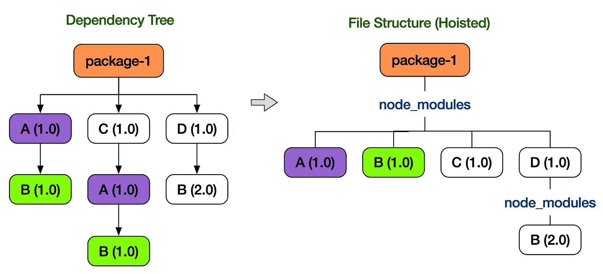
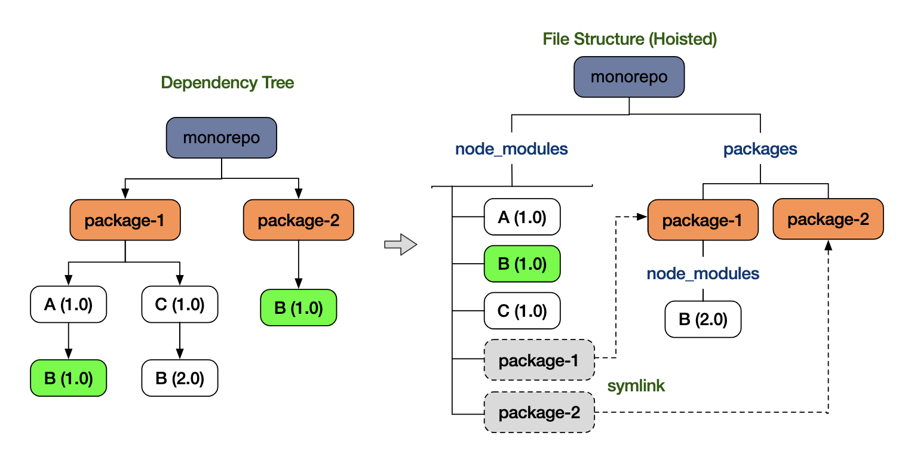
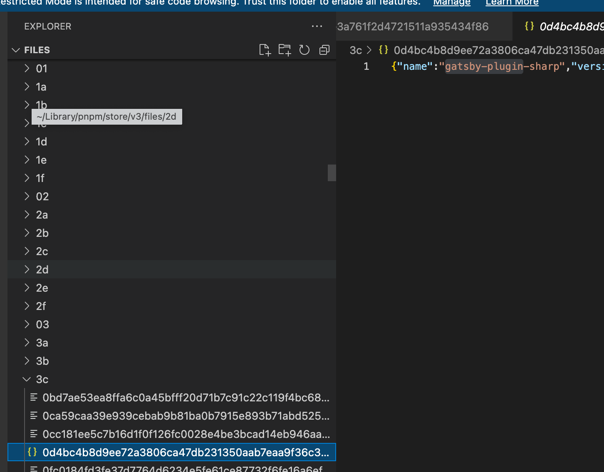
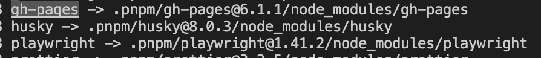
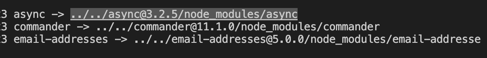
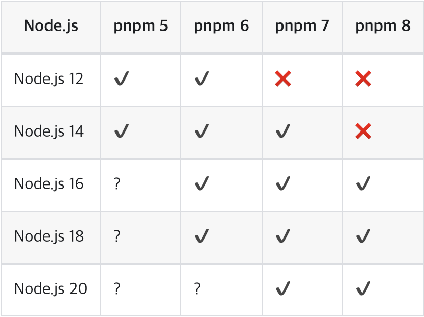
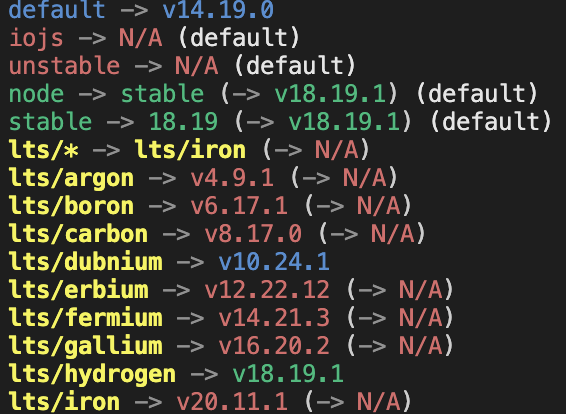
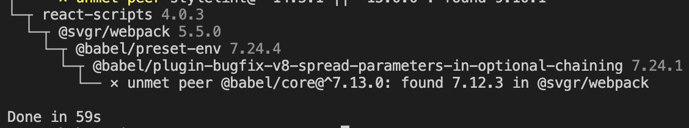
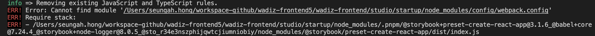
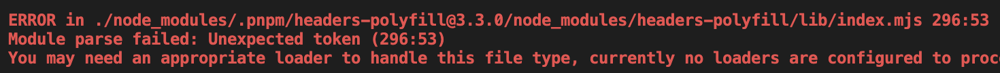

# Background

## Problems with the NPM and Yarn Classic (1.0) Package Managers

### Phantom Dependencies





- Both yarn classic (1.0) and npm (v3+) use hoisting and merging to flatten the dependency tree in order to efficiently manage the storage taken up by duplicate packages (surprisingly, up through npm v2 every dependency was installed redundantly).
- To minimize duplicate packages internally, the packages that each package depends on are lifted to the top level.
- The upshot is that a package you never installed gets lifted to the top level, which leads to the issue of being able to use a library you never explicitly added.

### Storage Issues

- With yarn 1.0 and npm, every library is installed into node_modules, so duplicate packages keep getting installed per package.

## What Can PNPM Solve?

### Resolving Phantom Dependencies

```tsx
// package.json
"dependencies": {
	"foo": "1.0.0",
}

// node_modules 폴더 구조
node_modules
├── foo -> ./.pnpm/foo@1.0.0/node_modules/foo // symbolic link
└── .pnpm
    ├── bar@1.0.0
    │   └── node_modules
    │       ├── bar -> <store>/bar // hard link
    │       └── qar -> ../../qar@2.0.0/node_modules/qar // symbolic link
    ├── foo@1.0.0
    │   └── node_modules
    │       ├── foo -> <store>/foo // hard link
    │       ├── bar -> ../../bar@1.0.0/node_modules/bar // symbolic link
    │       └── qar -> ../../qar@2.0.0/node_modules/qar // symbolic link
    └── qar@2.0.0
        └── node_modules
            └── qar -> <store>/qar
```

- Instead of hoisting packages, pnpm stores them globally in a global store (~/.pnpm-store).

  ```tsx
  $ pnpm store path

  Library/pnpm/store/v3 // 글로벌 저장소 패스
  ```

- The package paths installed in the global store (~/.pnpm-store) are connected to the virtual store (.pnpm) via hard links.

  - node_modules/.pnpm/~~
  - A folder named with the package version (bar@1.0.0) is created, and links are set up under node_modules.
  - Because both the package folders and the symbolic link files are added, the storage taken up by node_modules can increase.

  ```tsx
  # yarn 으로 설치한 용량
  du -shL ./node_modules
  3.0G

  # pnpm 으로 설치한 용량
  du -shL ./node_modules
  3.4G
  ```

  

- In node_modules, the packages installed from package.json are linked to the global packages via hard links.

  ```tsx
  ls -li ~/Library/pnpm/store/v3/files/3c/{package.json 해시값}
  11136652 # inode가 같다

  ls -li node_modules/.pnpm/gatsby-plugin-sharp@5.13.3/node_modules/gatsby-plugin-sharp/package.json
  11136652 # inode가 같다
  ```

- Packages and the sub-packages they depend on are wired together with symbolic links.
  Package installed from package.json → a folder is added at the first depth of node_modules and a symbolic link is connected
  - node_modules first depth → symbolic link to the .pnpm virtual store
    .pnpm dependency package → symbolic link to the .pnpm virtual store
  ```tsx
  ls -li ./node_modules
  ```
  
  ```tsx
  ls -li ./node_modules/.pnpm/gh-pages@6.1.1/node_modules
  ```
  
- Because only the packages installed from package.json exist at the first depth of node_modules, phantom dependencies are eliminated.
  Since packages are not hoisted, they are not installed at the first depth, so if you try to use a package you did not install while running the project, an error occurs.

→ Because every package is bundled only with its related packages, access to unrelated packages can be blocked, and there is no need to perform complex operations like hoisting, which makes management easier.

### Resolving Storage Issues

- By managing packages in one place in the global store (~/.pnpm-store) and composing node_modules through hard links / soft links, storage usage is reduced, and performance and build speed can also be improved.

# Yarn classic(1.0) → PNPM Migration

## Node Version Check & Change

- PNPM version 8 and above requires Node version 16 or higher.



- Installing and switching Node versions with nvm
  - nvm (node version manager): a tool that lets you use multiple Node versions
- nvm commands

```bash
nvm install v[install-version]
## Install: nvm install v11.10.1

nvm uninstall v[install-version]
## Uninstall: nvm uninstall v11.10.1

nvm use v[version-to-use]
## Use: nvm use v6.10.1. If .nvmrc is specified, you can just run nvm use.
## You can select by name, not just by version.

nvm ls
nvm list
## Shows the list of currently installed Node versions.

nvm ls-remote
## Also shows the remote Node versions available for installation.

nvm alias default v[install-version]
## Set the default Node version at terminal startup

node --v
## Check the Node version

nvm --version
## Check the nvm version
```



- Changing the .nvmrc version
  ```bash
  # .nvmrc file
  ## change lts/fermium
  lts/hydrogen
  ```
  - For projects, the required Node version can differ from project to project, so rather than reinstalling and removing Node every time, it is convenient to switch to the Node version needed for a given project using NVM.
  - A collaborator who has cloned the project can use the appropriate Node version simply by running the commands below.
  ```bash
  nvm install  // run if your nvm does not have this version
  nvm use      // required
  ```

## Installation

```tsx
// Homebrew 사용하기
brew install pnpm

// npm 사용하기
npm install -g pnpm
npm install -g @pnpm/exe
```

## Migration

- Delete the existing yarn.lock file
- Delete the existing node_modules
  ```bash
  rm -rf node_modules
  ```
- Install packages
  ```bash
  pnpm install
  ```
  
- Confirm the pnpm-lock.yaml file is created
- Run the commands
  - pnpm start
  - pnpm build
  - pnpm test
  - …

## Trouble Shooting

### Removing the yarn workspace & package.json setup

```tsx
// yarn workspace 설정된 package.json 삭제
{
  "private": true,
  "name": "workspace",
  "version": "0.0.0"
}

// workspace 사용했던 지점의 package.json에서도 동일하게 삭제
"devDependencies": {
  ...
	// "workspace": "0.0.0" -> 삭제
}
```

### Handling aliases after removing workspace

```tsx

// tsconfig.json -> typescript 사용
"paths": {
	"workspace/*": ["./src/workspace/*"],
}

// jest
"jest": {
  "moduleNameMapper": {
	  "workspace/(.*)": "<rootDir>/src/workspace/$1",
  }
}

// storybook
// .storybook/main.js
module.exports = {
	webpackFinal: (config) => {
		config.resolve.alias = {
      ...(config.resolve.alias || {}),
      workspace: path.resolve(__dirname, '../src/workspace'),
    };
	},

	return {
		...config,
	};
};
```

### Storybook run error

- Cannot find module 'node_modules/config/webpack.config’

  - When the package calls the getReactScriptsPath function, npm/yarn and pnpm search in different paths, so the config file cannot be found.
    - npm, yarn classic (1.0): node_modules/.bin/react-script
    - pnpm: node_modules

  ```tsx
  // .storybook/main.js
  // 변경 전
  addons: [
  	'@storybook/preset-create-react-app',
  ],

  // 변경 후
  addons: [
  	{
      name: '@storybook/preset-create-react-app',
      options: {
        // preset-create-react-app에 패키지명을 react-scripts로 지정해서 접근이 가능하도록 수정
        scriptsPackageName: "react-scripts",
      },
    },
  ],

  ```

  

  - [https://github.com/storybookjs/presets/issues/242](https://github.com/storybookjs/presets/issues/242)

- Aliases not applied even after injecting the tsconfig path (alias) settings into storybook

  - The TsconfigPathPlugin was installed to use the aliases defined in tsconfig.json and injected into the Storybook webpack, but it did not work correctly, so it was replaced with handling each alias individually.

  ```tsx
  // .storybook/main.js
  module.exports = {
    stories: async () => getStories(),
    webpackFinal: (config) => {

  	  // 직접 alias 처리하도록 처리
  	  config.resolve.alias = {
        ...(config.resolve.alias || {}),
        workspace: path.resolve(__dirname, '../src/workspace'),
      },

  	  // typescript path(alias) 스토리북에 주입하는 코드가 정상동작하지 않음
  	  /* config.resolve.plugins.push(
        new TsconfigPathsPlugin({
          configFile: path.resolve(__dirname, '../tsconfig.json'),
          extensions: ['.ts', '.tsx', '.js', '.jsx'],
        }),
      ); */

      return {
  	    ...config,
      };
    },
  },
  ```

### msw error

- An error occurs because the Module System differs (msw-storybook-addon, msw).
  Cause: msw-storybook-addon, the package needed to integrate msw with storybook, is built in the CommonJS style, while headers-polyfill, which is a dependency pulled in when installing the msw package, is built in the ESM style, causing a Module Parsing error.
- In particular, the msw package installs headers-polyfill (^3.~) using the caret (^) style, so the current latest version 3.2.5 gets installed, which means an ESM-style module is used and the error occurs.
  Fix: Resolved by installing version 0.36.8, the most recent version that does not use headers-polyfill.
  
  ```tsx
  // MSW 버전 downgrade
  pnpm install msw@0.36.8
  ```

# References

- [pnpm](https://jeonghwan-kim.github.io/2023/10/20/pnpm#용량-npm)
