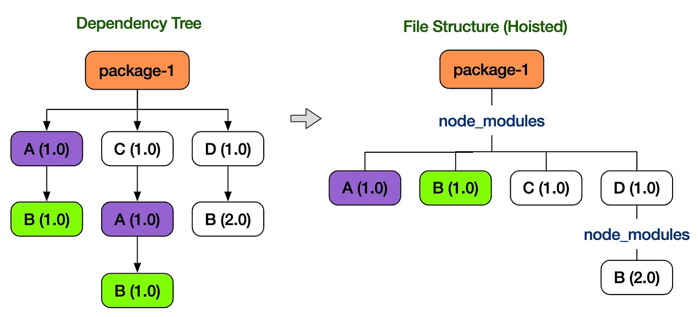
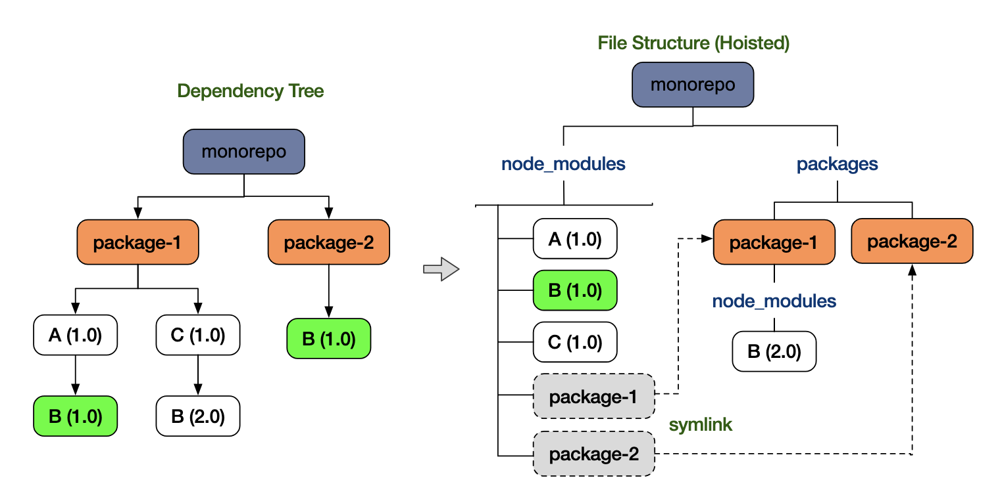
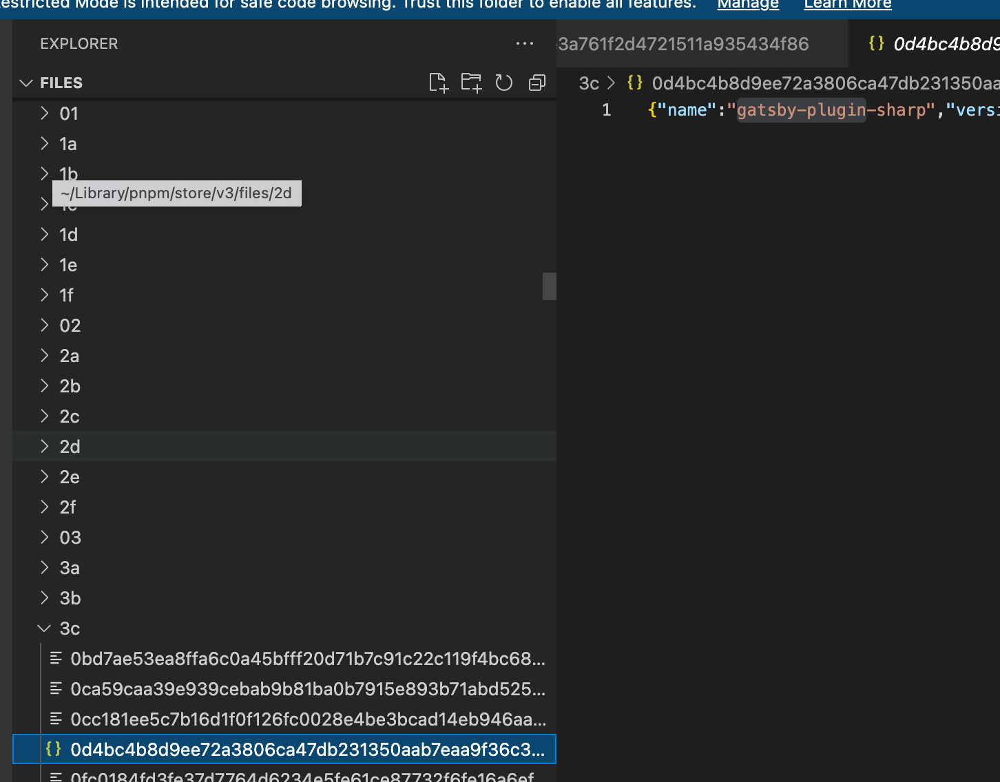
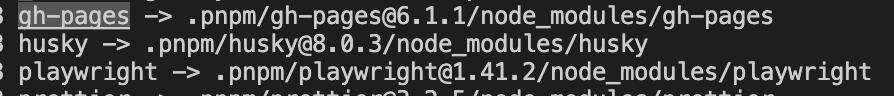
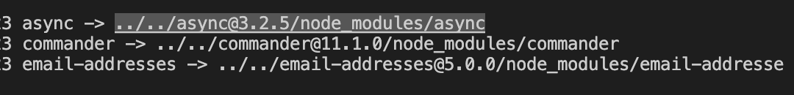
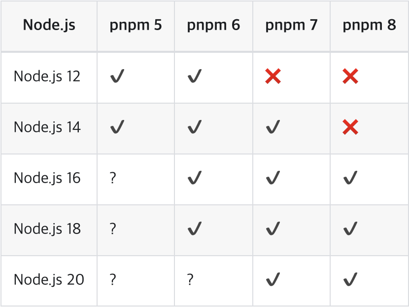
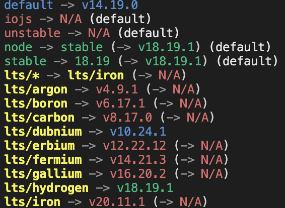
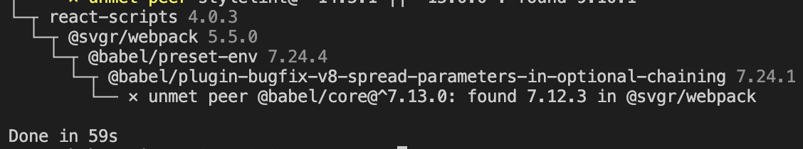
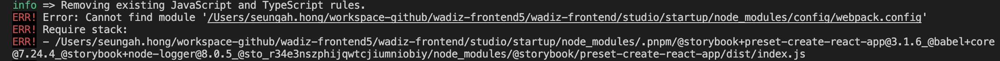
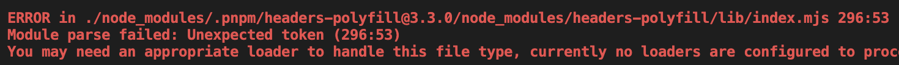

# 도입 배경

## NPM, Yarn Classic(1.0) 패키지 매니저 문제점

### 유령 의존성





- yarn classic(1.0), npm(v3~) 둘 다 중복 패키지에 대한 용량을 효율적으로 관리하기 위해서 호이스팅 & 병합을 기법을 사용해서 평탄화 작업 진행(놀랍게도 npm v2 까지는 모든 의존성을 중복 설치했다고 합니다.)
- 내부의 중복된 패키지를 최소화하기 위해 각 패키지가 의존하고 있는 패키지를 최상단으로 올림
- 결론은.. 내가 설치하지 않았는데 패키지가 최상단으로 올리다보니 라이브러리를 사용하게 되는 이슈 발생

### 용량 이슈

- yarn 1.0, npm에서는 모든 라이버리를 node_modules에 설치하다보니 중복되는 패키지들이 package 별로 계속 설치되는 이슈

## PNPM을 통해서 어떤걸 해결할 수 있을까??

### 유령 의존성 해결

```tsx
// package.json
"dependencies": {
	"foo": "1.0.0",
}

// node_modules 폴더 구조
node_modules
├── foo -> ./.pnpm/foo@1.0.0/node_modules/foo // symbolic link
└── .pnpm
    ├── bar@1.0.0
    │   └── node_modules
    │       ├── bar -> <store>/bar // hard link
    │       └── qar -> ../../qar@2.0.0/node_modules/qar // symbolic link
    ├── foo@1.0.0
    │   └── node_modules
    │       ├── foo -> <store>/foo // hard link
    │       ├── bar -> ../../bar@1.0.0/node_modules/bar // symbolic link
    │       └── qar -> ../../qar@2.0.0/node_modules/qar // symbolic link
    └── qar@2.0.0
        └── node_modules
            └── qar -> <store>/qar
```

- pnpm 패키지를 호이스팅 대신, 글로벌 저장소(~/.pnpm-store)에 패키지를 글로벌하게 저장

  ```tsx
  $ pnpm store path

  Library/pnpm/store/v3 // 글로벌 저장소 패스
  ```

- 글로벌 저장소(~/.pnpm-store)에 설치된 패키지 경로와 가상 저장소(.pnpm) 하드 링크로 연결

  - node_modules/.pnpm/~~
  - 패키지의 버전을 명시한 폴더명 생성(bar@1.0.0) 후 node_modules 하위에 링크 연결
  - 패키지 폴더와 심볼릭 링크 파일까지 추가됨에 따라서 node_modules에 용량을 늘어날 수 있음

  ```tsx
  # yarn 으로 설치한 용량
  du -shL ./node_modules
  3.0G

  # pnpm 으로 설치한 용량
  du -shL ./node_modules
  3.4G
  ```

  

- node_modules에서는 package.json 설치된 패키지를 하드 링크를 통해서 글로벌 패키지와 링크 설정

  ```tsx
  ls -li ~/Library/pnpm/store/v3/files/3c/{package.json 해시값}
  11136652 # inode가 같다

  ls -li node_modules/.pnpm/gatsby-plugin-sharp@5.13.3/node_modules/gatsby-plugin-sharp/package.json
  11136652 # inode가 같다
  ```

- 패키지와 의존한 서브 패키지에 대해서는 심볼릭 링크로 구성
  package.json 설치된 패키지 → node_modules 1depth에 폴더 추가 및 심볼릭 링크 연결
  - node_modules 1depth → .pnpm 가상 저장소 심볼릭 링크
    .pnpm dependencies 패키지 → .pnpm 가상 저장소 심볼릭 링크
  ```tsx
  ls -li ./node_modules
  ```
  
  ```tsx
  ls -li ./node_modules/.pnpm/gh-pages@6.1.1/node_modules
  ```
  
- node_modules 1depth 하위에는 package.json 설치된 패키지만 구성됨으로 유령 의존성은 제거
  패키지 hoisted 처리가 되지 않으므로 1 depth에 패키지가 설치가 안되고 프로젝트 실행 시 사용하지 않는 패키지 사용 시 에러 발생하게 됩니다.

→ 모든 패키지를 연관된 패키지만 묶기 때문에 관련 없는 패키지 접근을 차단할 수 있으며, 호이스팅 처럼 복잡한 작업을 굳이 할 필요가 없어서 관리가 쉬워진다.

### 용량 이슈 해결

- 글로벌 저장소(~/.pnpm-store)에 패키지를 한곳에 관리하고 하드링크/소프트링크를 통해서 node_modules를 구성하니 용량이 줄어들고 또한 성능/빌드속도 개선 가능

# Yarn classic(1.0) → PNPM Migration

## Node Version Check & Change

- PNPM 8 버전 이상에서는 Node 16 버전 이상 설치 필요



- nvm 활용한 노드 버전 설치 및 변경
  - nvm(node version manager) : 여러개의 노드 버전을 사용할 수 있는 도구
- nvm 명령어

```bash
nvm install v[설치버전]
## 설치 : nvm install v11.10.1

nvm uninstall v[설치버전]
## 삭제 : nvm uninstall v11.10.1

nvm use v[사용할 버전]
## 사용 : nvm use v6.10.1, .nvmrc가 명시되어있다면 그냥 nvm use만 하셔도됩니다.
## 버전만이 아닌 네이밍으로 선택이 가능합니다.

nvm ls
nvm list
## 현재 설치된 노드 버전 리스트를 보여줍니다.

nvm ls-remote
## 설치 가능한 원격 노드 버전까지 보여줍니다.

nvm alias default v[설치버전]
## 터미널 시작시 노드 기본버전 설정

node --v
## 노드 버전 확인

nvm --version
## nvm 버전 확인
```



- .nvmrc 버전 변경
  ```bash
  # .nvmrc 파일
  ## lts/fermium 변경
  lts/hydrogen
  ```
  - 프로젝트의 경우, 각 프로젝트별로 요구하는 노드 버전이 다를 수 있기 때문에 매번 node를 재설치하고 삭제하기 보다는 NVM을 이용해 해당 프로젝트에서 쓸 노드 버전을 바뀌주면 편리하다.
  - 해당 프로젝트를 clone 받은 작업자는 아래 명령어만 입력하면 해당 노드 버전을 사용 가능합니다.
  ```bash
  nvm install  // 만약 본인의 nvm에 해당 버전이 없다면 실행
  nvm use      // 필수 실행
  ```

## 설치

```tsx
// Homebrew 사용하기
brew install pnpm

// npm 사용하기
npm install -g pnpm
npm install -g @pnpm/exe
```

## Migration

- 기존 yarn.lock 파일 삭제
- 기존 node_modules 삭제
  ```bash
  rm -rf node_modules
  ```
- 패키지 설치
  ```bash
  pnpm install
  ```
  
- pnpm-lock.yaml 파일 생성 확인
- 커맨드 명령어 실행
  - pnpm start
  - pnpm build
  - pnpm test
  - …

## Trouble Shooting

### yarn workspace & package.json 설치 삭제

```tsx
// yarn workspace 설정된 package.json 삭제
{
  "private": true,
  "name": "workspace",
  "version": "0.0.0"
}

// workspace 사용했던 지점의 package.json에서도 동일하게 삭제
"devDependencies": {
  ...
	// "workspace": "0.0.0" -> 삭제
}
```

### workspace 삭제로 인한 alias 처리

```tsx

// tsconfig.json -> typescript 사용
"paths": {
	"workspace/*": ["./src/workspace/*"],
}

// jest
"jest": {
  "moduleNameMapper": {
	  "workspace/(.*)": "<rootDir>/src/workspace/$1",
  }
}

// storybook
// .storybook/main.js
module.exports = {
	webpackFinal: (config) => {
		config.resolve.alias = {
      ...(config.resolve.alias || {}),
      workspace: path.resolve(__dirname, '../src/workspace'),
    };
	},

	return {
		...config,
	};
};
```

### storybook 실행 에러

- Cannot find module 'node_modules/config/webpack.config’

  - 패키지에서 getReactScriptsPath 함수 호출 시 npm/yarn, pnpm이 다른 패스에서 검색을 하게 됨에 따라서 config 파일을 못 찾는 이슈
    - npm, yarn classic(1.0): node_modules/.bin/react-script
    - pnpm: node_modules

  ```tsx
  // .storybook/main.js
  // 변경 전
  addons: [
  	'@storybook/preset-create-react-app',
  ],

  // 변경 후
  addons: [
  	{
      name: '@storybook/preset-create-react-app',
      options: {
        // preset-create-react-app에 패키지명을 react-scripts로 지정해서 접근이 가능하도록 수정
        scriptsPackageName: "react-scripts",
      },
    },
  ],

  ```

  

  - [https://github.com/storybookjs/presets/issues/242](https://github.com/storybookjs/presets/issues/242)

- tsconfig에 path(alias) 세팅을 storybook 주입해도 alias 처리 안되는 이슈

  - tsconfig.json에 지정된 alias 사용을 위한 TsconfigPathPlugin 설치해서 스토리북 웹팩에 주입했지만, 정상동작하지 않아서 개별 alias 처리로 대체

  ```tsx
  // .storybook/main.js
  module.exports = {
    stories: async () => getStories(),
    webpackFinal: (config) => {

  	  // 직접 alias 처리하도록 처리
  	  config.resolve.alias = {
        ...(config.resolve.alias || {}),
        workspace: path.resolve(__dirname, '../src/workspace'),
      },

  	  // typescript path(alias) 스토리북에 주입하는 코드가 정상동작하지 않음
  	  /* config.resolve.plugins.push(
        new TsconfigPathsPlugin({
          configFile: path.resolve(__dirname, '../tsconfig.json'),
          extensions: ['.ts', '.tsx', '.js', '.jsx'],
        }),
      ); */

      return {
  	    ...config,
      };
    },
  },
  ```

### msw 에러

- Module System 방식이 달라서 에러 발생(msw-storybook-addon, msw)
  원인: storybook에서 msw 연동 시 필요한 패키지인 msw-storybook-addon이 commonJS 방식으로 구성되어 있고, msw 패키지 설치 시 종속성으로 걸려 있는 headers-polyfill은 ESM 방식으로 구성되어 있어 Module Parsing 에러 발생
- 특히 msw 패키지에 headers-polyfill(^3.~)이 캐럿(^) 방식으로 설치하고 있어서 현재 최신 버전인 3.2.5 설치가 되다보니 ESM 방식의 모듈을 사용하게 되서 에러가 발생
  수정: headers-polyfill을 사용하지 않는 버전 중에 가장 최근 버전인 0.36.8 설치해서 해결
  
  ```tsx
  // MSW 버전 downgrade
  pnpm install msw@0.36.8
  ```

# 참고페이지

- [pnpm](https://jeonghwan-kim.github.io/2023/10/20/pnpm#용량-npm)
