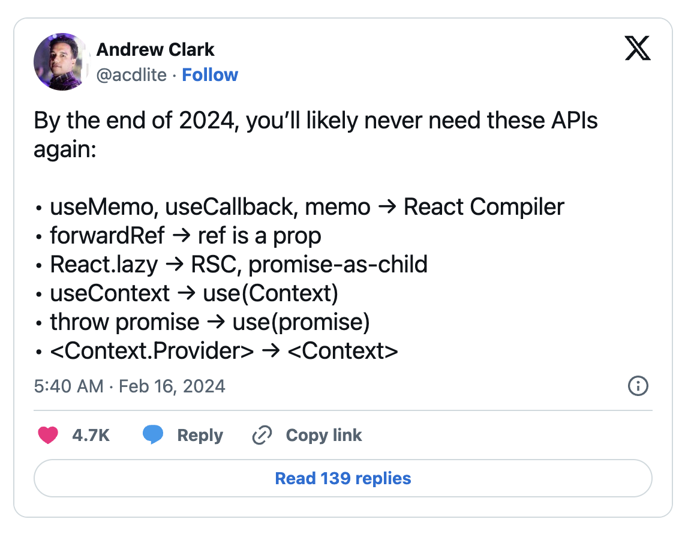

# 버전 관리 정책

[Latest](https://react.dev/community/versioning-policy#latest-channel)

- 안정적인 semver React 릴리스 버전입니다. npm에서 React 설치해서 사용이 가능합니다.
- [https://github.com/facebook/react/blob/main/CHANGELOG.md](https://github.com/facebook/react/blob/main/CHANGELOG.md)

[Canary](https://react.dev/community/versioning-policy#canary-channel)

- semver의 다음 릴리즈 후보 버전입니다. 최신 버전을 기준으로 주요 변경 사항이 포함될 수 있으며, 버그 수정등의 선별된 기능을 제공하고 있습니다.
- [https://github.com/facebook/react/blob/main/CHANGELOG-canary.md](https://github.com/facebook/react/blob/main/CHANGELOG-canary.md)

[Experimental](https://react.dev/community/versioning-policy#experimental-channel)

- 안정적인 semver 릴리스에서 사용할 수 없는 실험적 API 및 기능이 포함됩니다. 실험적으로 테스트해볼 경우 추가 기능에 대한 플래그를 키거나, 제한된 범위에서 사용해주시기 바랍니다.

# 왜 React Next를 알아야 할까요??

- Next13/14 변경 사항을 보면 React Canary 버전에 다수 포함되었음을 확인이 가능합니다.
- React 신규 버전 논의 시 NextJS 개발자분들과 긴밀하게 소통하고 있다고 하니, 어떤 문법이 추가되고 미리 학습을 해놓는다면 조금은 도움이 될꺼 같습니다.

# React 향후 변경사항

- 리액트 core team 멤버인 Andrew Clark Twitter(X)에서 리액트 버전에 대한 언급
  [Andrew Clark (@acdlite) on X](https://twitter.com/acdlite)
- 2024년 말쯤에 아래 기능들이 변경될 예정이라고 하네요.



## REACT Compiler (React Forget으로 알려진)

리액트 개발자로서 useCallback, useMemo, memo에 대해 불만이 없는 사람은 없을 것입니다. 리액트가 꽤 오랫동안 명시적인 방식을 고수했다면, 다른 프레임워크는 성능 향상을 위해 이러한 유틸리티가 필요하지 않으며 기본적으로 빠릅니다.

하지만 리액트 팀은 리액트 애플리케이션의 모든 메모화를 자동화하는 [React Compiler](https://www.youtube.com/watch?v=lGEMwh32soc)라는 컴파일러를 (비교적 조용히) 개발 중입니다. 함수(useCallback), 값(useMemo), 컴포넌트(memo)를 메모하는 수동 프로세스가 앞으로는 사라질 것으로 기대됩니다. 리액트가 이 모든 것을 메모화하여 다음 렌더링에서 모든 것을 다시 계산할 필요가 없도록 처리할 것입니다.

최근에는 프로덕션 환경에서 instagram.com에 라이브 환경에 적용했으며, 추가적으로 오픈 소스 릴리즈 준비를 하고 있다고 합니다.

아마도 해당 기능에 대한 추가적인 정보/영상은 2024년 5월에 개최될 [React Conf 2024](https://conf.react.dev/)에서 발표될 것으로 예상하고 있습니다.

- 리액트 컴파일러 영상: [https://www.youtube.com/watch?v=qOQClO3g8-Y](https://www.youtube.com/watch?v=qOQClO3g8-Y)
  - instagram.com의 한 페이지에는 React Compiler를 사용해 본 경험

## forwardRef → ref is a prop

- forwardRef 감싸서 ref 넘기는 문법에서 ref를 그대로 prop로 넘기도록 변경

## React.lazy → RSC, promise-as-child

- Automatic Code Splitting
  - 기존에 code splitting을 위해서는 lazy load 또는 dynamic import를 활용해야 했다.
  - RSC에서는 client component를 import하는 경우 자동으로 dynamic import가 적용된다.
    - [react RSC (feat.NextJS)](https://velog.io/@gouz7514/react-RSC-feat.NextJS)

## [use](https://react.dev/reference/react/use)

- useContext → use
  - useContext 사용법은 동일하나, 조건문에서도 사용이 가능한 것이 특징입니다.
  ```tsx
  function HorizontalRule({ show }) {
    if (show) {
      const theme = use(ThemeContext);
      return <hr className={theme} />;
    }
    return false;
  }
  ```
- throw Promise → use

  - promise를 use로 감싸고 상위에 Suspense로 감싸서 사용하면 됩니다.
  - 아래 코드를 보시다시피 간결하게 코드를 작성할 수 있으므로, 기존에 사용하던 비동기 라이브러리를 대체가 가능할 것으로 보입니다.

  ```tsx
  import { use } from 'react';

  async function fetchData() {
  	return await fetch(...)
  }

  function Component({ isFlag }) {
      let data = '';
      if (isFlag) {
        data = use(fetchData);
      } else {
        data = use(fetchData);
      }

      return <div>{data}</div>
  }

  import { Suspense } from 'react';

  function Container() {
    return (
      <div>
        <Suspense fallback={<Loading />}>
          <Component />
        </Suspense>
      </div>
    );
  }

  ```

- 그외 공유사항

  - Suspense 동작원리

    - [Suspense의 동작 원리](https://velog.io/@seeh_h/suspense의-동작원리)

    ```tsx
      public componentDidCatch(catchedPromise: any) {
        if (isPromise(catchedPromise)) {
          this.setState({ pending: true });

          catchedPromise
            .then(() => {
              this.setState({ pending: false });
            })
            .catch((err) => {
              this.setState({ error: err || new Error("Suspense Error") });
            });
        } else {
          throw catchedPromise;
        }
      }
    ```

  - throw Promise → componetDidCatch(Suspend) → pending, fullfiled, error

## Context.Provider → Context

- 간소화된 문법으로 변경 예정

# React Canary 변경사항

## Directives

[use client](https://react.dev/reference/react/use-client)와 [use server](https://react.dev/reference/react/use-server)는 full-stack React frameworks를 위해 설계된 번들러 기능으로써 2개의 환경을 나눠서 처리가 가능해졌습니다.

이들을 함께 사용하면 관련 서버 측 로직과 클라이언트 측 상호 작용을 구성하는 재사용 가능한 컴포넌트를 작성할 수 있습니다.

## Actions(Server Action)

클라이언트에서 서버로 데이터 전송을 관리하기 위한 Form 관련 Actions가 추가되었습니다.

- [form](https://react.dev/reference/react-dom/components/form) 엘리먼트 속성에 action 추가 구현 (클라이언트/서버 컴포넌트 둘다 사용 가능)

  - 예제코드

    ```tsx
    // 클라이언트에서 form 제출 처리
    export default function Search() {
      function search(formData) {
        const query = formData.get('query');
        alert(`You searched for '${query}'`);
      }
      return (
        <form action={search}>
          <input name="query" />
          <button type="submit">Search</button>
        </form>
      );
    }

    // 서버에서 form 제출 처리
    import { updateCart } from './lib.js';

    function AddToCart({ productId }) {
      async function addToCart(formData) {
        'use server';
        const productId = formData.get('productId');
        await updateCart(productId);
      }

      // 추가적인 인수 제공
      const addProductToCart = addToCart.bind(null, productId);

      return (
        <form action={addProductToCart}>
          <input type="hidden" name="productId" value={productId} />
          <button type="submit">Add to Cart</button>
        </form>
      );
    }
    ```

- [useFormStatus](https://react.dev/reference/react-dom/hooks/useFormStatus)

  - 마지막 Form 제출의 상태 정보를 제공하는 hook
    - pending: pending 여부 (boolean)
    - data: form에서 사용하고 있는 값들
    - method: form이 어떤 HTTP 메서드를 사용하고 있는지
    - action: 부모(form)에 전달된 action
  - 예제코드

    ```tsx
    import { useFormStatus } from 'react-dom';
    import action from './actions';

    function Submit() {
      const status = useFormStatus();
      return <button disabled={status.pending}>Submit</button>;
    }

    export default function App() {
      return (
        <form action={action}>
          <Submit />
        </form>
      );
    }
    ```

- [useFormState](https://react.dev/reference/react-dom/hooks/useFormState)

  - formAction을 도와주는 훅으로 이 훅을 통해 반환된 결과 값도 얻을 수 있는 hook
  - 예제코드

    ```tsx
    // ./actions.js
    "use server";

    export async function addToCart(prevState, queryData) {
      const itemID = queryData.get('itemID');
      if (itemID === "1") {
        return `Added to cart ${prevState}`;
      } else {
        return "Couldn't add to cart: the item is sold out.";
      }
    }

    // app.js
    import { useState } from "react";
    import { useFormState } from "react-dom";
    import { addToCart } from "./actions.js";

    function AddToCartForm({itemID, itemTitle}) {
      const [state, formAction] = useFormState(addToCart, 0 <!-- initialstate -->);
      return (
        <form action={formAction}>
          <h2>{itemTitle}</h2>
          <input type="hidden" name="itemID" value={itemID} />
          <button type="submit">Add to Cart</button>
          {state}
        </form>
      );
    }
    ```

- [useOptimistic](https://react.dev/reference/react/useOptimistic)

  - 네트워크 요청과 같은 백그라운드 작업이 완료되기 전에 사용자 인터페이스를 낙관적으로 업데이트하는 방법을 제공하기 위한 hook
  - 예제코드

    ```tsx
    import { useOptimistic, useState, useRef } from 'react';
    import { deliverMessage } from './actions.js';

    function Thread({ messages, sendMessage }) {
      const [optimisticMessages, addOptimisticMessage] = useOptimistic(
        messages,
        (state, newMessage) => [
          ...state,
          {
            text: newMessage,
            sending: true,
          },
        ],
      );

      const formRef = useRef();
      async function formAction(formData) {
        addOptimisticMessage(formData.get('message')); // 낙관적 UI 메시지를 세팅
        formRef.current.reset();
        await sendMessage(formData);
      }
      return (
        <>
          {optimisticMessages.map(
            (
              message,
              index, // 낙관적 UI 보여주기 위한 데이터
            ) => (
              <div key={index}>
                {message.text}
                {!!message.sending && <small> (Sending...)</small>} // 상태가 sending일
                경우 예외처리
              </div>
            ),
          )}
          <form action={formAction} ref={formRef}>
            <input type="text" name="message" placeholder="Hello!" />
            <button type="submit">Send</button>
          </form>
        </>
      );
    }

    export default function App() {
      const [messages, setMessages] = useState([
        { text: 'Hello there!', sending: false, key: 1 },
      ]);
      async function sendMessage(formData) {
        const sentMessage = await deliverMessage(formData.get('message'));
        setMessages(messages => [...messages, { text: sentMessage }]);
      }
      return <Thread messages={messages} sendMessage={sendMessage} />;
    }
    ```

## Document Metadata

구성 요소 트리의 어느 곳에서나 [\<title\>](https://react.dev/reference/react-dom/components/title), [\<meta\>](https://react.dev/reference/react-dom/components/meta) 및 metadata [\<link\>](https://react.dev/reference/react-dom/components/link) 태그 렌더링에 대한 내장 지원을 추가했습니다.

서버/클라이언트 컴포넌트 모두 지원하며, 기존에 사용중이던 React Helmet과 같은 라이브러리가 개척한 기능에 대해서 내재화를 뜻합니다.

## Asset Loading

Suspense를 stylesheets, fonts, scripts와 같은 리소스의 로딩 라이프사이클과 통합하여 React가 [\<style\>](https://react.dev/reference/react-dom/components/style), [\<link\>](https://react.dev/reference/react-dom/components/link), [\<script\>](https://react.dev/reference/react-dom/components/script)와 같은 요소의 콘텐츠를 표시할 준비가 되었는지 확인합니다.

또한 리소스를 로드하고 초기화해야 하는 시기를 더 잘 제어할 수 있도록 preload 및 preinit와 같은 새로운 [Resource Loading APIs](https://react.dev/reference/react-dom#resource-preloading-apis)를 추가했습니다.

- [prefetchDNS](https://react.dev/reference/react-dom/prefetchDNS) : 연결하려는 DNS 도메인 이름의 IP 주소를 미리 가져온다.

  ```tsx
  import { prefetchDNS } from 'react-dom';

  function AppRoot() {
    prefetchDNS('https://example.com');
    // ...
  }
  ```

- [preconnect](https://react.dev/reference/react-dom/preconnect) 리소스를 요청할 것으로 예상되는 서버에 연결할 때 사용한다.

  ```tsx
  import { preconnect } from 'react-dom';

  function AppRoot() {
    preconnect('https://example.com');
    // ...
  }
  ```

- [preload](https://react.dev/reference/react-dom/preload) 사용할 것으로 예상되는 스타일시트, 글꼴, 이미지 또는 외부 스크립트를 가져 올 때 사용한다.

  ```tsx
  import { preload } from 'react-dom';

  function AppRoot() {
    preload('https://example.com/font.woff2', { as: 'font' });
    // ...
  }
  ```

- [preloadModule](https://react.dev/reference/react-dom/preloadModule) 사용하려는 ESM 모듈을 가져올 수 있습니다.

  ```tsx
  import { preloadModule } from 'react-dom';

  function AppRoot() {
    preloadModule('https://example.com/module.js', { as: 'script' });
    // ...
  }
  ```

- [preinit](https://react.dev/reference/react-dom/preinit) 스크립트나 스타일시트를 사전 초기화할 경우 사용된다.

  ```tsx
  import { preinit } from 'react-dom';

  function AppRoot() {
    preinit('https://example.com/script.js', { as: 'script' });
    // ...
  }
  ```

- [preinitModule](https://react.dev/reference/react-dom/preinitModule) ESM 모듈을 사전 초기화 할 경우 사용된다.

  ```tsx
  import { preinitModule } from 'react-dom';

  function AppRoot() {
    preinitModule('https://example.com/module.js', { as: 'script' });
    // ...
  }
  ```

# 추후 삭제될 API

- [findDOMNode](https://react.dev/reference/react-dom/findDOMNode): 클래스 구성 요소 인스턴스에 해당하는 가장 가까운 DOM 노드를 찾을 경우 호출

# 참고페이지

- [React Trends in 2024](https://www.robinwieruch.de/react-trends/)
- [(번역) 2024 리액트 트렌드](https://ykss.netlify.app/translation/react_trends_in_2024/?utm_source=substack&utm_medium=email)
- [React Labs: What We've Been Working On – February 2024 – React](https://react.dev/blog/2024/02/15/react-labs-what-we-have-been-working-on-february-2024)
- [React 19가 다가온다](https://bysxx.tistory.com/47)
- [Exploring the Exciting Upgrades of React 19](https://medium.com/@kilian.cannet/exploring-the-exciting-upgrades-of-react-19-8d876f5dcd51)
- [기술 뉴스 #241 : 24-03-01 :: Outsider's Dev Story](https://blog.outsider.ne.kr/1710?fbclid=IwAR0zcTBNYeNmrNz5B4SL3C-3osoSSCWmfK2cKrGvtM2OYrnzTDBLbxEdc60_aem_AUP0Uw5cEBzJpnMUsRB-l1HkFCINBpa3U_QRBRPK2WVQSmfwX7Zz1aXeODZu-URvV_I&mibextid=S66gvF)
- [Versioning Policy – React](https://react.dev/community/versioning-policy)
- [번역) React Labs: What We've Been Working On – February 2024](https://wonse.dev/posts/react-dev-blog-february-2024)
