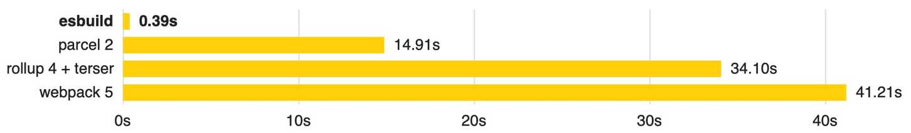

# Characteristics of esbuild

- **Written in Go and compiled using static (native) code**
  There are three ways to describe how code written in a programming language is converted into machine language that a machine can understand.
  - Static compilation
    - Because the entire program is converted into machine language during compilation, the total execution time is shorter.
    - However, compilation takes a long time, and the code must be compiled differently for each platform (Mac, Windows).
  - Interpreter
    - This approach reads the programming language one statement at a time and converts it into machine language. Because it converts and runs incrementally, the initial startup is fast (adopted by JavaScript).
    - However, the total execution time is slower than static compilation, and it is inefficient because it has to translate the same code the same way every time it encounters it.
  - JIT (Just in Time)
    - This approach translates a statement, stores the translated result in a cache, and if it encounters the same statement again, it uses the machine code stored in the cache to execute it.
    - It uses a mix of static compilation and interpretation (V8 engine).
      Because esbuild is written in Go and compiles using the static compilation approach, it can reduce the total execution time.
- **Heavily uses parallel processing**
  Parallel processing is another factor that contributes to the performance improvement.
  Because the JavaScript engine runs on a single thread, it can only operate on one thread, which limits processing speed.
  esbuild, written in Go, uses the operating system's parallel processing and maximizes CPU usage to perform bundling, which is why it is said to be highly performant.
- **Uses memory efficiently**
  It maximizes CPU cache usage, minimizes AST data conversion as much as possible, and reuses data.

Thanks to the three characteristics above, esbuild is said to be able to compile builds about 10-100 times faster overall^^



# Reasons for Using esbuild-loader

To improve the build speed of the service, I decided to measure the current build time to identify where most of the time is being spent, using speed-measure-webpack-plugin.

This plugin measures and reports the time each Loader and Plugin takes as well as the total time during a build, and you can install and use it as shown below.

- Loader
  - Performs a preprocessing step that transforms a module's source code when each file is imported or loaded during the build process
  - webpack basically understands only JS / JSON files → it performs the work of converting other web resources (HTML, CSS, Images, fonts, etc.)
- Plugin
  - While a loader is involved in the process of interpreting and transforming files, a plugin is responsible for changing the form of the resulting output
  - A feature that provides additional functionality on top of the basic behavior

## Measuring Build Speed


```tsx
yarn add -D speed-measure-webpack-plugin
```

### Let's measure the speed.

After measuring, I was able to confirm that, in order of slowest build time, babel-loader, the Terser Plugin, and OptimizeCssAssetsWebpackPlugin took the longest.

- Summary of the Loaders and Plugins involved in the performance measurement
  - **babel-loader**
    - Converting syntax of ES6 or higher into ES5 or lower code is called **transpiling**, and this is done by babel; babel-loader is what integrates this babel with webpack.
  - **optimize-css-assets-webpack-plugin**
    - If HtmlWebpackPlugin is a plugin that compresses HTML, optimize-css-assets-webpack-plugin is a plugin that compresses CSS.
  - **terser-webpack-plugin**
    - The series of operations that converts the code we write into a lighter version that provides the same functionality—such as mangling or compressing the code—is called minify or minification (code minification), and the tool that performs code minification is called a minifier. terser-webpack-plugin is a plugin that helps deliver the JavaScript code we write in a more minified state in production.
  - **css-loader, postcss-loader, sass-loader**
    - **postcss-loader**: A tool that transforms styles through JS plugins.
    - **sass-loader**: sass-loader is a third-party package rather than a feature managed and maintained by webpack; because browsers cannot recognize sass, it **transpiles** it into css.
    - **css-loader**: Converts css files into js code.
  - **IgnorePlugin**
    - Configures the files to ignore during bundling using regular expressions or filter functions.
  - **file-loader**: Handles making files usable as modules. It moves the actually used files to the output directory.
  - **url-loader**: Handles converting files into base64 urls. Rather than moving files, it converts them and stores them in the output directory.

# Introducing esbuild-loader to Leverage the Strengths of Both webpack and esbuild

As mentioned above, it would be nice to adopt esbuild as the bundler, but esbuild does not support all of the loaders and plugins used in the existing webpack, and it is also difficult to abandon webpack, which has a wealth of reference material for when issues arise. For these reasons, I ended up adopting esbuild-loader to benefit only from esbuild's speed while keeping webpack.

Rather than using webpack + babel/plugin, using webpack-[esbuild-loader/minifycss] provides an alternative that can make the transpilation and Minification steps faster.

## Installation

```tsx
npm install -D esbuild-loader
or
yarn add -D esbuild-loader
or
pnpm add -D esbuild-loader
```

## Quick Setup

### esbuild automatically decides how to process each file based on its extension

```tsx
// webpack.config.js
  module.exports = {
      module: {
          rules: [
-             // Transpile JavaScript
-             {
-                 test: /\.js$/,
-                 use: 'babel-loader'
-             },
-
-             // Compile TypeScript
-             {
-                 test: /\.tsx?$/,
-                 use: 'ts-loader'
-             },
+             // Use esbuild to compile JavaScript & TypeScript
+             {
+                 // Match `.js`, `.jsx`, `.ts` or `.tsx` files
+                 test: /\.[jt]sx?$/,
+                 loader: 'esbuild-loader',
+                 options: {
+                     // JavaScript version to compile to
+                     target: 'es2015'
+                 }
+             },
          ],
      },
  }
```

### Forcing a specific loader onto a different file extension

```tsx
// webpack.config.js
 {
     test: /\.js$/,
     loader: 'esbuild-loader',
     options: {
+        // Treat `.js` files as `.jsx` files
+        loader: 'jsx',

         // JavaScript version to transpile to
         target: 'es2015'
     }
 }
```

### Ensuring compatibility with older JavaScript engines

```tsx
// webpack.config.js
{
     test: /\.[jt]sx?$/,
     loader: 'esbuild-loader',
     options: {
+        target: 'es2015',
     },
 }
```

### TypeScript Support

- esbuild-loader supports TypeScript compilation
- If there is a tsconfig.json at the root path, esbuild-loader loads it automatically
- However, if you configured the config file differently, set it in options as shown below
  ```tsx
   // webpack.config.js
   {
       test: /\.tsx?$/,
       loader: 'esbuild-loader',
       options: {
  +        tsconfig: './tsconfig.custom.json',
       },
   },
  ```

### **EsbuildPlugin**

**Minification**

- Esbuild supports JavaScript minification and provides code compression features similar to Terser or UglifyJs
- In addition, depending on the configuration, it also supports CSS minification. However, a CSS loading feature such as css-loader must already be configured.
- It can be used as an alternative to terser-webpack-plugin and mini-css-extract-plugin/optimize-css-assets-webpack-plugin.

```tsx
// webpack.config.js
const { EsbuildPlugin } = require('esbuild-loader')

  module.exports = {
      ...,

+     optimization: {
+         minimizer: [
+             new EsbuildPlugin({
+                 target: 'es2015'  // Syntax to transpile to (see options below for possible values)
+                 css: true  // Apply minification to CSS assets
+             })
+         ]
+     },
  }

```

**CSS-in-JS**

- If you are using a CSS-in-JS approach such as styled-components or emotion, CSS is optimized as shown below

```tsx
// webpack.config.js
module.exports = {
      // ...,

      module: {
          rules: [
              {
                  test: /\.css$/i,
                  use: [
                      'style-loader',
                      'css-loader',
+                     {
+                         loader: 'esbuild-loader',
+                         options: {
+                             minify: true,
+                         },
+                     },
                  ],
              },
          ],
      },
  }
```

**Defining constants**

- The webpack DefinePlugin can be replaced with esbuild-loader's define property.

```tsx
- const { DefinePlugin } = require('webpack')
+ const { EsbuildPlugin } = require('esbuild-loader')

  module.exports = {
      // ...,

      plugins:[
-         new DefinePlugin({
-             'process.env.NODE_ENV': JSON.stringify(process.env.NODE_ENV),
-         })
+         new EsbuildPlugin({
+             define: {
+                 'process.env.NODE_ENV': JSON.stringify(process.env.NODE_ENV),
+             },
+         }),
      ]
  }
```

## CRA + react-app-rewired

**Applying esbuild-loader**

- Remove the babel-loader rules used internally by CRA
- Apply esbuild-loader
  - Remove the built-in babel-loader and babel-runtime plugins

```tsx
// config-override.js
{
  // Match `.js`, `.jsx`, `.ts` or `.tsx` files
  test: /\.[jt]sx?$/,
  loader: 'esbuild-loader',
  options: {
    target: 'es2015',
  },
},

const removeBabelImportsFromExternalPaths = (webpackConfig) => {
  const oneOfRule = webpackConfig.module.rules.find((rule) => rule.oneOf);

  if (oneOfRule) {
    oneOfRule.oneOf = oneOfRule.oneOf.filter((rule) => !rule.test || !rule.test.toString().includes('js'))
  }
};

removeBabelImportsFromExternalPaths(modifiedConfig);
```

### **Applying EsbuildPlugin**

- Remove the terser-webpack-plugin and optimize-css-assets-webpack-plugin used internally by CRA
- Apply EsbuildPlugin

```tsx
// config-override.js

modifiedConfig.optimization.minimizer = webpackConfig.optimization.minimizer.filter((plugin) => ['TerserPlugin', 'OptimizeCssAssetsWebpackPlugin'].indexOf(plugin.constructor.name) < 0);;

{
	optimization: {
      minimize: isEnvProduction,
      minimizer: [
        new EsbuildPlugin({
          target: ['es2015'],
          css: true,
        }),
      ],
}
```

# References

- [https://github.com/privatenumber/esbuild-loader](https://github.com/privatenumber/esbuild-loader)

- [Why is esbuild fast? (Korean translation)](https://gusrb3164.github.io/web/2022/04/16/esbuild/)
