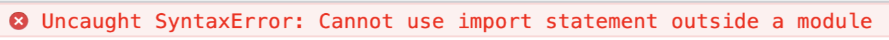
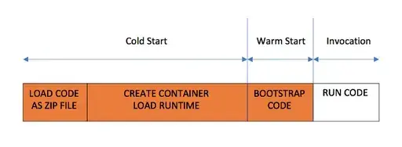
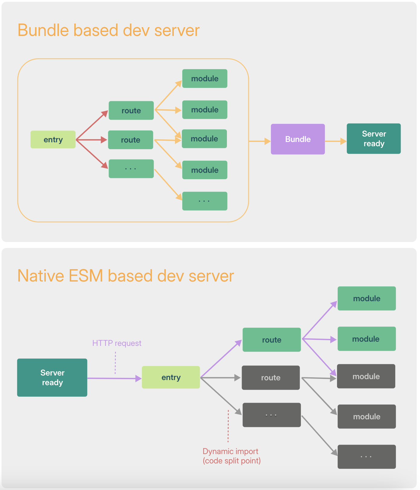
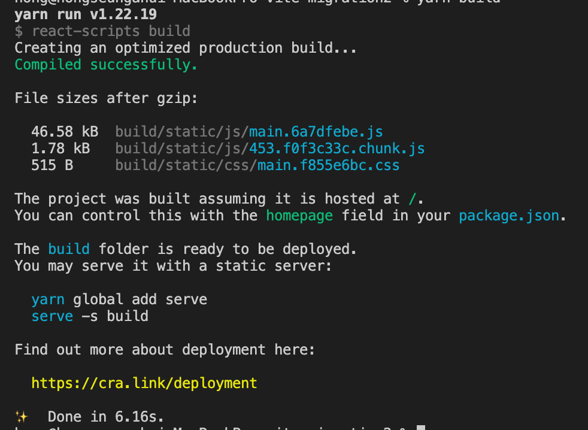
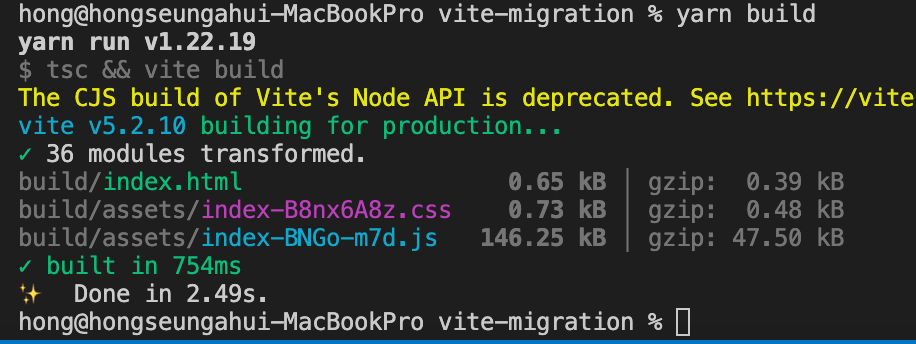
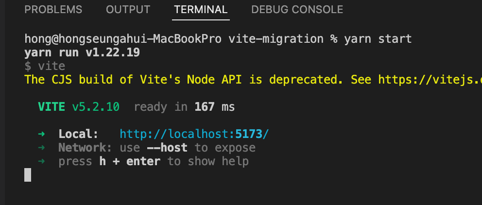

# Vite를 사용해야 하는 이유

## 기존 모듈 번들러 문제점

- 브라우저에서 Native ESM 방식을 지원하기 전까지는 Javascript 모듈화를 브라우저 레벨에서 진행할 수 없었고, 해당 소스 모듈을 브라우저에서 지원하기 위해서 require/IIFE/import,expor를 통한 모듈화 문법을 이용하여서 여러개의 파일로 합쳐주거나 의미 있는 단위로 묶어주는 기능을 번들링이라고 하며, 현재는 [Webpack](https://webpack.js.org/), [Rollup](https://rollupjs.org/) 그리고 [Parcel](https://parceljs.org/)을 도구들이 지원하고 있습니다.
- 하지만 애플리케이션이 점점 더 발전함에 따라서 JS 도구들의 성능 병목 현상이 발생, HMR 사용하더라도 변경된 파일 적용 시 수초가 걸려서 개발자 생산성을 떨어뜨는 문제가 발생하고 있습니다.
- ESM(ECMAScript Modules)

  - ESM은 모듈화 문법인 import, export를 별도의 도구 없이 브라우저 자체에서 소화해 낼 수 있는 모듈 방식을 의미한다. 만약 아래와 같은 코드를 웹팩과 같은 번들러 없이 브라우저에서 실행하면 에러가 발생합니다.

  ```tsx
  // app.js
  import { sum } from 'test.js'
  console.log(sum(1,2));

  <script src="app.js></script>
  ```

  
  예전에는 브라우저가 import와 export를 해석할 수 있는 능력이 없었지만 이제는 다음과 같이 속성을 추가하면 브라우저에서 import와 export를 소화할 수 있게 되었습니다.

  ```tsx
  <script type="module" src="app.mjs></script>
  ```

## Vite 특징

- 콜드 스타트 방식의 개발 서버 구동에 대한 성능 개선
  

  - Dependencies: node_modulesd와 같이 내용이 바뀌지 않는 소스코드에 대해서 esbuild 이용한 사전 번들링 기능 제공

    - esbuild는 webpack, parcel과 같은 기존의 번들러 대비 10-100배 빠른 속도를 제공
    - esbuild 로 node_modules 의 모든 패키지를 사전 번들링하여 아래와 같이 serving 하고 캐시

      ```tsx
      // Dependencies package import 할 경우
      import dayjs from 'dayjs';

      // vite esm 지원을 위한 변환/캐싱
      /node_modules/.vite/deps/dayjs.js?v=b09621d8
      ```

  - Source code: Native ESM 방식을 적용해서 브라우저가 모듈을 직접 가져오고 변환 및 제공하도록 처리
    

- HMR 성능 개선
  기존 번들러 기반에서는 소스 코드 변경 시 다시 번들링 과정을 다시 수행하다보니 성능이 느려지는 이슈를 Native ESM 방식을 사용하여 변경된 모듈만 교체해서 성능 개선
  HTTP 헤더를 활용하여 페이지 로드 속도 개선(요청 횟수 최소화)
  - 304 Not Modified: 클라이언트 캐시 사용
  - Cache-Control: max-age=31536000, immutalble 이용한 캐시 사용
- 프로덕션 환경 Rollup 사용
  - 가장 빠른 성능을 자랑하는 esbuild이지만 아쉬운 생태계와 브라우저용 번들링에서는 안정성이 떨어진다는 평가가 있어서 vite에서는 프로덕션 환경에서 Rollup 번들러를 사용(트리 셰이킹, 지연로딩, 파일 분활 등 성능 이점 제공)
  - Rollup은 v4에서 파서를 SWC 전환 → Rust 포팅인 Rolldown 만드는 작업을 진행 중이며 개발이 완료된다면 esbuild를 모두 대체 가능(개발/빌드 사이에 불이치 제거 목표)

# CRA to Vite Migration

### **Setting the Stage with Vite Installation**

- @vitejs/plugin-react : @vitejs/plugin-react는 Vite에서 React를 사용할 때 필요한 구성을 추가하여 React 애플리케이션의 빠른 개발 및 번들링을 지원
- vite-tsconfig-paths : tsconfig.json 파일에 설정된 경로 별칭을 Vite에서도 적용할 수 있도록 지원. vite-tsconfig-paths를 사용하면 TypeScript 설정에 정의된 경로 별칭이 Vite에서도 인식되어 모듈 경로를 해석할 때 사용 가능
- @svgr/rollup : SVGR을 Rollup 번들러에서 사용할 수 있도록 지원. SVGR은 SVG 파일을 React 컴포넌트로 변환하여, JSX로 SVG를 쉽게 조작하고 스타일링. @svgr/rollup은 Rollup의 플러그인으로서 SVGR을 프로젝트에 통합하여 SVG 파일을 React 컴포넌트로 자동으로 변환할 수 있도록 지원

```tsx
npm install vite @vitejs/plugin-react vite-tsconfig-paths @svgr/rollup vite-plugin-minify

npm uninstall react-scripts
```

### **Updating package.json for Vite Commands**

```tsx
"scripts": {
  "start": "vite",
  "build": "vite build",
  "preview": "vite preview"
},
```

### **Renaming File Extensions to .jsx or .tsx**

```tsx
mv src/App.js src/App.jsx
mv src/index.js src/index.jsx
```

### **Crafting the Vite Configuration**

- define: { global: '{}' }
  - Node.js 환경에서 사용되는 global 객체를 웹 환경에서도 사용할 수 있도록 하여 호환성을 보장하고, 라이브러리나 모듈의 원활한 사용을 지원하기 위한 것

```tsx
// vite.config.js
import { defineConfig } from 'vite';
import react from '@vitejs/plugin-react';
import viteTsconfigPaths from 'vite-tsconfig-paths';
import svgr from '@svgr/rollup';

export default defineConfig(() => {
  return {
    build: {
      outDir: 'build', // build 폴더명 변경(기본 dist)
    },
    define: {
			global: '{}',  // 글로벌 객체를 빈 객체로 대체
		},vi
    plugins: [react(), viteTsconfigPaths(), svgr()],
    server: {
        // this ensures that the browser opens upon server start
        open: true,
        // this sets a default port to 3000
        port: 3000,
    },
  };
});
```

### **Create a Vite Types File Reference**

For client side code, [Vite provides the type definitions](https://vitejs.dev/guide/env-and-mode.html#intellisense-for-typescript) in [`vite/client.d.ts`](https://github.com/vitejs/vite/blob/main/packages/vite/client.d.ts).

- create file src/vite-env.d.ts

```tsx
/// <reference types="vite/client" />
```

### Move the index.html File

```tsx
mv public/index.html .
```

### **Rehousing the index.html File**

- Remove %PUBLIC_URL%

```tsx
<script type="module" src="/src/index.jsx"></script> -
  <link rel="icon" type="image/svg+xml" href="%PUBLIC_URL%/favicon.svg" /> +
  <link rel="icon" type="image/svg+xml" href="/favicon.svg" />;
```

### **Add module script to the bottom of the body tag**

Vite treats `index.html` [as source code and part of the module graph](https://vitejs.dev/guide/#index-html-and-project-root)

```tsx
<body>
  {/* others here */}
  <script type="module" src="/src/index.tsx"></script>
</body>
```

### Update tsconfig.json

```tsx
{
    "compilerOptions": {
        "lib": ["dom", "dom.iterable", "esnext"],
        "target": "ESNext",
         "types": ["vite/client", "react", "react-dom", "node"], // 추가
         "isolatedModules": true, // 추가
    },
 }
```

### **ChangeEnv Variables and Modes**

```tsx
// .env Files
.env                # loaded in all cases
.env.local          # loaded in all cases, ignored by git
.env.[mode]         # only loaded in specified mode
.env.[mode].local   # only loaded in specified mode, ignored by git

// HTML Env Replacement(CRA 동일한 기능 제공)
<h1>Vite is running in %MODE%</h1>
<p>Using data from %VITE_API_URL%</p>

// Modes
# .env.staging
VITE_APP_TITLE=My App

// command mode option flag
vite build --mode staging
```

### **global is not defined error**

```tsx
// vite.config.ts
import { defineConfig } from 'vite';
import react from '@vitejs/plugin-react';

export default defineConfig({
  // ...
  define: {
    // here is the main update
    global: 'globalThis',
  },
});
```

### Update process.env.REACT_APP

```tsx
- process.env.REACT_APP_VARIABLE
+ import.meta.env.VITE_VARIABLE(이름 변경은 선택)
```

### Replace REACT*APP* with VITE\_

```tsx
- REACT_APP_API_BASE
+ VITE_API_BASE(이름 변경은 선택)
```

### Modify Jest Configration

- **Install Jest and TypeScript-related Dependencies**

  ```tsx
  yarn add -D jest @types/jest ts-jest jest-environment-jsdom

  OR

  npm install --save-dev jest @types/jest ts-jest jest-environment-jsdom
  ```

- **Update Jest Config**
  ```tsx
  // package.json
  "jest": {
    "preset": "ts-jest/presets/js-with-ts",
    "testEnvironment": "jest-environment-jsdom",
    "moduleNameMapper": {
      "\\.(jpg|jpeg|png|gif|eot|otf|webp|svg|ttf|woff|woff2|mp4|webm|wav|mp3|m4a|aac|oga)$": "<rootDir>/__mocks__/fileMock.js",
      "\\.(css|less)$": "<rootDir>/__mocks__/styleMock.js"
    },
    "modulePaths": [
      // you can update this to match your application setup
      "<rootDir>/src"
    ],
  },
  ```
- **Add the **mocks** Directory to the Root of Your Project**

  ```tsx
  // __mocks__//styleMock.js
  module.exports = {};

  // __mocks__//fileMock.js
  module.exports = 'test-file-stub';
  ```

- **Update the package.json Scripts**

  ```tsx
  // Before
  "scripts": {
      "test": "react-app-rewired test"
  }

  // After
  "scripts": {
      "test": "jest test"
  }
  ```

- **TroubleShooting**
  **unexpected Warning: ReactDOMTestUtils.act is deprecated in favor of React.act.**
  [https://github.com/facebook/react/issues/29000](https://github.com/facebook/react/issues/29000)

  ```tsx
  // upgrade @testing-library/react (>=v15.0.6)
  "@testing-library/react": "^15.0.6",
  ```

  **Property 'toBeInTheDocument' does not exist on type 'JestMatchers<HTMLElement>'**

  ```tsx
  // create ./jest-setup.ts
  import '@testing-library/jest-dom';

  // package.json
  "testEnvironment": "jest-environment-jsdom" // 추가
  ```

### Storybook for Vite

- Setup

  ```tsx
  // install
  yarn add --dev @storybook/builder-vite

  // include the builder
  //// .storybook/main.ts
  export default {
    stories: ['../src/**/*.mdx', '../stories/**/*.stories.@(js|jsx|mjs|ts|tsx)'],
    addons: ['@storybook/addon-links', '@storybook/addon-essentials'],
    core: {
      builder: '@storybook/builder-vite', // 👈 The builder enabled here.
    },
    async viteFinal(config, { configType }) { // configuration
      // Merge custom configuration into the default config
      const { mergeConfig } = await import('vite');

      if (configType === 'DEVELOPMENT') {
        // Your development configuration goes here
      }
      if (configType === 'PRODUCTION') {
        // Your production configuration goes here.
      }

      return mergeConfig(config, {
        // Add dependencies to pre-optimization
        optimizeDeps: {
          include: ['storybook-dark-mode'],
        },
      });
    },
  };
  ```

### import.meta.glob dynamic load

Vite의 import.meta.glob을 사용하여 모든 아이콘을 동적으로 가져옴

```tsx
const icons = import.meta.glob('./*Icon.tsx');

const iconComponentPath = './aIcon.tsx';

const Icon =
  icons && icons[iconComponentPath as string]
    ? lazy(
        () =>
          icons[iconComponentPath as string]() as Promise<{
            default: ComponentType;
          }>,
      )
    : null;
```

### sass-resources-loader → preprocessorOptions.sass

공통적으로 사용되는 스타일을 전역적으로 적용할 때 사용하는 sass-resources-loader를 vite에서는 preprocessorOptions.sass로 대체가 가능

```tsx
// CRA
rules: [
  {
    test: /\.scss$/,
    use: [
      {
        loader: 'sass-resources-loader',
        options: {
          resources: [
            path.resolve(__dirname, './index.scss'),
          ],
        },
      },
    ],
    include: path.resolve(__dirname, './src'),
    exclude: /node_modules/,
  },
]

// vite.config.js
css: {
  preprocessorOptions: {
    scss: {
      // Next line will prepend the import in all you scss files as you did with your vite.config.js file
      additionalData: `
        @use './index.scss' as *;
      `,
    },
  },
},
```

### vite-plugin-html(CRA CJS 대체, Html Minify)

CRA 내부적으로 지원하는 기능을 VITE에서는 vite-plugin-html 라이브러리를 통해서 지원이 가능합니다.

```tsx
// CRA
<!DOCTYPE html>
<html lang="ko">

<head>
  <title>테스트/title>
  %CJS%
</head>

<body>
  <noscript>
    You need to enable JavaScript to run this app.
  </noscript>
  <div id="root"></div>
</body>
</html>

// VITE
<!DOCTYPE html>
<html lang="ko">

<head>
  <title>테스트/title>
  <%= CJS %> // 문자로 삽입
  <%- CJS %> // RAW 데이터 그대로 삽입
</head>

<body>
  <noscript>
    You need to enable JavaScript to run this app.
  </noscript>
  <div id="root"></div>
</body>
</html>

//// vite.config.js
import createHtmlPlugin from 'vite-plugin-html';

createHtmlPlugin({
  minify: true, // html minify
  inject: { // CJS 대체
    data: {
      CJS: 'TEST',
    },
  },
}),

```

### server(proxy, outside file)

CRA proxy 설정을 VITE proxy로 대체가 가능합니다.

VITE 환경 외에 외부 폴더/파일 접근 시 fs.allow 객체로 추가 시 dev server에서 접근이 가능

```tsx
// CRA
//// setupProxy.js
const { createProxyMiddleware } = require("http-proxy-middleware");

module.exports = function setupProxy(app) {
  app.use(createProxyMiddleware(['/test'], {
    changeOrigin: true,
	  logLevel: 'debug',
	  autoRewrite: true,
    target: 'http://www.test.kr',
    onProxyRes: (proxyRes) => {
      console.log(proxyRes);
    }),
    onProxyReq: (proxyReq) => {
      proxyReq.setHeader('origin', 'http://www.test.kr');
    },
  }));

//// vite.config.js
server: {
	proxy: {
		fs: {
	    // 허용할 디렉터리 추가 (여기에 외부 파일 경로를 추가)
	    allow: [
	      '../../../outside',
	      '/'
	    ],
	  },
		'/test': {
	    changeOrigin: true,
		  logLevel: 'debug',
		  autoRewrite: true,
	    target: 'http://www.test.kr',
	    configure: (proxy) => {
	      proxy.on('proxyRes', (proxyRes) => {
	        console.log(proxyRes);
	      }),
	      proxy.on('proxyReq', (proxyReq) => {
	        proxyReq.setHeader('origin', 'http://www.test.kr');
	      });
	    },
	  },
	},
},
```

### support svg

CRA 환경에서는 내부적으로(react-scripts) SVG 파일을 import 시 리액트 컴포넌트로 변환해주지만, VITE에서는 외부 라이브리러를 사용해서 변경을 해줘야 합니다.

@svgr/rollup: Rollup 번들러를 사용할 때 SVG 파일을 React 컴포넌트로 변환해주는 플러그인

```tsx
// src/App.js
import React from 'react';
import { ReactComponent as Icon } from './icon.svg'; // SVG 파일을 React 컴포넌트로 가져오기

function App() {
  return (
    <div>
      <h1>Hello, SVG!</h1>
      <Icon width={50} height={50} fill="red" /> {/* SVG 속성 조정 */}
    </div>
  );
}

export default App;

// vite.config.js
import svgr from '@svgr/rollup';
plugins: [
  svgr(),
],
```

## 결과

빌드 성능: **6.16s → 2.49s ( 3.67s 빠름 )**





Dev Server 구동: **167ms → 엄청 빠름^^**



# 참고페이지

- [How to Migrate from create-react-app to Vite? · CoreUI](https://coreui.io/blog/how-to-migrate-create-react-app-to-vite/)

- [How to Migrate from create-react-app to Vite using Jest and Browserslist](https://www.freecodecamp.org/news/how-to-migrate-from-create-react-app-to-vite/)

- [[vite] 프론트엔드 개발자를 위한 Vite 101](https://nyagm.tistory.com/280)

- [[JS] 비트(Vite)란? - 비트 알아보기](https://khys.tistory.com/31)

- [Webpack → Vite: 번들러 마이그레이션 이야기](https://engineering.ab180.co/stories/webpack-to-vite)

- [[vite] 프론트엔드 개발자를 위한 Vite 101](https://nyagm.tistory.com/280)
