# Overview

I would like to share some cases where I improved development productivity and build performance while working on development.

# Improving Lint Speed

To improve the speed of Lint checks via husky, I applied eslint and prettier caching.
When the cache flag is applied, files or items that were previously checked are stored in the cache, so if there are no changes, those files are not checked again.

- eslint —cache
  ```json
  "lint-staged": {
    "src/**/*.{js,jsx,ts,tsx}": [
      "eslint --cache --max-warnings=0 --fix src"
    ],
  },
  "husky": {
    "hooks": {
      "pre-commit": "lint-staged"
    }
  },
  ```
- prettier —cache
  ```json
  "lint-staged": {
    "src/**/*.{js,jsx,ts,tsx}": [
      "prettier --cache --write src"
    ],
  },
  "husky": {
    "hooks": {
      "pre-commit": "lint-staged"
    }
  },
  ```

# Reducing Build Size

## [Tree Shaking](https://seungahhong.github.io/blog/2023/08/2023-08-16-treeshaking/)

- **Module fundamentals before explaining Tree Shaking**

  - Problems that occurred back when JavaScript had no module management spec

          - Hard to manage - to **load files with script tags**, you had to add each one manually,
          - Among countless code modules, cases where **global variables get overridden** also occurred

    - The approaches to solve these problems were also all over the place - so certain libraries **created their own module objects to use $**, \_

    - **Wrapping files in an IIFE** to create them was also awkward to look at…

  - CommonJS, AMD, UMD, ESM, and others emerged

    

  - CommonJS - 2009

    - From 2005 to 2009, with the birth of J-Query/AJAX, **server-side operation** beyond just the client
    - The **module loader operates synchronously** in order to be used as a way to load local files

    - **Directly accessing the file system, it can quickly load necessary modules or data locally**

      - **Too much of a burden to use in a browser environment that operates asynchronously**

    - **Loading modules or libraries over the network** **→ increased loading time**

      ```tsx
      // test.js
      module.exports = 'hi';
      // index.js
      const Hi = require('./test.js');
      ```

      - **exports and require point to different memory addresses.**
        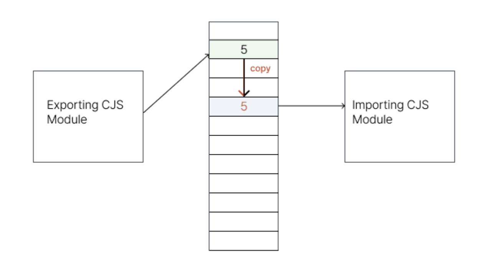
        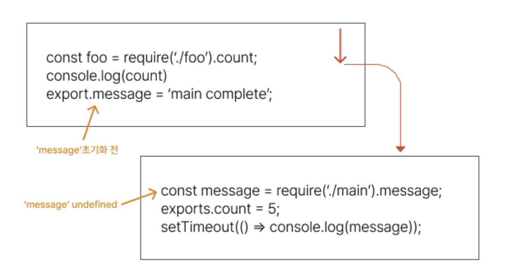

  - AMD(Asynchronous Module Definition) - 2009

    - In 2009, the **browser module standard for browser environments was designated**
    - **An open standard that defines a way to load modules and dependencies asynchronously**
    - **RequireJS**, the most widely adopted library after the standard was designated

      ```tsx
      define(['dep1', 'dep2'], function (dep1, dep2) {
        //Define the module value by returning a value.
        return function () {};
      });
      /_ RequireJS _/;
      // messages.js
      define(function () {
        return {
          getHello: function () {
            return 'Hello World';
          },
        };
      });
      // main.js
      define(function (require) {
        // Load any app-specific modules
        // with a relative require call,
        // like:
        var messages = require('./messages');
        // Load library/vendor modules using
        // full IDs, like:
        var print = require('print');
        print(messages.getHello());
      });
      ```

    - UMD (Universal Module Difinition) - 2010 - **A pattern that emerged in situations where both the CommonJS and AMD module systems had to be supported**

    ```tsx
    (function (root, factory) {
      if (typeof define === 'function' && define.amd) {
        // AMD
        define([], factory);
      } else if (typeof module === 'object' && module.exports) {
        // CommonJS
        module.exports = factory();
      } else {
        // browser
        root.isDev = factory();
      }
    })(this, function () {
      return process.env.NODE_ENV === 'development';
    });
    ```

    - ESM (esmodule) - 2015

      - **Clearly defining modules using import and export syntax → located only at the top level**
      - **Clear understanding of dependencies between each module**

        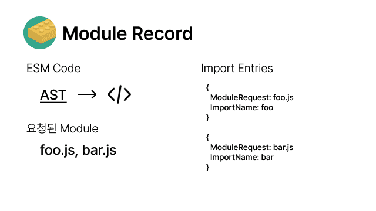

      - **import and export point to the same memory address.**
        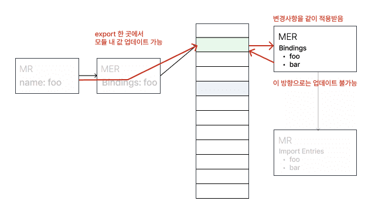
      - So does that mean Tree Shaking doesn't work in CommonJS?
        - When exports are dynamic, it's hard to include the module at the build stage.

      ```tsx
          module.exports[localStorage.getItem(Math.random())] = () => { … };
      ```

## [Removing Unused Dependency Packages](https://seungahhong.github.io/blog/2024/03/2024-03-17-remove-unused-dependencies/)

# Improving Build Speed (with CRA)

While keeping the loader-plugin approach of CRA (with webpack) as is, I improved build speed through esbuild-loader, which can boost build performance.

## Measuring Build Speed (speed-measure-webpack-plugin)


```tsx
yarn add -D speed-measure-webpack-plugin
```

Let's measure the speed.
After measuring, I was able to confirm that, in order of slowest build time, **babel-loader (5 min), Terser Plugin (2 min), and OptimizeCssAssetsWebpackPlugin (15 sec)** took the longest.
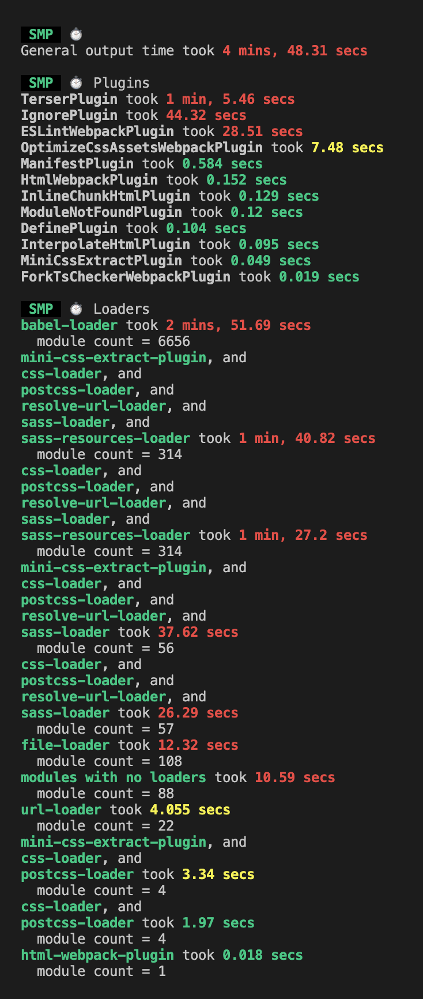

- Summary of the Loaders and Plugins measured for performance
  - **babel-loader**
    - Converting ES6+ syntax into ES5 or lower code is called **transpiling**, and it's babel that does this. babel-loader is what integrates babel with webpack.
  - **optimize-css-assets-webpack-plugin**
    - If HtmlWebpackPlugin is the plugin that compresses html, optimize-css-assets-webpack-plugin is the plugin that compresses css.
  - **terser-webpack-plugin**
    - The series of tasks that convert the code we wrote into a lightweight version that provides the same functionality — such as mangling or compressing the code — is called minify or minification (code lightening), and the tool that performs code lightening is what we call a minifier. terser-webpack-plugin is a plugin that helps our JavaScript code be served in a more lightweight state in production.
  - **css-loader, postcss-loader, sass-loader**
    - **postcss-loader**: A tool that transforms styles through js plugins.
    - **sass-loader**: sass-loader is a third-party package not maintained and managed by webpack, and since browsers can't recognize sass, it **transpiles** it into css.
    - **css-loader**: Converts css files into js code.
  - **IgnorePlugin**
    - Sets the files to ignore during bundling with a regular expression or a filter function.
  - **file-loader**: Handles making files usable as modules. It moves the files actually used to the output directory.
  - **url-loader**: Handles converting files into base64 urls. Rather than moving files, it converts and stores them in the output directory.

## Among babel-loader vs ts-loader vs esbuild-loader, which is better? → esbuild-loader chosen

- Comparison of babel-loader vs ts-loader vs esbuild-loader

  - Tested after adding fork-ts-checker-webpack-plugin for type checking
  - babel-loader, esbuild-loader → Running tsc --noEmit command checking possible
  - Build time

    - babel-loader: 19 sec
    - ts-loader: 17 sec (2 sec👇)
    - esbuild-loader: 14 sec (5 sec👇)

      (Reference: [victor's blog](https://victor-log.vercel.app/post/build-speed-optimization-with-loader/))

- Comparison of babel-loader + terser minify vs esbuild-loader + esbuild-minify

  (Reference: [Kakao Entertainment blog](https://fe-developers.kakaoent.com/2022/220707-webpack-esbuild-loader/))

  - Dev Server: 3399.80ms → 2031.40ms **(1.3s 👇)**
  - HMR: 199.20ms → 102.00ms **(97ms 👇)**
  - Production Build: 5617.40ms → 2238.20ms **(3.3s 👇)**
    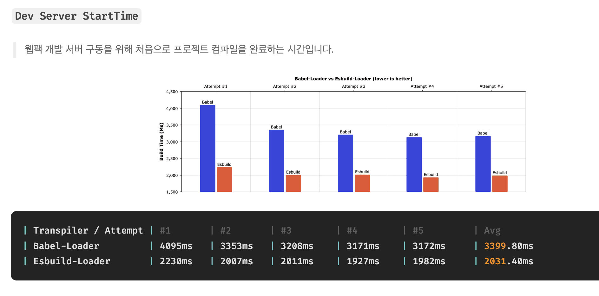
    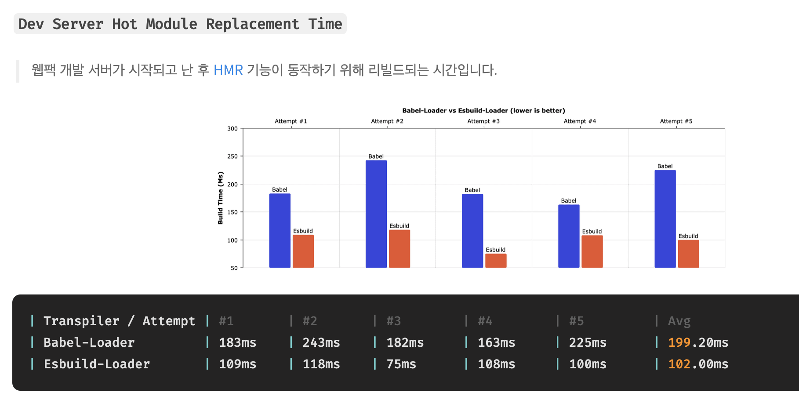
    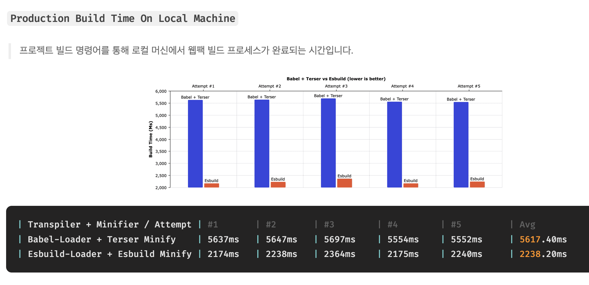

- Comparison of ts-loader vs esbuild-loader
  ts-loader vs esbuild-loader

  ( Reference: [votogeter blog](https://velog.io/@votogether2023/ts-loader%EB%A5%BC-esbuild-loader%EB%A1%9C-%EB%A7%88%EC%9D%B4%EA%B7%B8%EB%A0%88%EC%9D%B4%EC%85%98%ED%95%B4%EB%B3%B4%EC%9E%90) )

- Installing speed-measure-plugin: 23s → 4s **(19s👇)**
  - ts-loader
    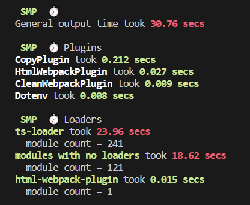
  - esbuild-loader
    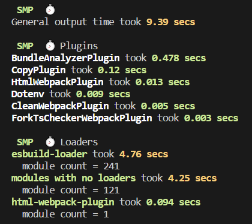
- production build: 2 min → 1 min **( 1 min👇)**
  - ts-loader
    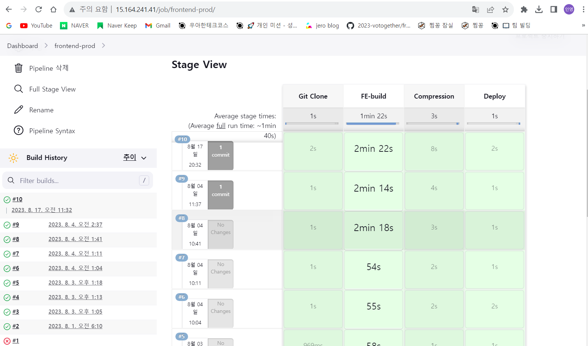
  - esbuild-loader
    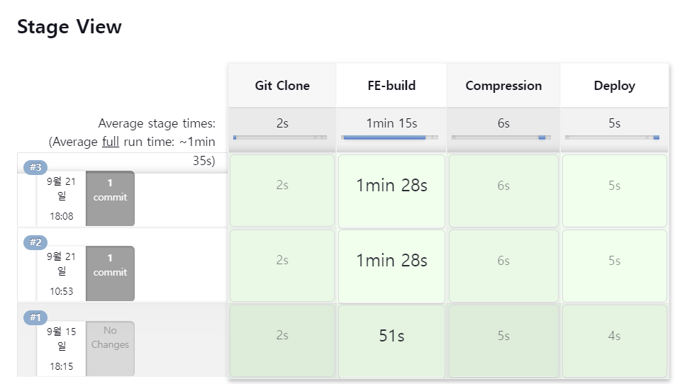

## An explanation of bundlers before explaining esbuild-loader

Bundler definition
A tool that gathers and combines the modules and resources (HTML, CSS, Javascript, Image, etc.) that make up a web application to create a single output.
Expected roles

- Modular
- Transpiler
- Obfuscation/compression
- Other optimization features (module splitting, tree shaking)
  Types of bundlers
  
- **Webapck - 2014**
  - **A static module bundler that provides development convenience features**
  - **Focused on managing large and complex applications**
  - Provides Tree-Shaking, code-splitting, and HMR features
  - v4 <= supports only the cjs (commonjs) format, v5 (supports the esmodule format)
- **Rollup - 2015**
  - **An esm-supporting module bundler focused on lightweighting and bundle optimization**
  - **Clear understanding of dependencies between modules through esmodule support → provides powerful Tree-shaking**
  - Provides Tree-Shaking, code-splitting, and HMR (rollup-plugin-hot) features
- **Parcel, zero-configuration - 2016**
  - A bundler that can be used right away without complex configuration like webpack and Rollup
  - Limitations in fine-grained optimization and customization
  - **A bundler suitable for small and medium projects**
- **esbuild, the arrival of a 100x faster bundler - 2020**
  - **Implemented in Go, a compiled language**
  - **Parallel processing tasks**
  - **Aggressive use of the CPU cache**
  - **However, many unsupported features exist**
- **Snowpack - 2019**
  - Focused on the dev server, Unbundled Development that doesn't bundle all files → uses esbuild
  - **Rebuilds changed files, and does NOT bundle all files**
  - **Production build → choose webpack or rollup bundler**
  - However, in January 2021 it declared end of support → recommends using vite
    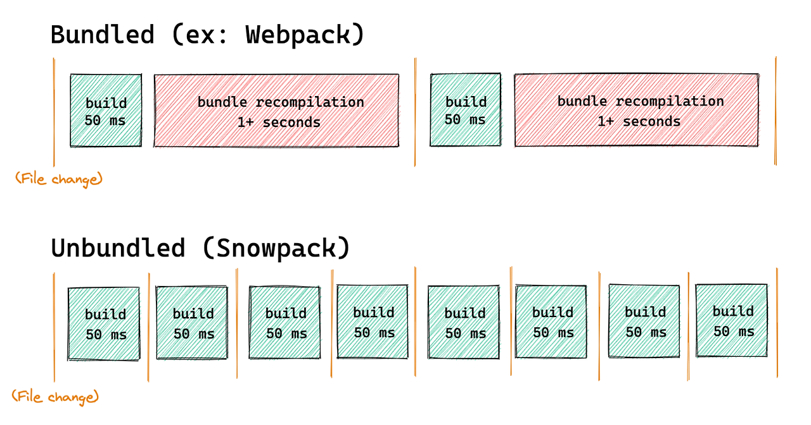
- **Vite - 2020**
  - **A frontend build tool that provides a dev server using ESM and a Rollup-optimized build command**
    - dev environment: esbuild
    - production environment: rollup
  - **Rebuilds changed files, and does NOT bundle all files**
  - Reason for choosing vite over Snowpack: dense integration and a simplified experience from configuring a single rollup bundler in the build process
    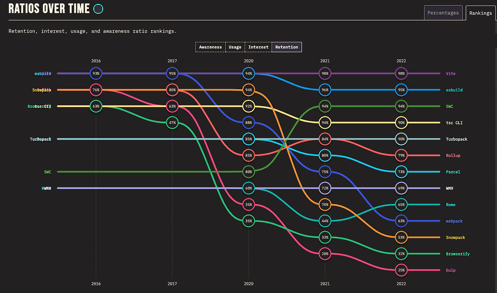
- **Webpack V5 - 2020**
  - **Improved build performance with persistent caching**
  - Improved long-term caching with better algorithms and default settings
  - Improved bundle size through Tree shaking and improvements to the default code generated by default during webpack builds
  - Improved compatibility with the web platform
  - Cleaned up the internal structure
  - **Module Federation → supports micro frontend Architecture → differs from the FE team's monorepo structure**
    - A feature that can load modules deployed across multiple servers
      
- **Turbopack, the arrival of a Rust-based Webpack successor bundler 5x faster than Vite - 2022**
  - Written in Rust
  - Lazy bundling
  - Unlike Vite, it does not use a per-module native browser approach
  - Fast cold start even in large-scale apps
  - Beta version

## [Explanation of esbuild and esbuild-loader](https://seungahhong.github.io/blog/2024/04/2024-04-28-esbuild/)

# Improving Package Installation, Size, and Speed

To improve package performance over the npm and yarn classic package managers, I selected the pnpm package manager and proceeded with improvements.

## An explanation of package managers before explaining pnpm

**npm (January 2010)**

- Abbreviation of pkgmakeinst + node version → npm
- package.json, dependencies → installs into node_modules
- Provides custom scripts and the concept of public & private package registries
  **yarn classic (yarn 1.x, 2016)**
- A package manager added to solve npm's consistency, security, and performance issues (abbreviation of Yet Another Resource Negotiator)
- Native monorepo support, cache-aware installation
- Offline caching, lock files
- Entered maintenance mode in 2020 → yarn berry developed and improved
  **npm, yarn classic → duplicate storage of dependencies, phantom dependencies arising through hoisting**
  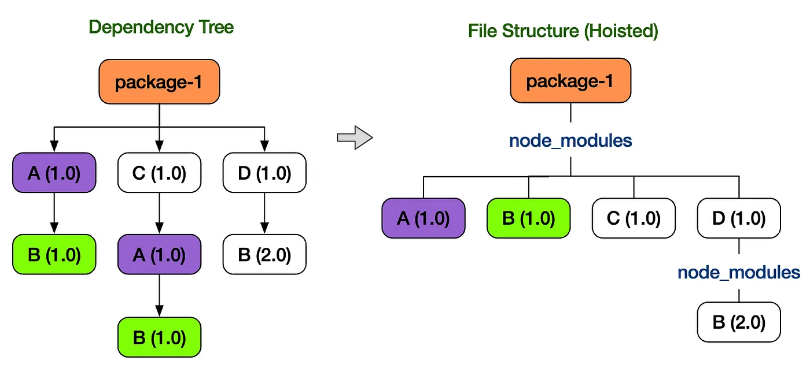
  **yarn berry, plug n play (January 2020)**
- Zero Install → PnP approach
  - Organizes packages flatly (no phantom dependencies)
  - Manages packages as a Zip Archive File without installing node_modules packages
  - The advantage of being able to reduce size by managing as a Zip file rather than installing
    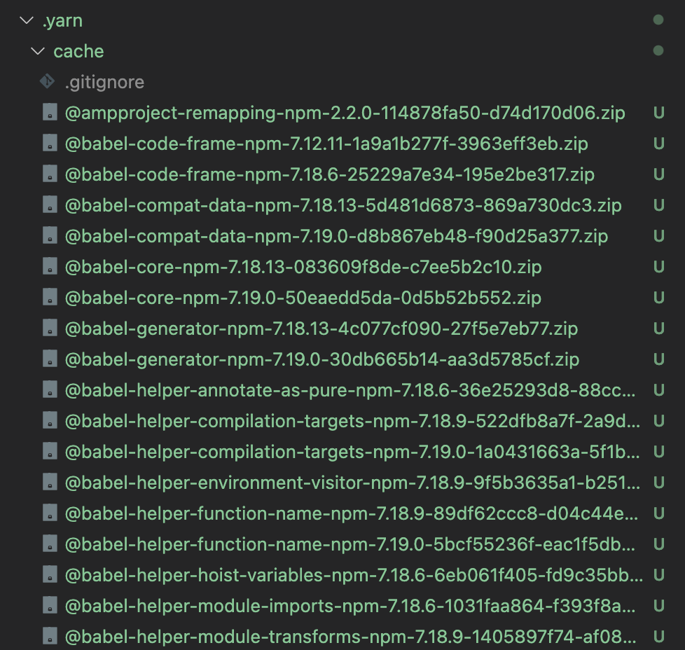
- Apparently there are also about 3 downsides ㅜㅜ
  - Performance issues → since it re-runs the pnp approach on top of the yarn classic environment, performance doesn't miraculously get faster
  - Not all Dependencies can be managed as zip files
    - Dependencies that must operate with binary information about the current environment → packages like _swc, esbuild, sentry-cli_ are tied to the shell, so they're managed in unplugged
      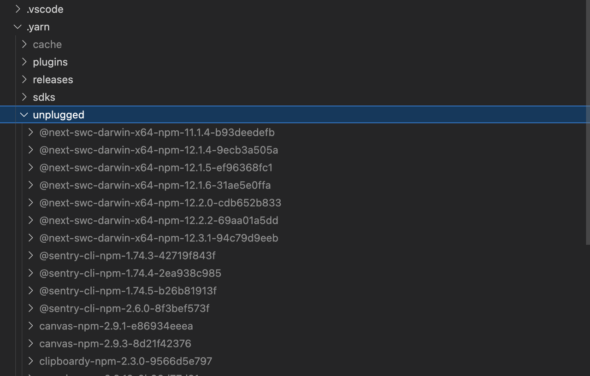
  - It's too heavy to carry all the zip files around under version control. - Even though they're compressed files, the dependency sizes are large, making management difficult. - When updating a Dependency, the number of changed files increases
    **pnpm (2017)**
- Fast and efficient disk management
  - Global store installation → connected via symbol link, hard link
  - Organizes packages flatly (no phantom dependencies)
    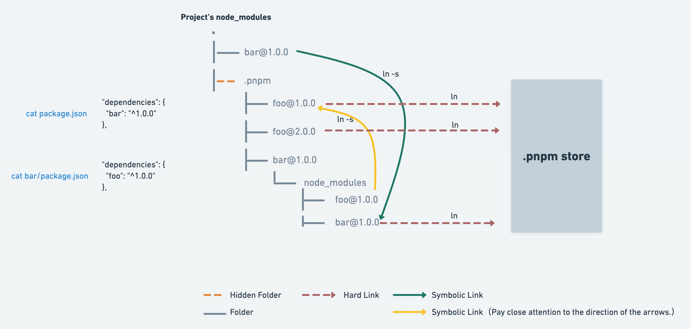

## [pnpm explanation](https://seungahhong.github.io/blog/2024/03/2024-03-18-pnpm/)

## Reasons for choosing pnpm

- Besides the npm and yarn classic package managers, the better options are yarn berry and pnpm.
- Reasons for choosing pnpm
  - If you place packages in a global store and connect them via symbolic and hard links, the installation speed can become faster after the initial build.
  - Since it manages packages flatly in node_modules and does not pull packages up through hoisting, packages not added to package.json are not installed at the 1st depth of node_modules, so phantom dependencies can be resolved.
- Reasons for not choosing yarn berry
  - Even if managed as zip files, if there were packages tied to the binary environment, zero install is impossible.
  - When managing packages under version control, it's hard to grasp too many changes when installing/removing/modifying packages.

# Improving the Build Tool (CRA → Vite)

## Reasons for choosing Vite

- Performance improvement for cold-start dev server startup → pre-bundling of node_modules (esbuild)
- HMR performance improvement → replacing changed files via the esm approach
- Production build → uses the rollup bundler (provides many benefits such as TreeShaking, lazy loading, and file splitting)
  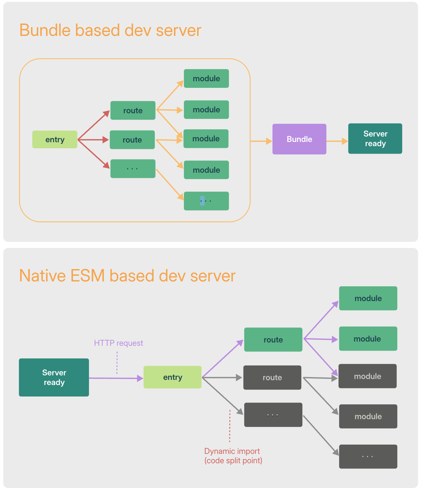

## [vite explanation](https://seungahhong.github.io/blog/2024/05/2024-05-06-vite/)

# Reference Pages

- [Modules, introduction](https://ko.javascript.info/modules-intro)

- [Tree Shaking and Module System](https://so-so.dev/web/tree-shaking-module-system/)

- [Esbuild-Loader to Give Webpack Builds Wings | Kakao Entertainment FE Tech Blog](https://fe-developers.kakaoent.com/2022/220707-webpack-esbuild-loader/)

- [Improving Developer Experience (2) - Let's migrate ts-loader to esbuild-loader!](https://velog.io/@votogether2023/ts-loader를-esbuild-loader로-마이그레이션해보자)

- [Victor Log | Build Speed Optimization with loader](https://victor-log.vercel.app/post/build-speed-optimization-with-loader/)

- [pnpm](https://jeonghwan-kim.github.io/2023/10/20/pnpm)

- [Comparing npm, yarn, and pnpm](https://yceffort.kr/2022/05/npm-vs-yarn-vs-pnpm)

- [[Yarn berry] Problems with Yarn Berry](https://helloinyong.tistory.com/m/344?utm_source=oneoneone)

- [Webpack 5, What Has Changed?](https://so-so.dev/tool/webpack/whats-different-in-webpack5/)

- [Things to Know Before Adopting Webpack Module Federation | Kakao Entertainment FE Tech Blog](https://fe-developers.kakaoent.com/2022/220623-webpack-module-federation/)
