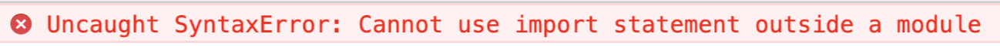
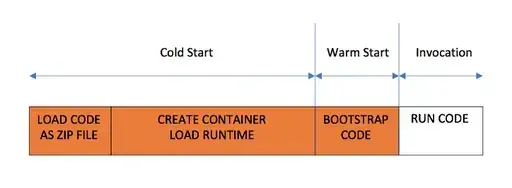
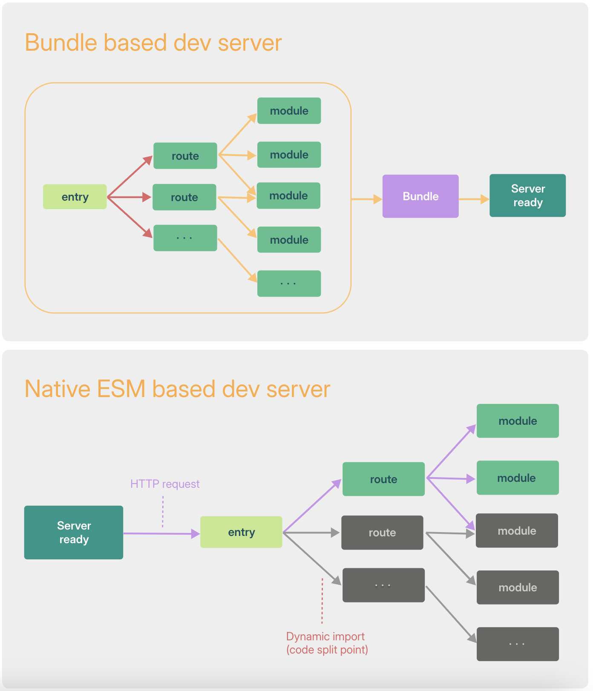
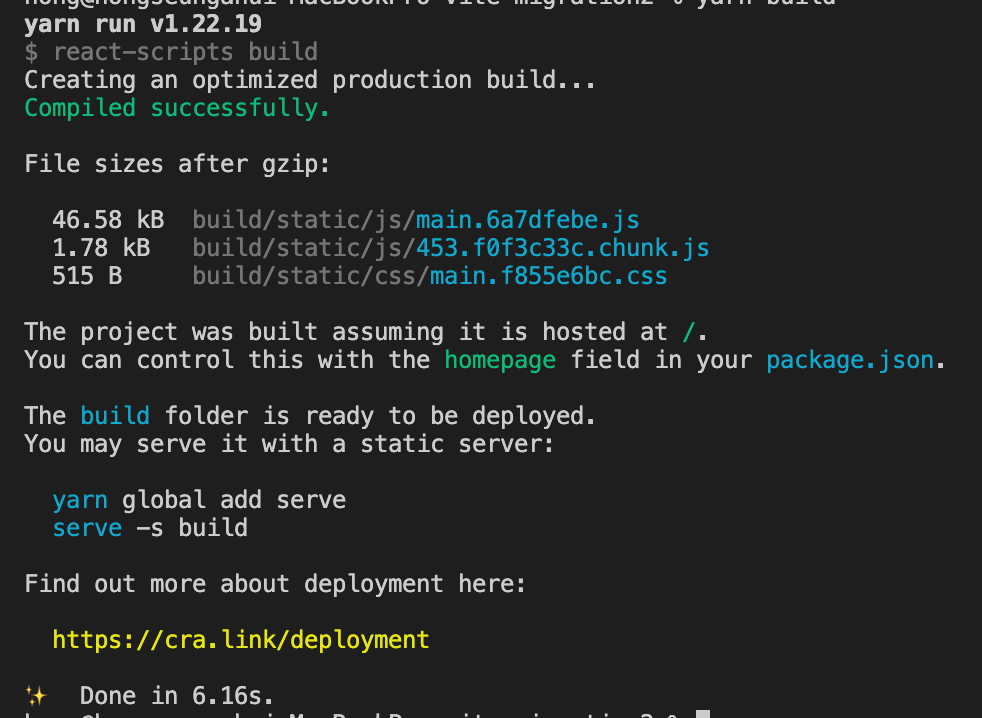
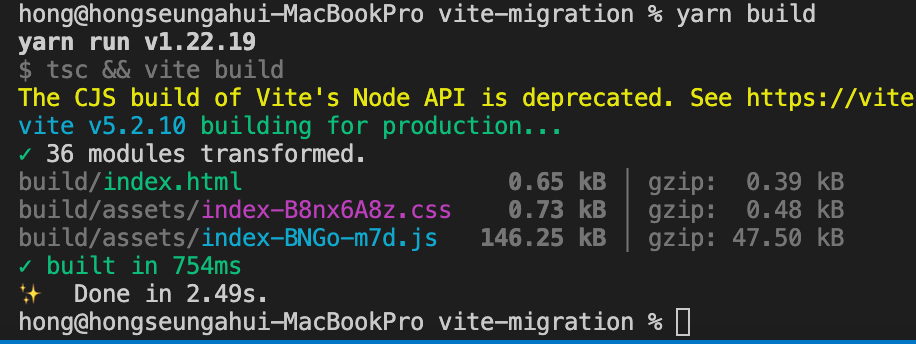
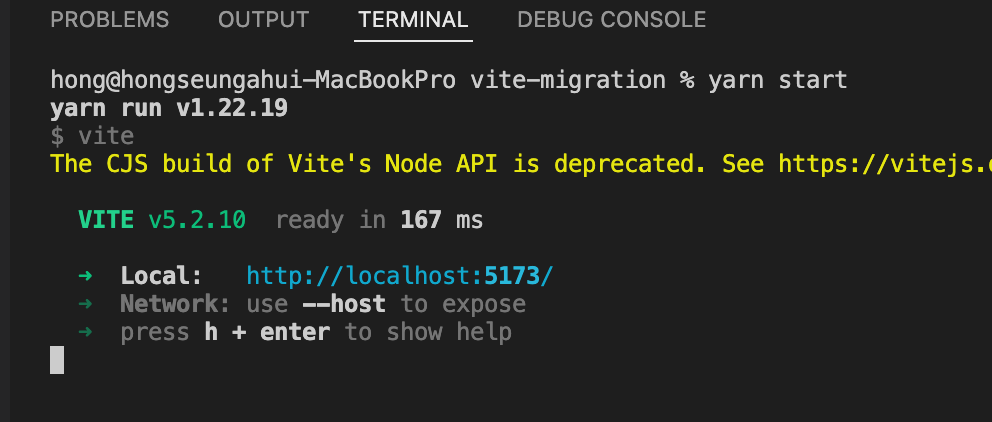

# Vite를 사용해야 하는 이유

### 기존 모듈 번들러 문제점

- 브라우저에서 Native ESM 방식을 지원하기 전까지는 Javascript 모듈화를 브라우저 레벨에서 진행할 수 없었고, 해당 소스 모듈을 브라우저에서 지원하기 위해서 require/IIFE/import,expor를 통한 모듈화 문법을 이용하여서 여러개의 파일로 합쳐주거나 의미 있는 단위로 묶어주는 기능을 번들링이라고 하며, 현재는 [**Webpack**](https://webpack.js.org/), [**Rollup**](https://rollupjs.org/) 그리고 [**Parcel**](https://parceljs.org/)을 도구들이 지원하고 있습니다.
- 하지만 애플리케이션이 점점 더 발전함에 따라서 JS 도구들의 성능 병목 현상이 발생, HMR 사용하더라도 변경된 파일 적용 시 수초가 걸려서 개발자 생산성을 떨어뜨는 문제가 발생하고 있습니다.
- ESM(ECMAScript Modules)

  - ESM은 모듈화 문법인 import, export를 별도의 도구 없이 브라우저 자체에서 소화해 낼 수 있는 모듈 방식을 의미한다. 만약 아래와 같은 코드를 웹팩과 같은 번들러 없이 브라우저에서 실행하면 에러가 발생합니다.

  ```tsx
  // app.js
  import { sum } from 'test.js'
  console.log(sum(1,2));

  <script src="app.js></script>
  ```

  
  예전에는 브라우저가 import와 export를 해석할 수 있는 능력이 없었지만 이제는 다음과 같이 속성을 추가하면 브라우저에서 import와 export를 소화할 수 있게 되었습니다.

  ```tsx
  <script type="module" src="app.mjs></script>
  ```

### Vite 특징

- 콜드 스타트 방식의 개발 서버 구동에 대한 성능 개선
  

  - Dependencies: node_modulesd와 같이 내용이 바뀌지 않는 소스코드에 대해서 esbuild 이용한 사전 번들링 기능 제공

    - esbuild는 webpack, parcel과 같은 기존의 번들러 대비 10-100배 빠른 속도를 제공
    - esbuild 로 node_modules 의 모든 패키지를 사전 번들링하여 아래와 같이 serving 하고 캐시

      ```tsx
      // Dependencies package import 할 경우
      import dayjs from 'dayjs';

      // vite esm 지원을 위한 변환/캐싱
      /node_modules/.vite/deps/dayjs.js?v=b09621d8
      ```

  - Source code: Native ESM 방식을 적용해서 브라우저가 모듈을 직접 가져오고 변환 및 제공하도록 처리
    

- HMR 성능 개선
  기존 번들러 기반에서는 소스 코드 변경 시 다시 번들링 과정을 다시 수행하다보니 성능이 느려지는 이슈를 Native ESM 방식을 사용하여 변경된 모듈만 교체해서 성능 개선
  HTTP 헤더를 활용하여 페이지 로드 속도 개선(요청 횟수 최소화)
  - 304 Not Modified: 클라이언트 캐시 사용
  - Cache-Control: max-age=31536000, immutalble 이용한 캐시 사용
- 프로덕션 환경 Rollup 사용
  - 가장 빠른 성능을 자랑하는 esbuild이지만 아쉬운 생태계와 브라우저용 번들링에서는 안정성이 떨어진다는 평가가 있어서 vite에서는 프로덕션 환경에서 Rollup 번들러를 사용(트리 셰이킹, 지연로딩, 파일 분활 등 성능 이점 제공)
  - Rollup은 v4에서 파서를 SWC 전환 → Rust 포팅인 Rolldown 만드는 작업을 진행 중이며 개발이 완료된다면 esbuild를 모두 대체 가능(개발/빌드 사이에 불이치 제거 목표)
  - [https://www.youtube.com/watch?v=EKvvptbTx6k](https://www.youtube.com/watch?v=EKvvptbTx6k)

# CRA to Vite Migration

## base

- **Remove CRA package for Vite**
  기존 CRA 환경에서 사용되는 패키지 삭제
  기존에 설치된 node_modules가 있는경우 폴더 자체를 삭제

  ```bash
  yarn remove react-scripts react-app-rewired babel-loader webpack-merge tsconfig-paths-webpack-plugin

  rm -rf node_modules
  ```

- **Setting the Stage with Vite Installation**
  **vite: 모던 웹 프로젝트 빌드 도구**

  - @vitejs/plugin-react: @vitejs/plugin-react는 vite에서 React를 사용할 때 필요한 구성을 추가하여 React 애플리케이션의 빠른 개발 및 번들링을 지원
  - vite-tsconfig-paths: tsconfig.json 파일에 설정된 경로 별칭을 Vite에서도 적용할 수 있도록 지원. vite-tsconfig-paths를 사용하면 TypeScript 설정에 정의된 경로 별칭이 Vite에서도 인식되어 모듈 경로를 해석할 때 사용 가능
  - vite-plugin-svgr
    - SVG를 React 컴포넌트로 변환하는 Vite 플러그인
    - 단, 3.3.0 이후 버전 설치 시 빌드, 타입 에러 발생(3.3.0 사용 시 아래와 같은 svgr을 리액트 컴포넌트로 변경 가능)
    ```bash
    import { ReactComponent as ChannelLogo } from '../../assets/artwork-illust-pm-assign-info-channel-talk.svg';
    ```
  - vite-plugin-checker
    - vite를 사용하는 프로젝트에서 타입 체크, ESLint, VLS (Volar Language Server) 등을 포함한 여러 검사 기능을 제공하는 플러그인
    - 비동기로 체크를 하기 때문에 개발 서버 환경 로딩 속도에 영향을 주지 않는 장점이 있다.

  ```
  yarn add vite @vitejs/plugin-react vite-tsconfig-paths vite-plugin-svgr@3.3.0

  yarn add vite-plugin-checker -D
  ```

- **Updating package.json for Vite Commands**
  ```bash
  scripts": {
    "start": "vite", // dev-server
    "build": "vite build", // build
  },
  ```
- **Renaming React File Extensions to .jsx or .tsx**
  React JSX 문법을 사용하는 파일에 대해서만, jsx/tsx로 변경해주시면 됩니다.
  ```bash
  mv src/App.js src/App.jsx
  mv src/index.ts src/index.tsx
  ```
- **Move the index.html File**
  - public 패스의 index.html 삭제하지 않을 경우 vite에서 개발 환경 로딩 시 public/index.html 선 로딩함으로 꼭 루트로 옮겨주세요!!
  ```bash
  mv public/index.html .
  ```
- **Add module script to the bottom of the body tag**
  초기 로딩 시 코드 진입점을 명시해주세요.
  ```html
  <body>
    {/* others here */}
    <script type="module" src="/src/index.tsx"></script>
  </body>
  ```
- **Update tsconfig.json**
  isolatedModules 사용이유
  - **모듈 간의 의존성 격리**: 각 모듈이 서로의 타입에 의존하지 않도록 하여, 컴파일 시 모듈을 개별적으로 처리합니다. 이를 통해 TypeScript의 컴파일 시간이 줄어들 수 있습니다.
  - **성능 향상**: 독립적으로 모듈을 컴파일하면, 변화가 발생한 모듈만 다시 컴파일되므로 전체 컴파일 속도가 개선됩니다.
  - **ESM 호환성**: ES 모듈과의 호환성을 높여, 다양한 빌드 도구와의 통합 시 더 나은 결과를 제공합니다.
  - **검사 오류 방지**: 모든 모듈이 개별적으로 체크되므로, 한 모듈에서의 타입 오류가 다른 모듈에 영향을 미치는 것을 방지할 수 있습니다.
    include에 vite.config.js 패스 설정
  ```bash
  {
    "extends": "./tsconfig.extend.json",
    "compilerOptions": {
      "lib": ["dom", "dom.iterable", "es2020"],
      "target": "ES6",
      "types": ["vite/client", "react", "react-dom", "node"],
      "isolatedModules": true // 추가
    },
    "include": [
      "./src/**/*",
      "vite.config.js"
    ],
    "exclude": [
      "node_modules"
    ]
  }
  ```
- **Add module html minify**
  CRA 프로젝트에서는 내장된 plugins중에 HtmlWebpackPlugin 통해서 html minify를 해주고 있는데, vite에서 내장이 되어 있지 않아서 직접 설치후에 환경 설정을 추가해줘야 합니다.

  ```bash
  // Installation
  yarn add vite-plugin-html

  // vite.config.js
  createHtmlPlugin({
    // input <https://www.npmjs.com/package/html-minifier-terser> options
    minify: true,
  }),
  ```

## Configuration

- **Crafting the Vite Configuration**

  ```tsx
  // <root>/vite.config.js
  import { defineConfig, loadEnv } from 'vite';
  import path from 'path';
  import react from '@vitejs/plugin-react';
  import viteTsconfigPaths from 'vite-tsconfig-paths';
  import svgr from 'vite-plugin-svgr';
  import { createHtmlPlugin } from 'vite-plugin-html';
  import checker from 'vite-plugin-checker';

  export default defineConfig(config => {
    const env = loadEnv(config.mode, process.cwd(), '');

    return {
      build: {
        outDir: 'build', // build 폴더명 변경(기본 dist)
        target: 'es2015', // es6 target transpile
        sourcemap: false, // 소스맵 생성 여부
        rollupOptions: {
          output: {
            manualChunks(id) {
              // chunks 파일을 만들 경우 아래와 같이 청크명과 필터를 걸어주세요.
              if (id.includes('/react')) {
                return 'venders';
              }
            },
          },
          onwarn(warning, defaultHandler) {
            // sourcemap: true 설정할 경우 node_modules에 소스맵 없는 경우에 대한 경고 무시를 위해 추가
            if (warning.code === 'SOURCEMAP_ERROR') {
              return;
            }
            defaultHandler(warning);
          },
        },
      },
      define: {
        global: 'globalThis', // 글로벌 객체를 빈 객체로 대체(global is not defined error 에러에 대한 방어코드)
      },
      plugins: [react(), viteTsconfigPaths(), svgr()],
    };
  });
  ```

## Environment Variables

- VITE라는 prefix를 설정하지 않을 경우 import.meta.env 에서 값을 얻어 올 수 없습니다.
- 기본적으로 속성값으로 DEV(vite), PROD(vite build)을 제공해줌으로 개발/빌드 환경 구분이 가능합니다.
- **ChangeEnv Variables and Modes**

  ```json
  // .env Files
  .env                # loaded in all cases
  .env.local          # loaded in all cases, ignored by git
  .env.[mode]         # only loaded in specified mode
  .env.[mode].local   # only loaded in specified mode, ignored by git

  // Modes
  # .env.production.live
  VITE_ENVIRONMENT=live

  // command mode option flag
  "build:dev": "yarn vite --mode production.dev",
  "build:rc": "yarn vite --mode production.rc",
  "build:live": "yarn vite --mode production.live",
  ```

- **Update process.env.REACT_APP**
  ```tsx
  -process.env.REACT_APP_VARIABLE + import.meta.env.VITE_VARIABLE;
  ```

## EJS Variables

- **Update Configuration for Vite**
  빌드 시 HTML CJS 문법이 치환되도록 처리하기 위해서 vite-plugin-html 이용해서 내보내기 처리 추가
  ```
  createHtmlPlugin({
    ....
    inject: {
      data: {
        VITE_VARIABLE: env.VITE_VARIABLE,
      },
    },
  }),
  ```
- **Replace EJS Variables for Vite**
  문자만 치환할 경우

  - “%” → “<%= ~~ =>”
  - 예) <script src="/variable"></script> → 문자안에 글자를 치환할 경우

  ```html
  // env VITE_VARIABLE='/variable' //
  <root
    >/index.html //// CRA
    <script src="%REACT_APP_VARIABLE%"></script>

    //// VITE
    <script src="<%= VITE_VARIABLE %>"></script
  ></root>
  ```

  엘리먼트(태그) 자체를 변경할 경우

  - % → <%- ~~ ->

  ```
   // env
  VITE_SCRIPT=<script>(function ~~ )</script>

  // <root>/index.html
  //// CRA
  %VITE_SCRIPT%

  //// VITE
  <%- VITE_SCRIPT %>
  ```

- **Updating Vite Commands(with enviroment)**
  ```json
  "start": "vite",
  "start:dev": "yarn start --mode development.dev",
  "start:rc": "yarn start --mode development.rc",
  "build": "vite build",
  "build:dev": "yarn build --mode production.dev",
  "build:rc": "yarn build --mode production.rc",
  "build:live": "yarn build --mode production.live",
  ```

## Vite Lint, Typescript Checker

- **Add module vite-plugin-checker**
  CRA 환경에서 내부적으로 fork-ts-checker-webpack-plugin 플러그인을 바탕으로 비동기로 타입 체크를 해주고 있지만, VITE 환경에서는 vite-plugin-checker 직접 설치 후 vite.config.js 구성에 추가해줘야 합니다.

  ```tsx
  // vite.config.js
  import checker from 'vite-plugin-checker';

  checker({
    typescript: config.mode.indexOf('development') > -1,
    eslint: config.mode.indexOf('development') > -1 ? {
      lintCommand: 'eslint "./src/**/*.{ts,tsx,js,jsx}"',
    } : false,
    stylelint: config.mode.indexOf('development') > -1 ? {
      lintCommand: 'stylelint "src/**/*.scss"'
    } : false,
  }),
  ```

# CRA to Vite Migration Tip

- **import.meta.glob dynamic load**
  Vite의 import.meta.glob을 사용하여 모든 아이콘을 동적으로 가져올 수 있습니다.

  ```tsx
  const icons = import.meta.glob('./*Icon.tsx');

  const iconComponentPath = './aIcon.tsx';

  const Icon =
    icons && icons[iconComponentPath as string]
      ? lazy(
          () =>
            icons[iconComponentPath as string]() as Promise<{
              default: ComponentType;
            }>,
        )
      : null;
  ```

- **sass-resources-loader(dart sass) → vite config preprocessorOptions.sass**
  공통적으로 사용되는 스타일을 전역적으로 적용할 때 사용하는 sass-resources-loader를 vite에서는 preprocessorOptions.sass로 대체가 가능

  ```tsx
  // CRA
  rules: [
    {
      test: /\\.scss$/,
      use: [
        {
          loader: 'sass-resources-loader',
          options: {
            resources: [
              path.resolve(__dirname, './sass.scss'),
            ],
          },
        },
      ],
      include: path.resolve(__dirname, './src'),
      exclude: /node_modules/,
    },
  ]

  // vite.config.js
  css: {
    preprocessorOptions: {
      scss: {
        // Next line will prepend the import in all you scss files as you did with your vite.config.js file
        additionalData: `
          @import "./sass.scss";
        `,
      },
    },
  },
  ```

  **단계별 에러 케이스 정리**
  @forward rules must be written before any other rules 에러

  - @forward 구문이 다른 모든 규칙(@import, @use, 스타일 선언) 보다 위에 위치하도록 수정
    @forward
  - Dart Sass에서 도입된 Sass 모듈 시스템의 일부로, 모듈화된 스타일시트를 구성하고 관리하는 데 중요한 역할을 합니다.
  - @import 방식과는 다르게, @forward는 Sass 코드의 모듈화와 재사용성을 더 쉽게 관리할 수 있도록 돕습니다.
    @use: 모듈을 가져오면서 네임스페이스를 사용해 충돌을 방지하고, 명시적으로 필요한 부분만 가져올 수 있습니다.
    @import는 파일을 단순히 포함하는 방식으로, 여러 번 포함될 수 있고 변수나 믹스인의 충돌 위험이 있습니다.

  ```tsx
  // reset.scss
  @forward 'reset';

  // ./sass.scss
  @use 'color';

  css: {
    preprocessorOptions: {
      scss: {
        // Next line will prepend the import in all you scss files as you did with your vite.config.js file
        additionalData: `
          @forward 'reset';

          @use './color.scss' as *;
          @use './sass.scss' as *
        `,
      },
    },
  },
  ```

- **setting module scss name for Vite(선택)**
  CRA에서는 SCSS 모듈을 사용할 때, 파일명과 클래스명을 결합해 고유한 클래스명을 자동으로 생성해주만, VITE 에서는 클래스명으로만 생성되는 규칙을 다르게 가져가고 있음

  - 규칙: [파일명]_[원래 클래스명]_[hash:base64:5]
    단, 서비스 내에서 module scss를 전역으로 선택하는 경우가 없다면 굳이 세팅을 해줄 필요가 없습니다.(내부적으로는 세팅을 하지 않을 시 [클래스명, hash]값을 토대로 유니크한 값으로 자동 변경)

  ```tsx
  import styles from './Test.module.scss';

  const Test = () => {
  	return (
  		<div className={styles.container}></div>
  	);
  };

  export default Test;

  // 변경 전
  class="Test_container__28qL6"

  // 변경 후
  //// vite.config.js
  const namespaceUUID = v4();
  css: {
    ...
    modules: {
      // 파일명과 클래스명을 포함한 고유한 이름 생성
      generateScopedName: (name, filename) => {
        // 파일 경로 기반 고유한 해시 생성
        const file = path.basename(filename).replace('.module', '').replace(/\.[^/.]+$/, '');

        // UUID 생성 후 Base64 인코딩
        const hash = Buffer.from(v5(`${file}_${name}`, namespaceUUID)).toString('base64').slice(0, 5);
        return `${file}_${name}__${hash}`;
      },
    },
  },
  ```

- **server(proxy, outside file)**
  CRA proxy 설정을 VITE proxy로 대체가 가능합니다.
  VITE 환경 외에 외부 폴더/파일 접근 시 fs.allow 객체로 추가 시 dev server에서 접근이 가능합니다.
  기존에는 proxy 패스를 배열로 관리했지만 vite에서는 각각 패스로 관리를 해줘야합니다.

  ```tsx
  // CRA
  //// 기존 패키지 삭제
  yarn remove http-proxy-middleware

  //// setupProxy.js
  // 수정 전
  const { createProxyMiddleware } = require('http-proxy-middleware');
  module.exports = function setupProxy(app) {
    app.use(createProxyMiddleware(['/test'], {
      changeOrigin: true,
  	  logLevel: 'debug',
  	  autoRewrite: true,
      target: 'http://www.test.kr',
      onProxyRes: (proxyRes) => {
        console.log(proxyRes);
      }),
      onProxyReq: (proxyReq) => {
        proxyReq.setHeader('origin', 'http://www.test.kr');
      },
    }));

  // vite.config.js
  //// 수정 후
  const env = loadEnv(config.mode, process.cwd(), '');
  server: {
  	proxy: {
  		fs: {
  	    // 허용할 디렉터리 추가 (여기에 외부 파일 경로를 추가)
  	    allow: [
  	      '../../../outside',
  	      '/'
  	    ],
  	  },
  		'/test': {
  	    changeOrigin: true,
  		  logLevel: 'debug',
  		  autoRewrite: true,
  	    target: 'http://www.test.kr',
  	    configure: (proxy) => {
  	      proxy.on('proxyRes', (proxyRes, env) => {
  	        console.log(proxyRes);
  	      }),
  	      proxy.on('proxyReq', (proxyReq, env) => {
  	        proxyReq.setHeader('origin', 'http://www.test.kr');
  	      });
  	    },
  	  },
  	},
  },
  ```

- **external file link settings(alias)**
  CRA에서 외부 파일내에 패스(tsconfig.json)를 접근 시 현재 프로젝트 환경 기준으로 패스를 바라보지만,
  VITE에서는 외부 파일 기준으로 패스를 접근하다보니 alias 처리에 이슈가 있어서 tsconfig path가 아닌 절대 경로 패스로 재 지정해야 합니다.
  예)

  - CRA(root)
    - outside/index.tsx 컴포넌트 위치 기준
  - VITE
    - root 위치 기준

  ```tsx
  // CRA
  const modifiedConfig = aliasWebpack({
    tsconfig: path.resolve(__dirname, './tsconfig.json'),
  })(config);

  // vite.config.js
  resolve: {
    alias: {
      '@outside': path.join(__dirname, '../outside'),
    },
  },

  // outside/index.tsx
  import Button from '../Button';
  ```

- **setting external file access permissions**
  CRA에서는 외부파일 접근 시 내부 config 파일에서 ModuleScopePlugin 플러그인에 추가해주는 번거로움이 있었지만,
  VITE에서는 빌드 과정에서는 외부 파일 접근이 자유로우나, 개발 환경에서는 외부 파일 패스 경로를 설정해줘야합니다.
  - 단, 파일 패스 설정 시 외부 파일 패스외에 내부 파일 패스도 같이 설정해줘야 합니다.
  ```tsx
  fs: {
    // 허용할 디렉터리 추가 (여기에 외부 파일 경로를 추가)
    allow: [
      '../outside',
      '/'
    ],
  },
  ```
- **setting baseurl for Vite**
  CRA에서는 내부적으로 BaseURL(PUBLIC_URL)을 기준으로 리소스 패스 경로를 설정해주지만, VITE에서는 해당 경로를 base 속성값으로 변경해줘야합니다.(env 환경 변수에 base url 패스를 지정해주세요.)
  단, DEV 환경에서는 내부 리소스 패스로 설정해야함으로 패스를 지정하지 말아야합니다.

  ```html
  // CRA //// index.html
  <head>
    <meta charset="utf-8" />
    <link rel="shortcut icon" href="%PUBLIC_URL%/favicon.ico" />
  </head>

  // VITE //// env.production.dev VITE_PUBLIC_URL=https://test ////
  vite.config.js base: env.VITE_PUBLIC_URL || '/', //// index.html
  <head>
    <meta charset="utf-8" />
    <link rel="shortcut icon" href="/favicon.ico" />
  </head>

  //// index.html(결과물)
  <head>
    <meta charset="utf-8" />
    <link rel="shortcut icon" href="https://test/favicon.ico" />
  </head>
  ```

-

# CRA to Vite Migration Storybook

- **Installation**
  이전 버전 Storybook 삭제
  ```bash
  yarn remove @storybook/addon-*(knobs, controls 등등)
  ```
  vite 연동을 위한 스토리북 패키지 추가
  기존 CRA 환경에서는 @storybook/react 패키지 명령어를 사용해서 문제가 없었지만,
  VITE에서는 @storybook/react-vite 패키지를 사용하면서 storybook 패키지를 추가적으로 설치가 필요합니다.
  또한, storybook 연동 패키지가 6버전 사용 시 ‘storybook-channel-mock.js:7 Uncaught TypeError: import_channels.default is not a constructor’ 와 같은 에러가 발생하게 됩니다.
  꼭 최신 버전인 8버전 이상에 패키지를 설치를 해주세요
  ```bash
  yarn add @storybook/builder-vite @storybook/react @storybook/react-vite storybook -D
  ```
  Major breaking changes
  - [Node 18+ is now required](https://github.com/storybookjs/storybook/blob/next/MIGRATION.md#dropping-support-for-nodejs-16)
  - [Addons API introduced in Storybook 7 is now required](https://github.com/storybookjs/storybook/blob/next/MIGRATION.md#new-addons-api)
  - vite 환경일 경우 root 패스에 vite.config.js가 필수로 추가
- **setting**
  .storybook/main
  addon 설정

  ```tsx
   addons: [
    '@storybook/addon-links',
    '@storybook/addon-essentials',
  ],
  ```

  builder, framework 지정

  ```tsx
  core: {
    builder: '@storybook/builder-vite', // 👈 The builder enabled here.
  },
  framework: '@storybook/react-vite',
  ```

  base static path 지정

  ```tsx
  // CRA - @storybook/react
  "storybook": "start-storybook -p 9009 -s public",

  // VITE - @storybook/vite
  staticDirs: ['../public'], // 이전 버전(v6) -s public 옵션과 동일
  ```

  webpackFinal → ViteFinal 마이그레이션

  - preprocess scss, 허용할 파일 패스 연동

  ```tsx
  // webpack
  config.module.rules.push({
    test: /\.scss$/,
    use: [
      {
        loader: 'sass-resources-loader',
        options: {
          resources: [path.resolve(__dirname, '../sass.scss')],
        },
      },
    ],
    include: path.resolve(__dirname, '../src'),
    exclude: /node_modules/,
  });

  // Vite
  const { mergeConfig } = await import('vite');
  return mergeConfig(config, {
    // Merge custom configuration into the default config
    const { mergeConfig } = await import('vite');
    css: {
      preprocessorOptions: {
        scss: {
        // Next line will prepend the import in all you scss files as you did with your vite.config.js file
        additionalData: `
          @forward 'reset';

          @use './color.scss' as *;
          @use './sass.scss' as *
        `,
  	    },
      },
    },
  ```

  - 외부 파일 접근

  ```tsx
  // VITE
  server: {
    fs: {
      // 허용할 디렉터리 추가 (여기에 외부 파일 경로를 추가)
      allow: [
        '../outside',
        '/'
      ],
    },
  },
  ```

- **storybook code migration processing**
  **No longer inferring default values of args(v6.3)**
  버전 업데이트가 되면서 argTypes에서 기본값 세팅을 할 수 없고 args에서 세팅하는걸로 변경되었습니다. 빌드 에러가 발생하진 않지만, 확인해보시면 undefined 설정되서 들어가게 되니 꼭 마이그레이션 시 변경 해주세요.

  ```tsx
  // CRA - storybook
  argTypes: {
    isModalOpened: {
      name: '모달 오픈여부',
      defaultValue: true,
      control: {
        type: 'boolean',
      },
    },
  },

  // VITE - storybook
  argTypes: {
    isModalOpened: {
      name: '모달 오픈여부',
      control: 'boolean',
    },
  },
  args: {
    isModalOpened: true,
  },
  ```

  **New parameters format for addon viewport(v8.3)**

  - viewports → options 변경

  ```tsx
  // 이전
  export const parameters = {
    viewport: {
      viewports: {
        iphone5: {
          name: 'phone',
          styles: {
            width: '320px',
            height: '568px',
         },
       },
     },
  }

  // 변경 후
  export const parameters = {
    viewport: {
      options: {
        iphone5: {
          name: 'phone',
          styles: {
            width: '320px',
            height: '568px',
         },
       },
     },
  }
  ```

  **Story type deprecated(v7.0)**

  ```tsx
  // 변경 전
  import type { Story } from '@storybook/react';

  export const MyStory: Story = () => <div />;

  // 변경 후
  import type { StoryFn, StoryObj } from '@storybook/react';

  export const MyCsf2Story: StoryFn = () => <div />;
  export const MyCsf3Story: StoryObj = {
    render: () => <div />,
  };
  ```

  **start-storybook / build-storybook binaries removed(v7.0)**

  ```bash
  // 변경 전
  {
    "scripts": {
      "storybook": "start-storybook <some flags>",
      "build-storybook": "build-storybook <some flags>"
    }
  }

  // 변경 후
  {
    "scripts": {
      "storybook": "storybook dev <some flags>",
      "build-storybook": "storybook build <some flags>"
    },
    "devDependencies": {
      "storybook": "next"
    }
  }
  ```

  **Ignore story files from node_modules(v7.0)**

  - 기본적으로 node_modules 안에 스토리북은 무시하도록 변경

  ```tsx
  export default {
    stories: ["../**/*.stories.*"],
  };

  // 기존 glob.sync 처리는 굳이 안해줘도 됩니다.
  // const getStories = () => glob.sync(`${path.resolve(__dirname, '../')}/src/**/*.stories.@(js|jsx|ts|tsx)`);
  // stories: async () => getStories(),

  // 펀딩 스튜디오 적용
  stories: ["../src/**/*.stories.@(js|jsx|ts|tsx)"],
  ```

  **Removed deprecated shim packages(v8.0)**
  | Removal | Replacement |
  | ------------------------------ | ------------------------------------------------- |
  | @storybook/addons | @storybook/manager-api or @storyboook/preview-api |
  | @storybook/channel-postmessage | @storybook/channels |
  | @storybook/channel-websocket | @storybook/channels |
  | @storybook/client-api | @storybook/preview-api |
  | @storybook/core-client | @storybook/preview-api |
  | @storybook/preview-web | @storybook/preview-api |
  | @storybook/store | @storybook/preview-api |
  | @storybook/api | @storybook/manager-api |
  | @storybook/testing-library | @storybook/test |
  **Deprecated addon-knobs(v6.3) → static쪽도 버전 업하시려면 수정을 해주셔야합니다.**
  addon-essentials 패키지 설치 후 knobs가 아닌 control을 사용

  1. **Controls (**@storybook/addon-controls**)**: 컴포넌트의 props를 UI에서 제어할 수 있도록 해줍니다.
  2. **Actions (**@storybook/addon-actions**)**: 이벤트 핸들러를 디버깅하기 쉽게 로그로 출력합니다.
  3. **Docs (**@storybook/addon-docs**)**: 컴포넌트의 문서를 자동 생성합니다.
  4. **Viewport (**@storybook/addon-viewport**)**: 다양한 화면 크기에 따른 컴포넌트의 동작을 확인합니다.
  5. 기타 애드온들 (e.g., Backgrounds, Toolbars & Icons 등).
     [https://github.com/storybookjs/storybook/blob/next/MIGRATION.md](https://github.com/storybookjs/storybook/blob/next/MIGRATION.md)

- **package.json storybook command**

  ```json
  // CRA
  "storybook": "start-storybook -p 9009 -s public",
  "build-storybook": "build-storybook -s public -o .storybook/build --quiet",

  // VITE
  "storybook": "storybook dev -p 9009",
  "build-storybook": "storybook build -o .storybook/build --quiet"
  ```

# Jest to Vitest Migration

- **Why Vitest is better than Jest**
  1. **빠른 성능**: esbuild 기반으로 Jest보다 빠른 테스트 실행.(jest: Babel)
  2. **ESM 지원**: 최신 ES 모듈을 기본적으로 지원.(ES 방식 지원 가능하나 호환성 이슈 발생)
  3. **타입스크립트 통합**: 추가 설정 없이 TypeScript와 자연스럽게 통합.
  4. **간단한 모킹 API**: 직관적이고 쉽게 사용할 수 있는 mocking 기능 제공.
  5. **Vite와의 호환성**: Vite 설정 및 플러그인을 그대로 활용.
  6. **현대적 기능**: HMR과 빠른 watch 모드 지원.
  7. **작은 학습 곡선**: Vite 사용자에게 친숙한 설정.
  8. **우수한 개발자 경험**: 오류 보고 및 테스트 피드백이 현대적이고 상세함.
- **Installation**

  ```bash
  yarn add -D vitest jsdom @testing-library/dom @testing-library/jest-dom @testing-library/react @testing-library/user-event

  // 기존 Jest 테스트 관련 패키지 삭제
  yarn remove jest babel-jest

  ```

- **setting**
  기존에 package.json/jest.setup.js 설정된 테스트 구성을 vitest.config.js로 이전

  ```tsx
  // 변경 전
  //// package.json
  "jest": {
    "collectCoverageFrom": [
      "!<rootDir>/node_modules/"
    ],
    "moduleNameMapper": {
      "lodash-es": "lodash",
    },
    "transformIgnorePatterns": [
      "/node_modules/",
    ],
    "setupFilesAfterEnv": [
      "<rootDir>/jest.setup.js"
    ]
  },

  // 변경 후
  //// vitest.config.js
  export default defineConfig({
    resolve: {
      alias: {
        "lodash-es": "lodash",
      },
    },
    plugins: [
      react(),
      viteTsconfigPaths(), // tsconfig 파일 패스 연동
    ],
    test: {
      environment: 'jsdom', // React 테스트 환경을 위해 설정
      globals: true,        // Jest와 동일한 글로벌 변수를 사용
      setupFiles: './src/setupTests.ts', // setup 파일
    },
  });

  // src/setupTest.ts
  import '@testing-library/jest-dom';
  ```

  기존 리액트 테스트 환경 테스트를 위해서 test 환경을 꼭 json 으로 설정해주세요.
  타입스크립트 타입에 vitest 추가해주세요.

  ```json
  // tsconfig.json
  "compilerOptions": {
    "lib": ["dom", "dom.iterable", "es2020"],
    "target": "ES6",
    "types": ["vite/client", "react", "react-dom", "node", "vitest/globals"], // vitest/globals 추가
    "isolatedModules": true
  },
  ```

  eslint 글로벌 체크 타입 변수에 vi 추가

  ```tsx
  // .eslint.js
  module.exports = {
    globals: {
      context: 'readonly',
      vi: true, // vi 추가
    },
  };
  ```

- **jest code migration processing**
  **module mocks**
  ```tsx
  // 변경 전
  jest.mock('./some-path', () => 'hello');
  // 변경 후
  vi.mock('./some-path', () => 'hello');
  ```
  **Importing the Original of a Mocked Package**
  ```tsx
  // 변경 전
  const { cloneDeep } = jest.requireActual('lodash/cloneDeep');
  // 변경 후
  const { cloneDeep } = await vi.importActual('lodash/cloneDeep');
  ```
  **Replace property**
  [Vitest](https://vitest.dev/guide/migration#replace-property)
  **Done Callback**
  - Vitest v0.10.0 이후부터는 callback 스타일을 지원하지 않고 있어서 지원을 해야할 경우 Promise callback 함수로 변경 필요
  ```tsx
  it('should work', done => {});
  it('should work', () =>
    new Promise(done => {
      // ...
      done();
    }));
  ```
  **Hooks**
  beforeAll/beforeEach hook에 대해서 null/undefined 외에 값을 반환해야합니다.
  ```tsx
  -beforeEach(() => setActivePinia(createTestingPinia())) +
    beforeEach(() => {
      setActivePinia(createTestingPinia());
    });
  ```
  jest hooks는 동기적으로 수행되고, vitest는 기본적으로 병렬로 진행하게 됩니다. 단, hooks 동기적으로 수행 시 sequence.hooks 속성을 지정해야합니다.
  ```tsx
  // vitest.config.js
  export default defineConfig({
    test: {
      sequence: {
        hooks: 'list',
      },
    },
  });
  ```
  **Types**
  vitest는 네임스페이스 속성을 지원하지 않기 때문에 직접 유형을 가져와야합니다.
  ```tsx
  // 변경 전
  let fn: jest.Mock<(name: string) => number>;
  // 변경 후
  import type { Mock } from 'vitest';
  let fn: Mock<(name: string) => number>;
  ```
  **Timeout**
  ```tsx
  // 변경 전
  jest.setTimeout(5_000);
  // 변경 후
  vi.setConfig({ testTimeout: 5_000 });
  ```
- **package.json test commands**
  ```bash
  "test": "vitest",
  "test:run": "vitest run",
  ```

# MSW Migration Guide

- vitest 테스트와 msw 0.43.1 버전 같이 사용 시 아래 같은 문구에 에러가 발생
- vitest에서 ECMAscript 모듈을 지원하고 있고 msw 이전버전에서는 미지원함에 따른 에러 발생으로 추측(버전을 최신 버전으로 변경해서 수정)

```tsx
vitest Package subpath './lib' is not defined by "exports" in node_modules/headers-polyfill/package.json
```

- **Installation**
  - msw 버전을 최신버전으로 업그레이드 함에 따른 storybook에 사용되는 storybook-addon도 동일하게 업그레이드 처리해야 합니다.
  - msw-storybook-addon 관련 스토리부 설정을 기존과 동일합니다.
  ```tsx
  yarn add -D msw@2.4.11 msw-storybook-addon@2.0.3
  ```
- **msw code migration processing**
  **worker-imports**
  ```tsx
  // 변경 전
  import { setupWorker } from 'msw';
  // 변경 후
  import { setupWorker } from 'msw/browser';
  ```
  **Response resolver arguments**
  ```tsx
  // 변경 전
  rest.get('/resource', (req, res, ctx) => {});
  // 변경 후
  import { http } from 'msw';
  http.get('/resource', ({ request }) => {
    const url = new URL(request.url);
    const productId = url.searchParams.get('id');
  });
  ```
  **Response declaration**
  ```tsx
  // 변경 전
  rest.get('/resource', (req, res, ctx) => {
    return res(ctx.status(200), ctx.json({ id: 'abc-123' }));
  });
  // 변경 후
  import { http } from 'msw';
  http.get('/resource', () => {
    return new Response(JSON.stringify({ id: 'abc-123' }), {
      headers: {
        'Content-Type': 'application/json',
      },
    });
  });
  // 변경 후 2
  import { http, HttpResponse } from 'msw';
  export const handlers = [
    http.get('/resource', () => {
      return HttpResponse.json({ id: 'abc-123' }, { status: 200 });
    }),
  ];
  ```
  **Request params**
  ```tsx
  // 변경 전
  rest.get('/post/:id', req => {
    const { id } = req.params;
  });
  // 변경 후
  import { http } from 'msw';
  http.get('/post/:id', ({ params }) => {
    const { id } = params;
  });
  ```
  **Request cookies**
  ```tsx
  // 변경 전
  rest.get('/resource', req => {
    const { token } = req.cookies;
  });
  // 변경 후
  import { http } from 'msw';
  http.get('/resource', ({ cookies }) => {
    const { token } = cookies;
  });
  ```
  **Request Body**
  ```tsx
  // 변경 전
  rest.post('/resource', req => {
    // The library would assume a JSON request body
    // based on the request's "Content-Type" header.
    const { id } = req.body;
  });
  // 변경 후
  import { http } from 'msw';
  http.post('/user', async ({ request }) => {
    // Read the request body as JSON.
    const user = await request.json();
    const { id } = user;
  });
  ```
  [1.x → 2.x](https://mswjs.io/docs/migrations/1.x-to-2.x/#resnetworkerror)

# 결과

빌드 성능: **6.16s → 2.49s ( 3.67s 빠름 )**





Dev Server 구동: **167ms → 엄청 빠름^^**



# 참고페이지

- [How to Migrate from create-react-app to Vite? · CoreUI](https://coreui.io/blog/how-to-migrate-create-react-app-to-vite/)

- [How to Migrate from create-react-app to Vite using Jest and Browserslist](https://www.freecodecamp.org/news/how-to-migrate-from-create-react-app-to-vite/)

- [[vite] 프론트엔드 개발자를 위한 Vite 101](https://nyagm.tistory.com/280)

- [[JS] 비트(Vite)란? - 비트 알아보기](https://khys.tistory.com/31)

- [Webpack → Vite: 번들러 마이그레이션 이야기](https://engineering.ab180.co/stories/webpack-to-vite)

- [[vite] 프론트엔드 개발자를 위한 Vite 101](https://nyagm.tistory.com/280)

- [How to Migrate from create-react-app to Vite using Jest and Browserslist](https://www.freecodecamp.org/news/how-to-migrate-from-create-react-app-to-vite/)

- [CRA에서 Vite로 마이그레이션하기 (feat. 배포 시간 줄이기)](https://eun-jee.com/post/front-end/CRA_to_Vite/)

- [Docs | Storybook](https://storybook.js.org/docs/builders/vite)
