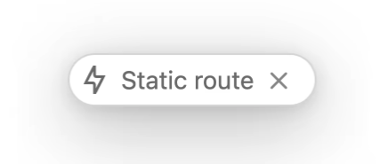

# Overview

This release incorporates features that were built on top of RC1 and RC2. It focuses on stability while also introducing a number of other features. You can learn more about these details at the conference.
The conference was held on Thursday, October 24 → Next.js Conf
[Next.js Conf by Vercel](https://nextjs.org/conf)

# Installation

```bash
npm i next@latest react@rc react-dom@rc eslint-config-next@latest
# or
yarn upgrade next --latest
yarn add react@rc react-dom@rc eslint-config-next@latest
# or
pnpm up next --latest
yarn add react@rc react-dom@rc eslint-config-next@latest
```

# Summary

- Internet Explorer has been dropped from the list of supported browsers, and support has shifted to [modern browsers](https://nextjs.org/docs/basic-features/supported-browsers-features).
  - Chrome 64+
  - Edge 79+
  - Firefox 67+
  - Opera 51+
  - Safari 12+
- The minimum Node version has been raised to 18.18.x and above.
- The minimum React version has been raised to react and react-dom 19.
  - useFormState → renamed to useActionState
  - [https://react.dev/blog/2024/04/25/react-19-upgrade-guide](https://react.dev/blog/2024/04/25/react-19-upgrade-guide)

# Key Features

- [Smooth upgrades with @next/codemod CLI](https://nextjs.org/blog/next-15#smooth-upgrades-with-nextcodemod-cli)
  Provides a codemod that automatically upgrades Next.js major versions.
  ```bash
  npx @next/codemod@canary upgrade latest
  ```
- [Async Request APIs (Breaking Change)](https://nextjs.org/blog/next-15#async-request-apis-breaking-change)
  Previously, SSR waited for all data before rendering the content. Because it was determined that not every component needs to wait for all of the server data, the existing synchronous APIs have been converted to asynchronous APIs.
  With this shift to asynchronous APIs, you now need to await the async API response when requesting data.

  ```tsx
  import { cookies } from 'next/headers';

  export async function AdminPanel() {
    const cookieStore = await cookies();
    const token = cookieStore.get('token');

    // ...
  }
  ```

  ```bash
  // A codemod is also provided.
  npx @next/codemod@canary next-async-request-api
  ```

- [Caching Semantics](https://nextjs.org/blog/next-15#caching-semantics)
  The default caching policy ([caching heuristics](https://x.com/feedthejim/status/1785242054773145636)) that had previously been introduced by default to improve performance has been changed, so the caching defaults for Route Handlers and the Client Router Cache are now set to not cache.
  GET Route Handlers and the Client Router Cache are no longer cached by default.

  ```bash
  // If you need default caching
  //// GET Route
  export dynamic = 'force-static'

  //// Client Router Cache
  ///// next.config.ts
  const nextConfig = {
    experimental: {
      staleTimes: {
        dynamic: 30,
      },
    },
  };

  export default nextConfig;
  ```

- [React 19](https://nextjs.org/blog/next-15#react-19)
  With confidence in the stability of the React 19 RC after extensive testing, the decision was made to adopt it in Next.js v15.
  A [codemod](https://nextjs.org/blog/next-15#smooth-upgrades-with-codemod-cli) is provided to make the transition seamless.
  Pages Router on React 18
  - In the Pages Router (as opposed to the App Router), React 18 can still be used as-is to maintain backward compatibility.
    React Compiler (Experimental)
  - This is a React compiler created by Meta's React team, and support for it has been added in Next.js 15.
    It reduces the amount of manual memoization code (useMemo, useCallback) that developers previously had to write, making the code simpler and easier to maintain.
  -
- [Turbopack Dev](https://nextjs.org/blog/next-15#turbopack-dev)
  The `next dev --turbo` command approach has now stabilized and become faster.
  - Local server startup is up to **76.7% faster.**
  - Code updates via Fast Refresh are up to **96.3% faster.**
  - Initial route compilation without caching is up to **45.8% faster.**
- [Static Route Indicator](https://nextjs.org/blog/next-15#static-route-indicator)
  Next.js now displays a static route indicator during development, helping you identify which routes are static or dynamic.
  
- [Support for next.config.ts](https://nextjs.org/blog/next-15#support-for-nextconfigts)
  next.config.ts is supported to provide type safety and autocompletion.

  ```tsx
  // next.config.ts

  import type { NextConfig } from 'next';

  const nextConfig: NextConfig = {
    /* config options here */
  };

  export default nextConfig;
  ```

- [ESLint 9 Support](https://nextjs.org/blog/next-15#eslint-9-support)
  As an alternative to ESLint 8, whose support ends on October 5, 2024, Next.js 15 now supports ESLint 9. (The `-ext` option is not supported → apparently ESLint 10 is heading in a direction that no longer allows the legacy configuration.)
  However, ESLint 8 is also still supported to maintain backward compatibility.
- [Development and Build Improvements](https://nextjs.org/blog/next-15#development-and-build-improvements)
  Server Components HMR
  - As part of improving HMR performance, previous rendering responses are reused, improving fetch development performance to reduce the cost of API calls.
    Faster Static Generation for the App Router
  - The logic that previously rendered twice for static optimization has been reduced to a single render.
  - The fetch cache is shared across static pages.

# NextJS v14 → v15 Migration

- [Async Request APIs (Breaking change)](https://nextjs.org/docs/app/building-your-application/upgrading/version-15#async-request-apis-breaking-change)
  Dynamic APIs that used to operate synchronously by relying on runtime information have been changed to work asynchronously.

  - [cookies](https://nextjs.org/docs/app/building-your-application/upgrading/version-15#cookies)

    - Recommended Async Usage

    ```tsx
    // app/page.tsx
    import { cookies } from 'next/headers';

    // Before
    const cookieStore = cookies();
    const token = cookieStore.get('token');

    // After
    const cookieStore = await cookies();
    const token = cookieStore.get('token');
    ```

    - Temporary Synchronous Usage

    ```tsx
    // app/page.tsx
    import { cookies, type UnsafeUnwrappedCookies } from 'next/headers';

    // Before
    const cookieStore = cookies();
    const token = cookieStore.get('token');

    // After
    const cookieStore = cookies() as unknown as UnsafeUnwrappedCookies;
    // will log a warning in dev
    const token = cookieStore.get('token');
    ```

  - [header](https://nextjs.org/docs/app/building-your-application/upgrading/version-15#headers)
    Recommended Async Usage

    ```tsx
    import { headers } from 'next/headers';

    // Before
    const headersList = headers();
    const userAgent = headersList.get('user-agent');

    // After
    const headersList = await headers();
    const userAgent = headersList.get('user-agent');
    ```

    Temporary Synchronous Usage

    ```tsx
    import { headers, type UnsafeUnwrappedHeaders } from 'next/headers';

    // Before
    const headersList = headers();
    const userAgent = headersList.get('user-agent');

    // After
    const headersList = headers() as unknown as UnsafeUnwrappedHeaders;
    // will log a warning in dev
    const userAgent = headersList.get('user-agent');
    ```

  - [draftMode](https://nextjs.org/docs/app/building-your-application/upgrading/version-15#draftmode)

    - draftMode is a feature used to enable draft mode in Next.js, primarily used when you need preview functionality or temporary content management.
      It lets you easily preview content changes in real time, allowing administrators to check new content or edits in advance without affecting the deployed site.
    - Recommended Async Usage

    ```tsx
    // app/page.tsx
    import { draftMode } from 'next/headers';

    // Before
    const { isEnabled } = draftMode();

    // After
    const { isEnabled } = await draftMode();
    ```

    - Temporary Synchronous Usage

    ```tsx
    // app/page.tsx
    import { draftMode, type UnsafeUnwrappedDraftMode } from 'next/headers';

    // Before
    const { isEnabled } = draftMode();

    // After
    // will log a warning in dev
    const { isEnabled } = draftMode() as unknown as UnsafeUnwrappedDraftMode;
    ```

  - [params & searchparams](https://nextjs.org/docs/app/building-your-application/upgrading/version-15#params--searchparams)

    - Asynchronous Layout

    ```tsx
    // app/layout.tsx
    // Before
    type Params = { slug: string };

    export function generateMetadata({ params }: { params: Params }) {
      const { slug } = params;
    }

    export default async function Layout({
      children,
      params,
    }: {
      children: React.ReactNode;
      params: Params;
    }) {
      const { slug } = params;
    }

    // After
    type Params = Promise<{ slug: string }>;

    export async function generateMetadata({ params }: { params: Params }) {
      const { slug } = await params;
    }

    export default async function Layout({
      children,
      params,
    }: {
      children: React.ReactNode;
      params: Params;
    }) {
      const { slug } = await params;
    }
    ```

    - Synchronous Layout

    ```tsx
    // app/layout.tsx
    // Before
    type Params = { slug: string };

    export default function Layout({
      children,
      params,
    }: {
      children: React.ReactNode;
      params: Params;
    }) {
      const { slug } = params;
    }

    // After
    import { use } from 'react';

    type Params = Promise<{ slug: string }>;

    export default function Layout(props: {
      children: React.ReactNode;
      params: Params;
    }) {
      const params = use(props.params);
      const slug = params.slug;
    }
    ```

    - Asynchronous Page

    ```tsx
    // app/page.tsx
    // Before
    type Params = { slug: string };
    type SearchParams = { [key: string]: string | string[] | undefined };

    export function generateMetadata({
      params,
      searchParams,
    }: {
      params: Params;
      searchParams: SearchParams;
    }) {
      const { slug } = params;
      const { query } = searchParams;
    }

    export default async function Page({
      params,
      searchParams,
    }: {
      params: Params;
      searchParams: SearchParams;
    }) {
      const { slug } = params;
      const { query } = searchParams;
    }

    // After
    type Params = Promise<{ slug: string }>;
    type SearchParams = Promise<{
      [key: string]: string | string[] | undefined;
    }>;

    export async function generateMetadata(props: {
      params: Params;
      searchParams: SearchParams;
    }) {
      const params = await props.params;
      const searchParams = await props.searchParams;
      const slug = params.slug;
      const query = searchParams.query;
    }

    export default async function Page(props: {
      params: Params;
      searchParams: SearchParams;
    }) {
      const params = await props.params;
      const searchParams = await props.searchParams;
      const slug = params.slug;
      const query = searchParams.query;
    }
    ```

    - Synchronous Page

    ```tsx
    // app/page.tsx
    'use client';

    // Before
    type Params = { slug: string };
    type SearchParams = { [key: string]: string | string[] | undefined };

    export default function Page({
      params,
      searchParams,
    }: {
      params: Params;
      searchParams: SearchParams;
    }) {
      const { slug } = params;
      const { query } = searchParams;
    }

    // After
    import { use } from 'react';

    type Params = Promise<{ slug: string }>;
    type SearchParams = { [key: string]: string | string[] | undefined };

    export default function Page(props: {
      params: Params;
      searchParams: SearchParams;
    }) {
      const params = use(props.params);
      const searchParams = use(props.searchParams);
      const slug = params.slug;
      const query = searchParams.query;
    }
    ```

    - Route Handlers

    ```tsx
    // app/api/route.ts
    // Before
    type Params = { slug: string };

    export async function GET(
      request: Request,
      segmentData: { params: Params },
    ) {
      const params = segmentData.params;
      const slug = params.slug;
    }

    // After
    type Params = Promise<{ slug: string }>;

    export async function GET(
      request: Request,
      segmentData: { params: Params },
    ) {
      const params = await segmentData.params;
      const slug = params.slug;
    }
    ```

- [fetch requests](https://nextjs.org/docs/app/building-your-application/upgrading/version-15#fetch-requests)
  fetch requests are no longer cached by default.
  To include a specific fetch request in the cache, you can use the cache: 'force-cache' option.

  ```tsx
  // app/layout.js
  export default async function RootLayout() {
    const a = await fetch('https://...'); // Not Cached
    const b = await fetch('https://...', { cache: 'force-cache' }); // Cached

    // ...
  }
  ```

  To include all fetch requests in a layout or page in the cache, you can add the export const fetchCache = 'default-caceh' setting.
  Once added, all fetch requests within the page will be cached unless they set their own cache option.

  ```tsx
  export const fetchCache = 'default-cache';

  export default async function RootLayout() {
    const a = await fetch('https://...'); // Cached
    const b = await fetch('https://...', { cache: 'no-store' }); // Not cached

    // ...
  }
  ```

- [Route Handlers](https://nextjs.org/docs/app/building-your-application/upgrading/version-15#route-handlers-1)
  GET functions in Route Handlers are also no longer cached by default. To enable caching in a handler's GET method, you need to add the route configuration option export const dynamic = 'force-static'.

  ```tsx
  // app/api/route.js
  export const dynamic = 'force-static';

  export async function GET() {}
  ```

- [Client-side Router Cache](https://nextjs.org/docs/app/building-your-application/upgrading/version-15#client-side-router-cache)
  When navigating between pages via Link or useRouter, the client router cache is no longer reused. However, the cache is still reused when navigating with the browser's back/forward buttons. (layout and loading states are also cached/reused.)
  To include page caching, you can use the staleTimes configuration option.

  ```tsx
  // next.config.js
  /** @type {import('next').NextConfig} */
  const nextConfig = {
    experimental: {
      staleTimes: {
        dynamic: 30,
        static: 180,
      },
    },
  };

  module.exports = nextConfig;
  ```

- [next/font](https://nextjs.org/docs/app/building-your-application/upgrading/version-15#nextfont)
  The @next/font package has been replaced by the built-in next/font.

  ```tsx
  // Before
  import { Inter } from '@next/font/google';

  // After
  import { Inter } from 'next/font/google';
  ```

- [experimental.bundlePagesExternals → bundlePagesRouterDependencies](https://nextjs.org/docs/app/building-your-application/upgrading/version-15#bundlepagesrouterdependencies)
  As the previously experimental property experimental.bundlePagesExternals has stabilized, the property name has changed to bundlePagesRouterDependencies.

  ```tsx
  // next.config.js

  /** @type {import('next').NextConfig} */
  const nextConfig = {
    // Before
    experimental: {
      bundlePagesExternals: true,
    },

    // After
    bundlePagesRouterDependencies: true,
  };

  module.exports = nextConfig;
  ```

- [experimental.serverComponentsExternalPackages → serverExternalPackages](https://nextjs.org/docs/app/building-your-application/upgrading/version-15#serverexternalpackages)
  As the previously experimental property experimental.serverComponentsExternalPackages has stabilized, the property name has changed to serverExternalPackages.

  ```tsx
  // next.config.js

  /** @type {import('next').NextConfig} */
  const nextConfig = {
    // Before
    experimental: {
      serverComponentsExternalPackages: ['package-name'],
    },

    // After
    serverExternalPackages: ['package-name'],
  };

  module.exports = nextConfig;
  ```

- [Speed Insights](https://nextjs.org/docs/app/building-your-application/upgrading/version-15#speed-insights)
  The auto instrumentation for Speed Insights has been removed in Next.js 15.
  To keep using Speed Insights, please follow the [Vercel Speed Insights Quickstart(opens in a new tab)](https://vercel.com/docs/speed-insights/quickstart) guide.

# References

- [Next.js 15](https://nextjs.org/blog/next-15)
