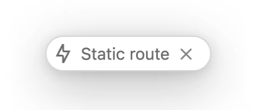

# 개요

이번 릴리즈에서는 RC1, RC2 기반에 기능이 포함되어 있으며, 안정성에 중점/그 외에 여러 기능이 포함되어 있습니다. 그 내용에 대해서는 컨퍼런스에서 확인이 가능합니다.
10월 24일 목요일 컨퍼런스 → Next.js Conf
[Next.js Conf by Vercel](https://nextjs.org/conf)

# 설치

```bash
npm i next@latest react@rc react-dom@rc eslint-config-next@latest
# or
yarn upgrade next --latest
yarn add react@rc react-dom@rc eslint-config-next@latest
# or
pnpm up next --latest
yarn add react@rc react-dom@rc eslint-config-next@latest
```

# 요약

- 지원하는 브라우저에서 Internet Explorer를 삭제하고, [최신 브라우저](https://nextjs.org/docs/basic-features/supported-browsers-features)를 지원하는걸로 변경되었습니다.
  - Chrome 64+
  - Edge 79+
  - Firefox 67+
  - Opera 51+
  - Safari 12+
- 최소 Node 버전이 18.18.x ~ 으로 변경되었습니다.
- 최소 React 버전이 react, react-dom 19 버전으로 변경되었습니다.
  - useFormState → useActionState 변경
  - [https://react.dev/blog/2024/04/25/react-19-upgrade-guide](https://react.dev/blog/2024/04/25/react-19-upgrade-guide)

# 주요 기능

- [Smooth upgrades with @next/codemod CLI](https://nextjs.org/blog/next-15#smooth-upgrades-with-nextcodemod-cli)
  nextjs 메이저 버전을 자동으로 업그레이드 해주는 codemod 지원
  ```bash
  npx @next/codemod@canary upgrade latest
  ```
- [Async Request APIs (Breaking Change)](https://nextjs.org/blog/next-15#async-request-apis-breaking-change)
  기존에 SSR에서는 콘텐츠 렌더링 전에 데이터를 전부 기다리고 있었는데, 모든 구성 요소가 서버 데이터를 모두 기다릴 필요가 없다고 판단해서 기존 동기 API를 비동기 API로 전환하게 되었습니다.
  비동기 API로 전환됨에 따라서 데이터에 요청할 경우 비동기 API 응답을 기다리도록 변경이 필요합니다.

  ```tsx
  import { cookies } from 'next/headers';

  export async function AdminPanel() {
    const cookieStore = await cookies();
    const token = cookieStore.get('token');

    // ...
  }
  ```

  ```bash
  // codemod도 제공해주고 있습니다.
  npx @next/codemod@canary next-async-request-api
  ```

- [Caching Semantics](https://nextjs.org/blog/next-15#caching-semantics)
  기존에 기본적으로 성능 향상을 위해서 도입되었던 기본 캐싱 정책([caching heuristics](https://x.com/feedthejim/status/1785242054773145636))을 변경해서 Route Handler와 Client Router Cache의 캐싱 기본값을 캐시하지 않음으로 변경하였습니다.
  GET Route, Client Router Cache는 더 이상 기본적으로 캐시하지 않습니다.

  ```bash
  // 기본적인 캐시가 필요한 경우
  //// GET Route
  export dynamic = 'force-static'

  //// Client Router Cache
  ///// next.config.ts
  const nextConfig = {
    experimental: {
      staleTimes: {
        dynamic: 30,
      },
    },
  };

  export default nextConfig;
  ```

- [React 19](https://nextjs.org/blog/next-15#react-19)
  React 19 RC 버전이 광범위한 테스트 안정성에 대한 확신이 있어서 NextJS v15에서 도입하기로 결정하였습니다.
  원활한 전환을 위해서 [codemod](https://nextjs.org/blog/next-15#smooth-upgrades-with-codemod-cli)를 제공하고 있습니다.
  Pages Router on React 18
  - App Router가 아닌 Page Router에서는 하위 호환성 유지를 위해서 React18을 그대로 이용이 가능합니다.
    React Compiler (Experimental)
  - Meta의 React팀에서 만든 리액트 컴파일러로써 NextJS 15 버전에서 지원이 추가되었습니다.
    기존에 개발자가 수행해야했던 수동 메이이제이션 코드(useMemo, useCallback)양을 줄이고 코드를 더 단순하고 유지관리가 쉽게 처리를 해주게 됩니다.
  -
- [Turbopack Dev](https://nextjs.org/blog/next-15#turbopack-dev)
  next dev —turbo command 방식이 인제 안정화가 되었고 속도도 빨라졌습니다.
  - 로컬 서버 시작 속도가 최대 **76.7% 빨라졌습니다 .**
  - 빠른 새로 고침으로 최대 **96.3% 더 빠른** 코드 업데이트.
  - 캐싱 없이 초기 경로 컴파일 속도가 최대 **45.8% 더 빠릅니다.**
- [Static Route Indicator](https://nextjs.org/blog/next-15#static-route-indicator)
  NextJs에 개발 중에 정적 경로 표시기가 표시되어서 어떤 경로가 정적/동적인지를 식별하는데 도움을 얻을 수 있습니다.
  
- [Support for next.config.ts](https://nextjs.org/blog/next-15#support-for-nextconfigts)
  타입 안정성과 자동 완성 기능을 제공하기 위해서 next.config.ts 지원합니다.

  ```tsx
  // next.config.ts

  import type { NextConfig } from 'next';

  const nextConfig: NextConfig = {
    /* config options here */
  };

  export default nextConfig;
  ```

- [ESLint 9 Support](https://nextjs.org/blog/next-15#eslint-9-support)
  2024년 10월 5일 종료되는 ESLint 8 대안으로 NextJS 15에서는 ESLint 9 버전을 지원하게 됩니다.(-ext 옵션 미지원 → ESLint 10에서 이전 구성을 허용하지 않는 방향으로 간다고 하네요.)
  단, 하위 호환성을 유지하기 위해서 ESLint 8 또한 지원합니다.
- [Development and Build Improvements](https://nextjs.org/blog/next-15#development-and-build-improvements)
  Server Components HMR
  - HMR 성능 개선의 일환으로 이전 렌더링 응답을 재사용, API 호출에 대한 비용 감소를 위해서 fetch 개발 성능 개선
    Faster Static Generation for the App Router
  - 정적 최적화를 위해서 2번 렌더링 하던 로직을 1번으로 축소
  - 정적 페이지 간의 fetch 캐시 공유

# NextJS v14 → v15 Migration

- [Async Request APIs (Breaking change)](https://nextjs.org/docs/app/building-your-application/upgrading/version-15#async-request-apis-breaking-change)
  런타임 정보에 의존해서 동기적 동작했던 동적 API들이 비동기 방식으로 변경되었습니다.

  - [cookies](https://nextjs.org/docs/app/building-your-application/upgrading/version-15#cookies)

    - Recommended Async Usage

    ```tsx
    // app/page.tsx
    import { cookies } from 'next/headers';

    // Before
    const cookieStore = cookies();
    const token = cookieStore.get('token');

    // After
    const cookieStore = await cookies();
    const token = cookieStore.get('token');
    ```

    - Temporary Synchronous Usage

    ```tsx
    // app/page.tsx
    import { cookies, type UnsafeUnwrappedCookies } from 'next/headers';

    // Before
    const cookieStore = cookies();
    const token = cookieStore.get('token');

    // After
    const cookieStore = cookies() as unknown as UnsafeUnwrappedCookies;
    // will log a warning in dev
    const token = cookieStore.get('token');
    ```

  - [header](https://nextjs.org/docs/app/building-your-application/upgrading/version-15#headers)
    Recommended Async Usage

    ```tsx
    import { headers } from 'next/headers';

    // Before
    const headersList = headers();
    const userAgent = headersList.get('user-agent');

    // After
    const headersList = await headers();
    const userAgent = headersList.get('user-agent');
    ```

    Temporary Synchronous Usage

    ```tsx
    import { headers, type UnsafeUnwrappedHeaders } from 'next/headers';

    // Before
    const headersList = headers();
    const userAgent = headersList.get('user-agent');

    // After
    const headersList = headers() as unknown as UnsafeUnwrappedHeaders;
    // will log a warning in dev
    const userAgent = headersList.get('user-agent');
    ```

  - [draftMode](https://nextjs.org/docs/app/building-your-application/upgrading/version-15#draftmode)

    - draftMode는 Next.js에서 초안 모드를 활성화하기 위해 사용되는 기능으로, 주로 미리보기 기능이나 임시 콘텐츠 관리가 필요한 경우에 사용됩니다.
      이를 통해 실시간으로 변경된 콘텐츠를 쉽게 미리 볼 수 있으며, 배포된 사이트에 영향을 주지 않고도 관리자가 새 콘텐츠나 수정사항을 미리 확인할 수 있습니다.
    - Recommended Async Usage

    ```tsx
    // app/page.tsx
    import { draftMode } from 'next/headers';

    // Before
    const { isEnabled } = draftMode();

    // After
    const { isEnabled } = await draftMode();
    ```

    - Temporary Synchronous Usage

    ```tsx
    // app/page.tsx
    import { draftMode, type UnsafeUnwrappedDraftMode } from 'next/headers';

    // Before
    const { isEnabled } = draftMode();

    // After
    // will log a warning in dev
    const { isEnabled } = draftMode() as unknown as UnsafeUnwrappedDraftMode;
    ```

  - [params & searchparams](https://nextjs.org/docs/app/building-your-application/upgrading/version-15#params--searchparams)

    - Asynchronous Layout

    ```tsx
    // app/layout.tsx
    // Before
    type Params = { slug: string };

    export function generateMetadata({ params }: { params: Params }) {
      const { slug } = params;
    }

    export default async function Layout({
      children,
      params,
    }: {
      children: React.ReactNode;
      params: Params;
    }) {
      const { slug } = params;
    }

    // After
    type Params = Promise<{ slug: string }>;

    export async function generateMetadata({ params }: { params: Params }) {
      const { slug } = await params;
    }

    export default async function Layout({
      children,
      params,
    }: {
      children: React.ReactNode;
      params: Params;
    }) {
      const { slug } = await params;
    }
    ```

    - Synchronous Layout

    ```tsx
    // app/layout.tsx
    // Before
    type Params = { slug: string };

    export default function Layout({
      children,
      params,
    }: {
      children: React.ReactNode;
      params: Params;
    }) {
      const { slug } = params;
    }

    // After
    import { use } from 'react';

    type Params = Promise<{ slug: string }>;

    export default function Layout(props: {
      children: React.ReactNode;
      params: Params;
    }) {
      const params = use(props.params);
      const slug = params.slug;
    }
    ```

    - Asynchronous Page

    ```tsx
    // app/page.tsx
    // Before
    type Params = { slug: string };
    type SearchParams = { [key: string]: string | string[] | undefined };

    export function generateMetadata({
      params,
      searchParams,
    }: {
      params: Params;
      searchParams: SearchParams;
    }) {
      const { slug } = params;
      const { query } = searchParams;
    }

    export default async function Page({
      params,
      searchParams,
    }: {
      params: Params;
      searchParams: SearchParams;
    }) {
      const { slug } = params;
      const { query } = searchParams;
    }

    // After
    type Params = Promise<{ slug: string }>;
    type SearchParams = Promise<{
      [key: string]: string | string[] | undefined;
    }>;

    export async function generateMetadata(props: {
      params: Params;
      searchParams: SearchParams;
    }) {
      const params = await props.params;
      const searchParams = await props.searchParams;
      const slug = params.slug;
      const query = searchParams.query;
    }

    export default async function Page(props: {
      params: Params;
      searchParams: SearchParams;
    }) {
      const params = await props.params;
      const searchParams = await props.searchParams;
      const slug = params.slug;
      const query = searchParams.query;
    }
    ```

    - Synchronous Page

    ```tsx
    // app/page.tsx
    'use client';

    // Before
    type Params = { slug: string };
    type SearchParams = { [key: string]: string | string[] | undefined };

    export default function Page({
      params,
      searchParams,
    }: {
      params: Params;
      searchParams: SearchParams;
    }) {
      const { slug } = params;
      const { query } = searchParams;
    }

    // After
    import { use } from 'react';

    type Params = Promise<{ slug: string }>;
    type SearchParams = { [key: string]: string | string[] | undefined };

    export default function Page(props: {
      params: Params;
      searchParams: SearchParams;
    }) {
      const params = use(props.params);
      const searchParams = use(props.searchParams);
      const slug = params.slug;
      const query = searchParams.query;
    }
    ```

    - Route Handlers

    ```tsx
    // app/api/route.ts
    // Before
    type Params = { slug: string };

    export async function GET(
      request: Request,
      segmentData: { params: Params },
    ) {
      const params = segmentData.params;
      const slug = params.slug;
    }

    // After
    type Params = Promise<{ slug: string }>;

    export async function GET(
      request: Request,
      segmentData: { params: Params },
    ) {
      const params = await segmentData.params;
      const slug = params.slug;
    }
    ```

- [fetch requests](https://nextjs.org/docs/app/building-your-application/upgrading/version-15#fetch-requests)
  fetch 요청은 기본적으로 더 이상 캐시되지 않습니다.
  특정 fetch 요청을 캐시에 포함시키려면 cache: 'force-cache' 옵션을 사용할 수 있습니다.

  ```tsx
  // app/layout.js
  export default async function RootLayout() {
    const a = await fetch('https://...'); // Not Cached
    const b = await fetch('https://...', { cache: 'force-cache' }); // Cached

    // ...
  }
  ```

  layout or page 모든 fetch 요청을 캐시에 포함시키려면 export const fetchCache = ‘default-caceh’ 설정을 추가하면 됩니다.
  추가될 경우 페이지 내에 모든 fetch 요청을 자체 캐시 옵션을 설정하지 않는 한 캐시되게 됩니다.

  ```tsx
  export const fetchCache = 'default-cache';

  export default async function RootLayout() {
    const a = await fetch('https://...'); // Cached
    const b = await fetch('https://...', { cache: 'no-store' }); // Not cached

    // ...
  }
  ```

- [Route Handlers](https://nextjs.org/docs/app/building-your-application/upgrading/version-15#route-handlers-1)
  Route Handlers에서 GET 함수도 기본적으로 캐시를 제공하지 않습니다. handler GET 메서드에서 캐시를 포함시키려면 route 설정 옵션인 export const dynamic = ‘force-static’ 추가해주셔야지 사용이 가능합니다.

  ```tsx
  // app/api/route.js
  export const dynamic = 'force-static';

  export async function GET() {}
  ```

- [Client-side Router Cache](https://nextjs.org/docs/app/building-your-application/upgrading/version-15#client-side-router-cache)
  Link or useRouter를 통한 페이지 간 탐색할 경우 클라이언트 라우터 캐시기 재사용되지 않습니다. 단, 브라우저 뒤로/앞으로 가기 탐색 시 캐시가 여전히 재사용됩니다.(layout, loading 상태 또한 캐시/재사용)
  Page 캐시를 포함시키려면 staleTimes 설정 옵션을 통해서 사용이 가능합니다.

  ```tsx
  // next.config.js
  /** @type {import('next').NextConfig} */
  const nextConfig = {
    experimental: {
      staleTimes: {
        dynamic: 30,
        static: 180,
      },
    },
  };

  module.exports = nextConfig;
  ```

- [next/font](https://nextjs.org/docs/app/building-your-application/upgrading/version-15#nextfont)
  @next/font 패키지가 내장 next/font 로 대체되었습니다.

  ```tsx
  // 변경 전
  import { Inter } from '@next/font/google';

  // 변경 후
  import { Inter } from 'next/font/google';
  ```

- [experimental.bundlePagesExternals → bundlePagesRouterDependencies](https://nextjs.org/docs/app/building-your-application/upgrading/version-15#bundlepagesrouterdependencies)
  실험적인 속성이였던 experimental.bundlePagesExternals가 안정화 됨에 따라서 속성명이 bundlePagesRouterDependencies 변경되었습니다.

  ```tsx
  // next.config.js

  /** @type {import('next').NextConfig} */
  const nextConfig = {
    // Before
    experimental: {
      bundlePagesExternals: true,
    },

    // After
    bundlePagesRouterDependencies: true,
  };

  module.exports = nextConfig;
  ```

- [experimental.serverComponentsExternalPackages → serverExternalPackages](https://nextjs.org/docs/app/building-your-application/upgrading/version-15#serverexternalpackages)
  실험적인 속성이였던 experimental.serverComponentsExternalPackages가 안정화 됨에 따라서 속성명이 serverExternalPackages 변경되었습니다.

  ```tsx
  // next.config.js

  /** @type {import('next').NextConfig} */
  const nextConfig = {
    // Before
    experimental: {
      serverComponentsExternalPackages: ['package-name'],
    },

    // After
    serverExternalPackages: ['package-name'],
  };

  module.exports = nextConfig;
  ```

- [Speed Insights](https://nextjs.org/docs/app/building-your-application/upgrading/version-15#speed-insights)
  Speed Insights의 auto instrumentation이 Next.js 15에서 제거되었습니다
  Speed Insights를 계속 사용하려면, [Vercel Speed Insights Quickstart(opens in a new tab)](https://vercel.com/docs/speed-insights/quickstart) 가이드를 따라주세요.

# 참고페이지

- [Next.js 15](https://nextjs.org/blog/next-15)
