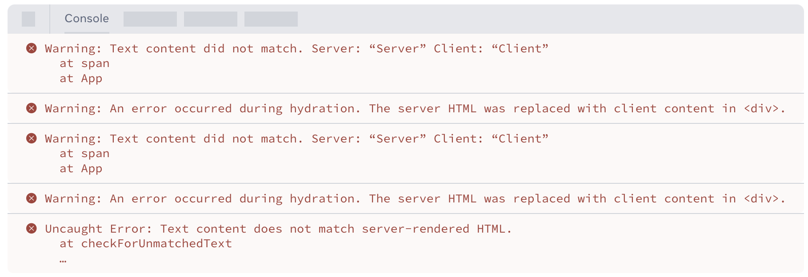
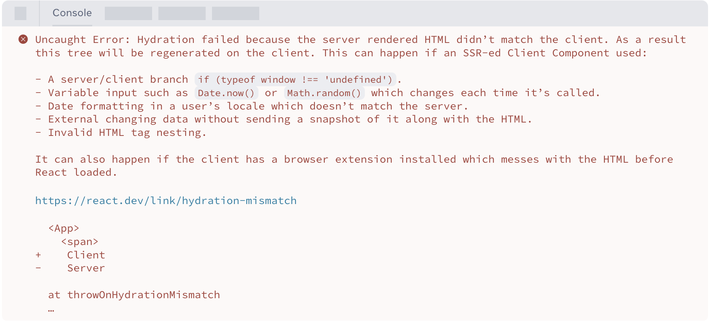
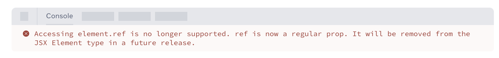

# Overview

React 19 introduces a number of new features and improvements that enhance the developer experience, simplify common patterns, and boost performance. Below is a summary along with the key changes and code examples.

# What’s new in React 19

## Actions

A common use case in React apps is to perform a data mutation and then update the state based on the response.

In the past, pending, state, and optimistic updates had to be managed sequentially as separate pieces of state, but with the introduction of Actions this can now be handled automatically.

- Before Actions

  ```tsx
  function UpdateName({}) {
    const [name, setName] = useState('');
    const [error, setError] = useState(null);
    const [isPending, setIsPending] = useState(false);

    const handleSubmit = async () => {
      setIsPending(true);
      const error = await updateName(name);
      setIsPending(false);
      if (error) {
        setError(error);
        return;
      }
      redirect('/path');
    };

    return (
      <div>
        <input value={name} onChange={event => setName(event.target.value)} />
        <button onClick={handleSubmit} disabled={isPending}>
          Update
        </button>
        {error && <p>{error}</p>}
      </div>
    );
  }
  ```

- Support for using async functions

  ```tsx
  // Using pending state from Actions
  function UpdateName({}) {
    const [name, setName] = useState('');
    const [error, setError] = useState(null);
    const [isPending, startTransition] = useTransition();

    const handleSubmit = () => {
      startTransition(async () => {
        const error = await updateName(name);
        if (error) {
          setError(error);
          return;
        }
        redirect('/path');
      });
    };

    return (
      <div>
        <input value={name} onChange={event => setName(event.target.value)} />
        <button onClick={handleSubmit} disabled={isPending}>
          Update
        </button>
        {error && <p>{error}</p>}
      </div>
    );
  }
  ```

- useActionState: Handle common cases for Actions

  - In earlier Canary versions this hook was named useFormState, and it has been renamed to useActionState

  ```tsx
  // Using <form> Actions and useActionState
  function ChangeName({ name, setName }) {
    const [error, submitAction, isPending] = useActionState(
      async (previousState, formData) => {
        const error = await updateName(formData.get('name'));
        if (error) {
          return error;
        }
        redirect('/path');
        return null;
      },
      null,
    );

    return (
      <form action={submitAction}>
        <input type="text" name="name" />
        <button type="submit" disabled={isPending}>
          Update
        </button>
        {error && <p>{error}</p>}
      </form>
    );
  }
  ```

- React DOM: <form> Actions
  In React 19 you can pass a function to the action and formAction attributes of <form>, <input>, and <button> elements
  ```tsx
  <form action={actionFunction}>
  + <button formAction={formAction}>Increment</button>
  + <input type="submit" formAction={formAction}>Increment</input>
  ```
- useFormStatus: React DOM: New hook
  A hook that lets you access information about a form without prop drilling through components

  ```tsx
  import { useFormStatus } from 'react-dom';
  import action from './actions';

  function Submit() {
    const status = useFormStatus();
    return <button disabled={status.pending}>Submit</button>;
  }

  export default function App() {
    return (
      <form action={action}>
        <Submit />
      </form>
    );
  }
  ```

- useOptimistic: New hook
  A hook for optimistically showing the final state while an asynchronous request is in progress

  ```tsx
  function ChangeName({ currentName, onUpdateName }) {
    const [optimisticName, setOptimisticName] = useOptimistic(currentName); // initial state

    const submitAction = async formData => {
      const newName = formData.get('name');
      setOptimisticName(newName); // set state
      const updatedName = await updateName(newName);
      onUpdateName(updatedName);
    };

    return (
      <form action={submitAction}>
        <p>Your name is: {optimisticName}</p>
        <p>
          <label>Change Name:</label>
          <input
            type="text"
            name="name"
            disabled={currentName !== optimisticName}
          />
        </p>
      </form>
    );
  }
  ```

## USE

- useContext → use

  - The usage is the same as useContext, but the distinguishing feature is that it can also be used inside conditional statements.

  ```tsx
  import { use } from 'react';
  import ThemeContext from './ThemeContext';

  function Heading({ children }) {
    if (children == null) {
      return null;
    }

    // This would not work with useContext
    // because of the early return.
    const theme = use(ThemeContext);
    return <h1 style={{ color: theme.color }}>{children}</h1>;
  }
  ```

- promise → use

  - Just wrap the promise with use and wrap the parent with Suspense.
  - As you can see in the code below, it lets you write concise code, so it looks like it could replace the async libraries you have been using.

  ```tsx
  import { use } from 'react';

  function Comments({ commentsPromise }) {
    // `use` will suspend until the promise resolves.
    const comments = use(commentsPromise);
    return comments.map(comment => <p key={comment.id}>{comment}</p>);
  }

  function Page({ commentsPromise }) {
    // When `use` suspends in Comments,
    // this Suspense boundary will be shown.
    return (
      <Suspense fallback={<div>Loading...</div>}>
        <Comments commentsPromise={commentsPromise} />
      </Suspense>
    );
  }
  ```

  - Additional notes
    - How Suspense works
      [How Suspense works](https://velog.io/@seeh_h/suspense의-동작원리)
    - throw Promise → componetDidCatch(Suspend) → pending, fullfiled, error

## React Server Components and Server Actions

- Server Components
  An option that lets you pre-render components in an environment separate from the client application or the SSR server.
  One common misconception, though: the use server directive is only used in server actions, not in server components.
- Server Actions
  They let client components call asynchronous functions that execute on the server.

# Improvements in React 19

- forwardRef → ref is a prop

  - Changed from the syntax of wrapping with forwardRef to pass ref, so that ref is passed as a regular prop

  ```tsx
  function MyInput({ placeholder, ref }) {
    return <input placeholder={placeholder} ref={ref} />;
  }

  //...
  <MyInput ref={ref} />;
  ```

- improved error reporting for hydration errors in react-dom
  Improved reporting of hydration errors, changed to a comparison of the mismatch and a single message
  - Before
    
  - After
    
- <Context> as a provider
  Instead of using Context.Provider, it has been replaced with using Context directly.

  ```tsx
  // < v19
  const ThemeContext = createContext('');

  function App({ children }) {
    return (
      <ThemeContext.Provider value="dark">{children}</ThemeContext.Provider>
    );
  }

  // >= v19
  // < v19
  const ThemeContext = createContext('');

  function App({ children }) {
    return <ThemeContext value="dark">{children}</ThemeContext>;
  }
  ```

- Cleanup functions for refs
  A feature was added that calls a cleanup function on a ref when the component unmounts.

  ```tsx
  <input
    ref={ref => {
      // ref created

      // NEW: return a cleanup function to reset
      // the ref when element is removed from DOM.
      return () => {
        // ref cleanup
      };
    }}
  />
  ```

  With the introduction of cleanup functions, returning anything else from a ref callback now produces a TypeScript error, so to resolve it you need to make sure the callback does not return a value.

  ```tsx
  -(<div ref={current => (instance = current)} />) +
  (
    <div
      ref={current => {
        instance = current;
      }}
    />
  );
  ```

- useDeferredValue initial value
  It is now possible to set an initial value for useDeferredValue.

  ```tsx
  function Search({ deferredValue }) {
    // On initial render the value is ''.
    // Then a re-render is scheduled with the deferredValue.
    const value = useDeferredValue(deferredValue, '');

    return <Results query={value} />;
  }
  ```

## Support for Document Metadata

- Overview
  Built-in support was added for rendering [**`<title>`**](https://react.dev/reference/react-dom/components/title), [**`<meta>`**](https://react.dev/reference/react-dom/components/meta), and **metadata** [**`<link>`**](https://react.dev/reference/react-dom/components/link) tags anywhere in the component tree.
  It works in both server and client components, meaning that functionality pioneered by libraries such as **React Helmet**, which were already in use, has been brought in-house.
  However, if you need to override generic metadata with route-specific metadata based on the current path, you will still need to use a library such as React Helmet.
- Example
  ```tsx
  function BlogPost({ post }) {
    return (
      <article>
        <h1>{post.title}</h1>
        <title>{post.title}</title>
        <meta name="author" content="Josh" />
        <link rel="author" href="https://twitter.com/joshcstory/" />
        <meta name="keywords" content={post.keywords} />
        <p>Eee equals em-see-squared...</p>
      </article>
    );
  }
  ```

## Support for stylesheets

- Overview
  It provides built-in support for stylesheets, letting you set insertion priority through the precedence style attribute.
  Before the client-side rendering commit, it waits for added stylesheets and handles loading them according to their priority.
- Example

  ```tsx
  function ComponentOne() {
    return (
      <Suspense fallback="loading...">
        <link rel="stylesheet" href="foo" precedence="default" />
        <link rel="stylesheet" href="bar" precedence="high" />
        <article class="foo-class bar-class">
          {...}
        </article>
      </Suspense>
    )
  }

  function ComponentTwo() {
    return (
      <div>
        <p>{...}</p>
        <link rel="stylesheet" href="baz" precedence="default" />  <-- will be inserted between foo & bar
      </div>
    )
  }
  ```

## Support for async scripts

- Example

  ```tsx
  function MyComponent() {
    return (
      <div>
        <script async={true} src="..." />
        Hello World
      </div>
    )
  }

  function App() {
    <html>
      <body>
        <MyComponent>
        ...
        <MyComponent> // won't lead to duplicate script in the DOM
      </body>
    </html>
  }
  ```

## Support for preloading resources

- Overview
  A feature was added that tells the browser, both on the initial document load and on client-side updates, about resources that should be loaded as early as possible.
- Example

  ```tsx
  import { prefetchDNS, preconnect, preload, preinit } from 'react-dom'
  function MyComponent() {
    preinit('https://.../path/to/some/script.js', {as: 'script' }) // loads and executes this script eagerly
    preload('https://.../path/to/font.woff', { as: 'font' }) // preloads this font
    preload('https://.../path/to/stylesheet.css', { as: 'style' }) // preloads this stylesheet
    prefetchDNS('https://...') // when you may not actually request anything from this host
    preconnect('https://...') // when you will request something but aren't sure what
  }

  // result
  <!-- the above would result in the following DOM/HTML -->
  <html>
    <head>
      <!-- links/scripts are prioritized by their utility to early loading, not call order -->
      <link rel="prefetch-dns" href="https://...">
      <link rel="preconnect" href="https://...">
      <link rel="preload" as="font" href="https://.../path/to/font.woff">
      <link rel="preload" as="style" href="https://.../path/to/stylesheet.css">
      <script async="" src="https://.../path/to/some/script.js"></script>
    </head>
    <body>
      ...
    </body>
  </html>

  ```

  - [`prefetchDNS`](https://react.dev/reference/react-dom/prefetchDNS) : prefetches the IP address of a DNS domain name you intend to connect to.

    ```tsx
    import { prefetchDNS } from 'react-dom';

    function AppRoot() {
      prefetchDNS('https://example.com');
      // ...
    }
    ```

  - [`preconnect`](https://react.dev/reference/react-dom/preconnect) used to connect to a server from which you expect to request resources.

    ```tsx
    import { preconnect } from 'react-dom';

    function AppRoot() {
      preconnect('https://example.com');
      // ...
    }
    ```

  - [`preload`](https://react.dev/reference/react-dom/preload) used to fetch a stylesheet, font, image, or external script that you expect to use.

    ```tsx
    import { preload } from 'react-dom';

    function AppRoot() {
      preload('https://example.com/font.woff2', { as: 'font' });
      // ...
    }
    ```

  - [`preloadModule`](https://react.dev/reference/react-dom/preloadModule) lets you fetch an ESM module you intend to use.

    ```tsx
    import { preloadModule } from 'react-dom';

    function AppRoot() {
      preloadModule('https://example.com/module.js', { as: 'script' });
      // ...
    }
    ```

  - [`preinit`](https://react.dev/reference/react-dom/preinit) used when you want to pre-initialize a script or stylesheet.

    ```tsx
    import { preinit } from 'react-dom';

    function AppRoot() {
      preinit('https://example.com/script.js', { as: 'script' });
      // ...
    }
    ```

  - [`preinitModule`](https://react.dev/reference/react-dom/preinitModule) used when you want to pre-initialize an ESM module.

    ```tsx
    import { preinitModule } from 'react-dom';

    function AppRoot() {
      preinitModule('https://example.com/module.js', { as: 'script' });
      // ...
    }
    ```

# Migration Guide

## Installing

```tsx
npm install react@latest react-dom@latest
npm install -D @types/react@latest @types/react-dom@latest

yarn add react@latest react-dom@latest
yarn add -D @types/react@latest @types/react-dom@latest
```

## Codemods

```bash
npx codemod@latest react/19/migration-recipe
```

- [replace-reactdom-render](https://github.com/reactjs/react-codemod?tab=readme-ov-file#replace-reactdom-render)
  - Replaces usages of ReactDom.render() with createRoot(node).render().
- [replace-string-ref](https://github.com/reactjs/react-codemod?tab=readme-ov-file#replace-string-ref)
  - Replaces deprecated string refs with callback refs.
- [replace-act-import](https://github.com/reactjs/react-codemod?tab=readme-ov-file#replace-act-import)
  - Updates act import path from react-dom/test-utils to react.
- [replace-use-form-state](https://github.com/reactjs/react-codemod?tab=readme-ov-file#replace-use-form-state)
  - Replaces usages of useFormState() to use useActionState().

## Errors in render are not re-thrown

React 19 introduces new capabilities for fine-grained control over error handling.

You can now adjust how errors are handled using the onCaughtError and onUncaughtError options on the createRoot and hydrateRoot methods.

The existing problem

Previously, even when you caught errors using an Error Boundary, the errors were still printed to the console via console.error.

As a result, developers saw unnecessary error messages even though the errors had been handled properly, which could cause confusion during development.

Improvements in React 19

React 19 provides a way to control error handling more granularly.

Using the onCaughtError and onUncaughtError options of createRoot and hydrateRoot, you can override the default behavior of printing error messages to the console.

onCaughtError is used to handle errors caught by an Error Boundary.

```tsx
const root = createRoot(container, {
  onUncaughtError: (error, errorInfo) => {
    // ... log error report(Errors that are not caught by an Error Boundary)
  },
  onCaughtError: (error, errorInfo) => {
    // ... log error report(Errors that are caught by an Error Boundary)
  },
});
```

## Removed deprecated React APIs

- Removed: propTypes and defaultProps for functions
  PropTypes was deprecated in April 2017. If you want to keep using type checking, use TypeScript or a type-solution package.
  Once ES6 default parameters are supported, defaultProps can also be removed (however, it will continue to be supported for class components).

  ```tsx
  // < 19
  import PropTypes from 'prop-types';

  function Heading({ text }) {
    return <h1>{text}</h1>;
  }
  Heading.propTypes = {
    text: PropTypes.string,
  };
  Heading.defaultProps = {
    text: 'Hello, world!',
  };

  // >= 19
  // After
  interface Props {
    text?: string;
  }
  function Heading({ text = 'Hello, world!' }: Props) {
    return <h1>{text}</h1>;
  }
  ```

- Legacy Context using contextTypes and getChildContext
  Legacy Context was deprecated in October 2018.
  If you still want to keep using context types in class components, use the contextType API instead.

  ```tsx
  // < 19
  import PropTypes from 'prop-types';

  class Parent extends React.Component {
    static childContextTypes = {
      foo: PropTypes.string.isRequired,
    };

    getChildContext() {
      return { foo: 'bar' };
    }

    render() {
      return <Child />;
    }
  }

  class Child extends React.Component {
    static contextTypes = {
      foo: PropTypes.string.isRequired,
    };

    render() {
      return <div>{this.context.foo}</div>;
    }
  }

  // >= 19
  const FooContext = React.createContext();

  class Parent extends React.Component {
    render() {
      return (
        <FooContext value="bar">
          <Child />
        </FooContext>
      );
    }
  }

  class Child extends React.Component {
    static contextType = FooContext;

    render() {
      return <div>{this.context}</div>;
    }
  }
  ```

- Removed: string refs
  String refs were deprecated in March 2018.
  String refs were supported before ref callbacks, but React 19 removes the string ref approach to make React simpler and easier to understand.
  If you happen to have code that uses them, you need to switch to the ref callback approach.
  codemod: npx codemod@latest react/19/replace-string-ref

  ```tsx
  // < 19
  class MyComponent extends React.Component {
    componentDidMount() {
      this.refs.input.focus();
    }

    render() {
      return <input ref="input" />;
    }
  }

  // >= 19
  class MyComponent extends React.Component {
    componentDidMount() {
      this.input.focus();
    }

    render() {
      return <input ref={input => (this.input = input)} />;
    }
  }
  ```

- Removed: Module pattern factories
  Module pattern factories were deprecated in August 2019.
  Since React 19 removes support for Module pattern factories, you need to migrate to regular functions.

  ```tsx
  // < 19
  function FactoryComponent() {
    return {
      render() {
        return <div />;
      },
    };
  }

  // >= 19
  function FactoryComponent() {
    return <div />;
  }
  ```

- Removed: React.createFactory
  createFactory was deprecated in February 2020.
  Since it is removed in React 19, you need to migrate to plain JSX.

  ```tsx
  // < 19
  import { createFactory } from 'react';

  const button = createFactory('button');

  // >= 19
  const button = <button />;
  ```

- Removed: react-test-renderer/shallow
  In React 18, react-shallow-renderer was re-exported as react-test-renderer/shallow, but since React 19 removes react-test-renderer/shallow, you need to install the react-shallow-renderer package directly.

  ```tsx
  npm install react-shallow-renderer --save-dev

  - import ShallowRenderer from 'react-test-renderer/shallow';
  + import ShallowRenderer from 'react-shallow-renderer';
  ```

- Removed deprecated React DOM APIs
  Importing the act method has changed from react-dom/test-utils to react. (test-utils removed)
  codemod: npx codemod@latest react/19/replace-act-import
  ```tsx
  - import {act} from 'react-dom/test-utils'
  + import {act} from 'react';
  ```
- Removed: ReactDOM.render, ReactDOM.hydrate
  ReactDOM.render and ReactDOM.hydrate were deprecated in March 2022.
  ReactDOM.render → ReactDOM.createRoot
  ReactDOM.hydrate → ReactDOM.hydrateRoot
  codemod: npx codemod@latest react/19/replace-reactdom-render

  ```tsx
  // < 19
  import { render } from 'react-dom';
  render(<App />, document.getElementById('root'));

  // >= 19
  import { createRoot } from 'react-dom/client';
  const root = createRoot(document.getElementById('root'));
  root.render(<App />);

  // < 19
  import { hydrate } from 'react-dom';
  hydrate(<App />, document.getElementById('root'));

  // >= 19
  import { hydrateRoot } from 'react-dom/client';
  hydrateRoot(document.getElementById('root'), <App />);
  ```

- Removed: unmountComponentAtNode
  ReactDOM.unmountComponentAtNode was deprecated in March 2022.
  unmountComponentAtNode → root.unmount

  ```tsx
  // < 19
  unmountComponentAtNode(document.getElementById('root'));

  // >= 19
  const root = createRoot(document.getElementById('root'));
  root.unmount();
  ```

- Removed: ReactDOM.findDOMNode
  ReactDOM.findDOMNode was deprecated in October 2018.
  Since findDOMNode is removed, you need to migrate to DOM Refs.

  ```tsx
  // < 19
  import { findDOMNode } from 'react-dom';

  function AutoselectingInput() {
    useEffect(() => {
      const input = findDOMNode(this);
      input.select();
    }, []);

    return <input defaultValue="Hello" />;
  }

  // >= 19
  function AutoselectingInput() {
    const ref = useRef(null);
    useEffect(() => {
      ref.current.select();
    }, []);

    return <input ref={ref} defaultValue="Hello" />;
  }
  ```

## New deprecations

- Deprecated: element.ref
  Since React 19 supports ref as a prop, element.ref is no longer supported, and to access it you need to use element.props.ref.
  Accessing element.ref triggers a warning
  
- Deprecated: react-test-renderer
  react-test-renderer → @testing-library/react or @testing-library/react-native
- Notable changes
  [StrictMode changes](https://react.dev/blog/2024/04/25/react-19-upgrade-guide#strict-mode-improvements)
  [Improvements to Suspense](https://react.dev/blog/2024/04/25/react-19-upgrade-guide#improvements-to-suspense)
  [UMD builds removed](https://react.dev/blog/2024/04/25/react-19-upgrade-guide#umd-builds-removed)
  [Libraries depending on React internals may block upgrades](https://react.dev/blog/2024/04/25/react-19-upgrade-guide#libraries-depending-on-react-internals-may-block-upgrades)
- TypeScript changes
  As React 19 APIs were removed, the types associated with the removed APIs were also removed.
  codemod: types-react-codemod

  ```tsx
  npx types-react-codemod@latest ./path-to-app

  npx types-react-codemod@latest react-element-default-any-props ./path-to-your-react-ts-files
  ```

- ref cleanups required
  A feature was added that calls a cleanup function on a ref when the component unmounts.
  A feature was added that calls a cleanup function on a ref when the component unmounts.

  ```tsx
  <input
    ref={ref => {
      // ref created

      // NEW: return a cleanup function to reset
      // the ref when element is removed from DOM.
      return () => {
        // ref cleanup
      };
    }}
  />
  ```

  With the introduction of cleanup functions, returning anything else from a ref callback now produces a TypeScript error, so to resolve it you need to make sure the callback does not return a value.

  ```tsx
  -(<div ref={current => (instance = current)} />) +
  (
    <div
      ref={current => {
        instance = current;
      }}
    />
  );
  ```

- useRef requires an argument
  useRef and createContext were updated to require an argument.
  null → RefObject

  - The return type is RefObject<T>, so you cannot directly change the .current property value of the ref object
  - However, since the ref object is a shallow copy, its nested properties can be changed
    Otherwise (including undefined)
  - With MutableRefObject<T | undefined>, you can directly change the .current property of the ref object

  ```tsx
  // @ts-expect-error: Expected 1 argument but saw none
  useRef();
  // Passes
  useRef(undefined);
  // @ts-expect-error: Expected 1 argument but saw none
  createContext();
  // Passes
  createContext(undefined);

  const ref = useRef<number>(null);

  // Cannot assign to 'current' because it is a read-only property
  ref.current = 1;
  ```

- Changes to the ReactElement TypeScript type
  The ReactElement element type was changed from any to unknown.
  ```tsx
  type Example = ReactElement['props'];
  //   ^? Before, was 'any', now 'unknown'
  ```
- [The JSX namespace in TypeScript](https://react.dev/blog/2024/04/25/react-19-upgrade-guide#the-jsx-namespace-in-typescript)
- Better useReducer typings
  The type inference for useReducer was improved. It moved from the previous approach of specifying types explicitly to an approach that infers types as much as possible.
  ```tsx
  -useReducer<React.Reducer<State, Action>>(reducer) +
    useReducer(reducer) -
    useReducer<React.Reducer<State, Action>>((state, action) => state) +
    useReducer((state: State, action: Action) => state);
  ```

## Trouble Shooting

- Removed: @deprecated - Use `typeof React.Children` instead.
  The ReactChildren type, which had been targeted for gradual removal since React 16.x, has been removed. (Use ReactNode or ReactElement as alternatives.)

  ```tsx
  // Before
  import React, { ReactChildren, Component } from 'react';

  // After
  import React, { ReactNode, Component } from 'react';
  ```

- Removed: @deprecated - Namespace 'React' has no exported member 'ReactText’
  The ReactText type was also removed as of React 18. (Use ReactNode or ReactElement as alternatives.)

  ```tsx
  // Before
  badge: React.ReactText;

  // After
  badge: React.ReactNode;
  ```

- ERROR(TypeScript) 'component' cannot be used as a JSX component.(react-redux connect, ConnectedComponent)

  - If a type error occurs, use the useSelector and useDispatch hooks.
  - [https://redux.js.org/usage/migrating-to-modern-redux#modernizing-react-components-with-react-redux](https://redux.js.org/usage/migrating-to-modern-redux#modernizing-react-components-with-react-redux)

  ```tsx
  // Before
  const mapStateToProps = (state, ownProps) => {
    return {
      todo: selectTodoById(state, ownProps.todoId),
      activeTodoId: selectActiveTodoId(state),
    };
  };

  const mapDispatchToProps = dispatch => {
    return {
      todoDeleted: id => dispatch(todoDeleted(id)),
      todoToggled: id => dispatch(todoToggled(id)),
    };
  };
  export default connect(mapStateToProps, mapDispatchToProps)(TodoListItem);

  // After
  // Get the actual `dispatch` function with `useDispatch`
  const dispatch = useDispatch();

  // Select values from the state with `useSelector`
  const activeTodoId = useSelector(selectActiveTodoId);
  // Use prop in scope to select a specific value
  const todo = useSelector(state => selectTodoById(state, todoId));
  ```

- ERROR(TypeScript) Property 'className' does not exist on type 'unknown'.
  Changes to the ReactElement TypeScript type

  - Since the ReactElement element type was changed from any to unknown, you must explicitly specify the type in order to access it.
    Because the component type is React.ReactNode, which is a general-purpose type, specifying the props or className type can cause an error, so you need to use a type assertion to specify the type of that component.

  ```tsx
  // Before
  export const Component = (
    component: React.ReactNode,
    iconClassName: string,
  ) => {
    if (!React.isValidElement(component)) {
      return null;
    }

    const { className } = component.props;
    return React.cloneElement(component, {
      ...props,
      className: cx(styles.icon, styles[iconClassName], className),
    });
  };

  // After
  export const Component = (
    component: React.ReactNode,
    iconClassName: string,
  ) => {
    if (!React.isValidElement(component)) {
      return null;
    }

    const { props } = component as React.ReactSVGElement;
    return React.cloneElement(component as React.ReactSVGElement, {
      ...props,
      className: cx(styles.icon, styles[iconClassName], props.className),
    });
  };
  ```

- ERROR(TypeScript) Argument of type '({ children, container, disablePortal, onRendered, }: Props, ref: ForwardedRef<ReactElement<any, string | JSXElementConstructor<any>>>)
  This issue occurs because the return value is being interpreted as ReactNode, which does not match the ForwardRefRenderFunction type, so you need to explicitly specify the ReactElement type.

  ```tsx
  // Before
  export const Test = forwardRef<Element, Props>(({
    children,
  }, ref) => {
  };

  // After
  export const Test = forwardRef<HTMLDivElement, Props>(({
    children,
  }, ref): React.ReactElement | null => {
  };
  ```

# REACT Compiler

- Overview
  - [https://ko.react.dev/learn/react-compiler](https://ko.react.dev/learn/react-compiler)
- What does the compiler do?
  - [https://ko.react.dev/learn/react-compiler#what-does-the-compiler-do](https://ko.react.dev/learn/react-compiler#what-does-the-compiler-do)
- Initial assumptions of the compiler
  - Write correct and semantically meaningful JavaScript code
  - Test whether nullable/optional values and properties are defined before accessing them
    - If you use TypeScript, enable strictNullChecks and then proceed
  - Follow the Rules of React properly
- Compatibility check

  ```bash
  npx react-compiler-healthcheck@experimental

  Successfully compiled 8 out of 9 components.
  // Check the number of components that can be optimized successfully: the higher the number, the better

  StrictMode usage not found.
  // Check whether <StrictMode> is used: if you enable and follow it, you are more likely to be following the Rules of React well.

  Found no usage of incompatible libraries.
  // Check for usage of incompatible libraries: checks known libraries for any that are incompatible with the compiler.
  ```

- eslint-plugin-react-compiler (applied to an existing codebase)
  Flags violations of the Rules of React
  When using compilationMode: "annotation” mode, compilation only proceeds for components that add the “use memo” directive.

  ```bash
  // Compatibility check
  npx react-compiler-healthcheck@experimental

  // .eslint
  module.exports = {
    plugins: [
      'eslint-plugin-react-compiler',
    ],
    rules: {
      'react-compiler/react-compiler': "error",
    },
  }

  const ReactCompilerConfig = {
    compilationMode: "annotation",
  };

  // src/app.jsx
  export default function App() {
    "use memo";
    // ...
  }
  ```

- babel-plugin-react-compiler@experimental (applied to the entire codebase)
  babel-plugin-react-compiler must run before other Babel plugins.

  - Installation

  ```bash

  npm install babel-plugin-react-compiler@experimental
  ```

  - babel.config.js

  ```tsx
  // babel.config.js
  const ReactCompilerConfig = {
    /* ... */
  };

  module.exports = function () {
    return {
      plugins: [
        ['babel-plugin-react-compiler', ReactCompilerConfig], // Run this first!
        // ...
      ],
    };
  };
  ```

  - If installing the React 19 RC version is difficult, you can specify the React version (but install the react-compiler-runtime package to do so)

  ```tsx
  // Installation
  npm install react-compiler-runtime@experimental

  // babel.config.js
  const ReactCompilerConfig = {
    target: '18' // '17' | '18' | '19'
  };

  module.exports = function () {
    return {
      plugins: [
        ['babel-plugin-react-compiler', ReactCompilerConfig],
      ],
    };
  };
  ```

- Applying to vite

  ```tsx
  // vite.config.js
  const ReactCompilerConfig = {
    /* ... */
  };

  export default defineConfig(() => {
    return {
      plugins: [
        react({
          babel: {
            plugins: [['babel-plugin-react-compiler', ReactCompilerConfig]],
          },
        }),
      ],
      // ...
    };
  });
  ```

- Applying to Next.js
  ```tsx
  // shell
  npm install next@canary babel-plugin-react-compiler@experimental
  // next.config.js
  /** @type {import('next').NextConfig} */
  const nextConfig = {
    experimental: {
      reactCompiler: true,
    },
  };
  module.exports = nextConfig;
  ```

# References

- [React 19 RC Upgrade Guide – React](https://react.dev/blog/2024/04/25/react-19-upgrade-guide#the-jsx-namespace-in-typescript)
- [React 19 RC – React](https://react.dev/blog/2024/04/25/react-19)
- [React Compiler – React](https://ko.react.dev/learn/react-compiler)
- [Next](https://www.notion.so/Next-2fc6e7f2a7a24eaf9d7b18f13ff1364c?pvs=21)
