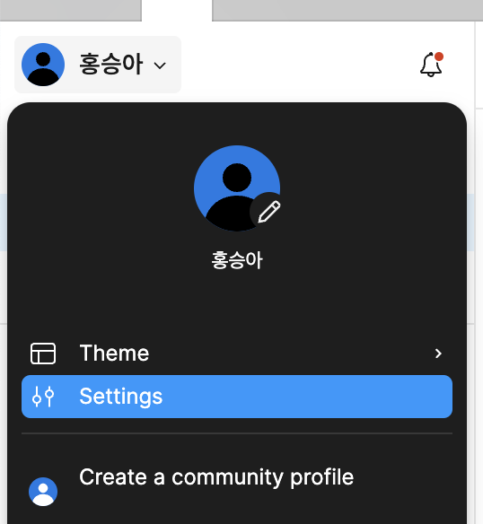
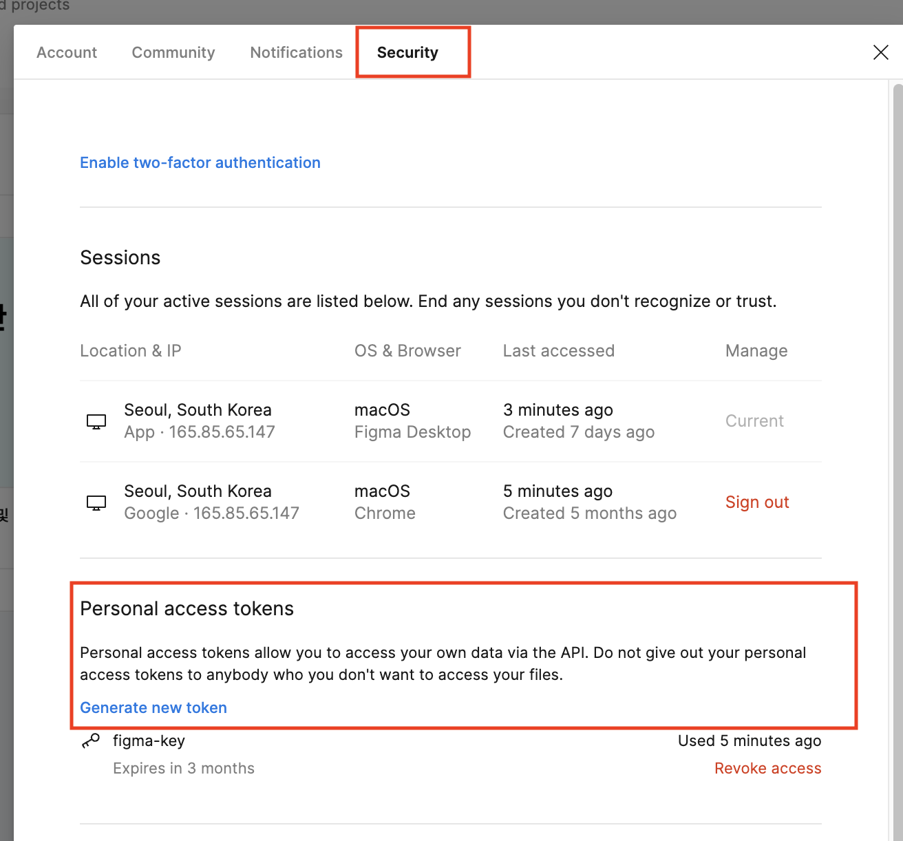
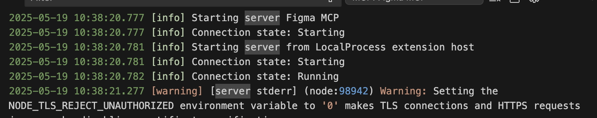
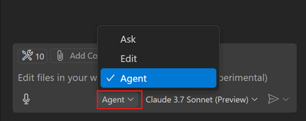
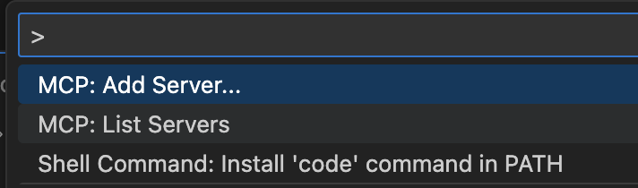
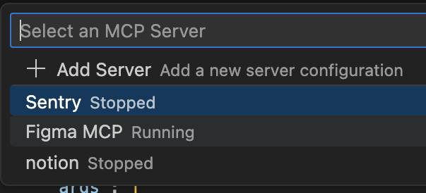
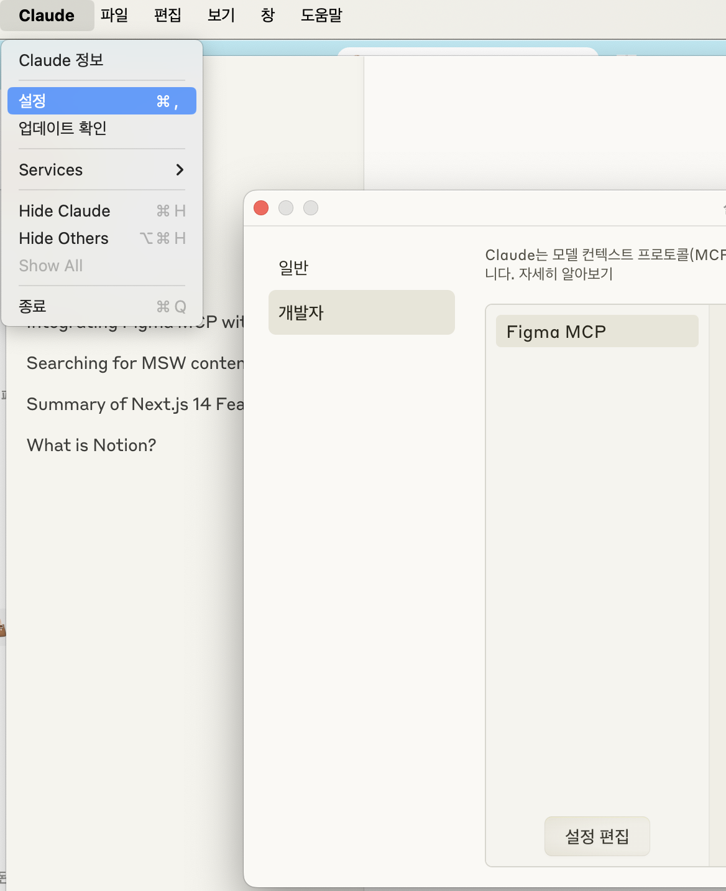
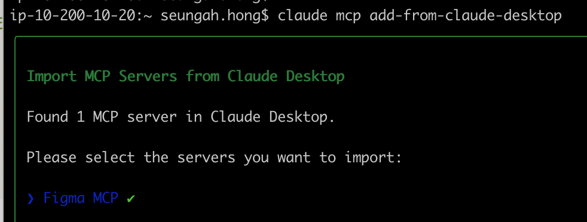

# Development Environment

- VSCode version: 1.99 or higher
- Copilot account required

# How to Integrate with Copilot

### Issuing a Figma API access token

### **Step 1: Prerequisites**

- **Node.js** (v16.0 or higher)
- **npm** (v7.0 or higher) or pnpm (v8.0 or higher)
- **Figma account:** A Professional or Enterprise plan is recommended.
- **Figma API access token:** You need a Figma API access token with read permissions.

### **Step 2: How to get a Figma API access token**

To integrate MCP with Figma, you need an API access token. This token acts as a security key that allows MCP to interact with your Figma account. Here is a step-by-step guide to creating and storing a Figma API access token:

**Register a Figma account:**

1. **Visit the official Figma website:** Go to the [Figma website](https://www.figma.com/).
2. **Sign up:** If you do not have an account, create a new one.

**Step 2: Download the Figma app:**

1. **Choose your operating system:** Download the Figma desktop app compatible with your operating system (Windows, macOS, or Linux).
2. **Install the app:** Follow the simple installation instructions to set up Figma on your device.

**Log in to Figma:**

1. **Open the app:** Launch the Figma desktop app.
2. **Log in:** Log in using your Figma credentials.

**Access your profile settings:**

1. **Click the profile icon:** In the sidebar, click the profile icon (usually your name or avatar).
2. **Open the dropdown menu:** When the menu appears, click **Settings**.



**Go to security settings:**

1. **Go to Security:** In the settings menu, find and click the **Security** tab.
2. **Find personal access tokens:** Scroll down to the **Personal access tokens** section.
3. **Generate a new token:**
   1. **Click "Generate new token":** A prompt to create a new token opens.
   2. **Name the token:** Give it a descriptive name that makes its purpose easy to identify, such as `Figma_MCP`.
   3. **Create the token:** Click the **Generate** button to create the API access token.



How to configure the .vscode > mcp.json file

- Only create this file if an mcp.json file does not already exist.
- Only for Copilot, you must put it under the `servers` object property.

```bash

{
  "servers": {
    "Figma MCP": {
      "command": "npx",
      "args": [
        "-y",
        "figma-developer-mcp",
        "--figma-api-key=figd_xxxxxxxxxxxxxxxxxxxxxxxxxxxxxxxxxxxxxxx", -> add the Figma-issued key
        "--stdio"
      ],
      "env": {
        "NODE_TLS_REJECT_UNAUTHORIZED": "0" -> whether to verify authentication on API calls (it is on by default, so turn it off. Otherwise an authentication error occurs when calling the API)
      }
    },
  }

```

## Starting the MCP Server

1. CMD+Shift+P → MCP: List Servers
2. Select Figma MCP
3. Start the server
4. Check the output
   1. Note: when running alongside the Claude MCP integration, an error occurs during API calls, so be sure to leave the claude_desktop_config.json file as an empty object.



## Copilot → Figma Mcp Server

1. In the chat screen, switch to Agent mode.

   1. If you are running multiple MCP servers, start the MCP you want to use.
   2. How to check: CMD+Shift+P > MCPL List Servers > run Figma MCP

   

   

   

1. Write a chat prompt (make sure to share the link, not dev mode).

```
https://www.figma.com/design/~~

Based on the Figma link, write it in React, TypeScript, and module.scss
```

# Claude Desktop Integration

## Installation

- Install Claude Desktop from the [https://claude.ai/download](https://claude.ai/download) link
- Reference: [https://docs.anthropic.com/en/docs/claude-code/tutorials#import-mcp-servers-from-claude-desktop](https://docs.anthropic.com/en/docs/claude-code/tutorials#import-mcp-servers-from-claude-desktop)

## Configuration File

- Menu > Settings > Developer > Edit Config



- Add the Figma MCP integration settings property to claude_desktop_config.json

```bash
{
  "mcpServers": {
    "Figma MCP": {
      "command": "npx",
      "args": [
        "-y",
        "figma-developer-mcp",
        "--figma-api-key=figd_xxxxxxxxxxxxxxxxxxxxxxxxxxxxxxxxxxxxxxx", -> add the Figma-issued key
        "--stdio"
      ],
      "env": {
        "NODE_TLS_REJECT_UNAUTHORIZED": "0" -> whether to verify authentication on API calls (it is on by default, so turn it off. Otherwise an authentication error occurs when calling the API)
      }
    }
  }
}

```

## Running

Import servers from Claude Desktop

```bash
claude mcp add-from-claude-desktop
```

Select which servers to import

- Select the MCP servers you want to import.



Write a chat prompt (make sure to share the link, not dev mode).

```
https://www.figma.com/design/~~

Based on the Figma link, write it in React, TypeScript, and module.scss
```
