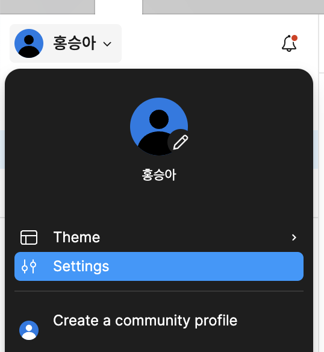
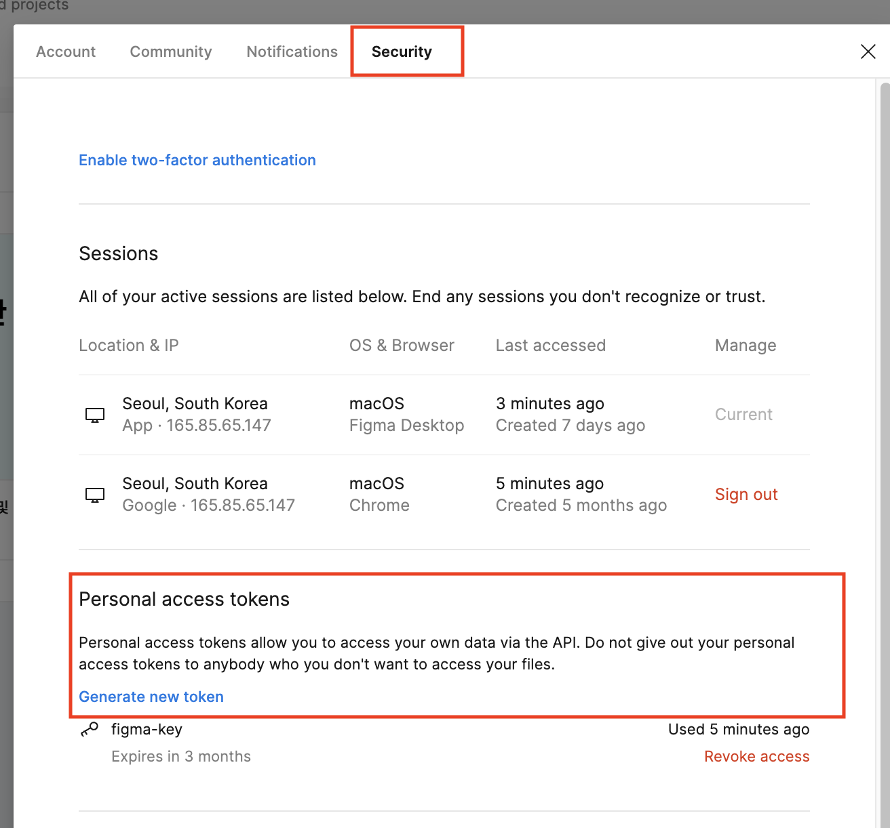
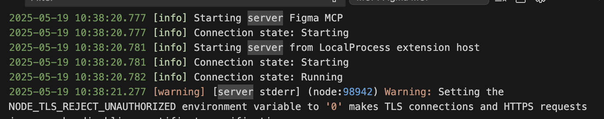
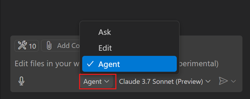
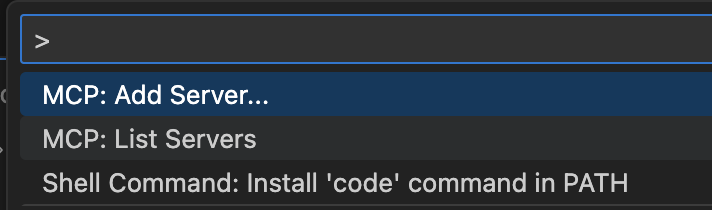
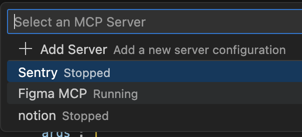
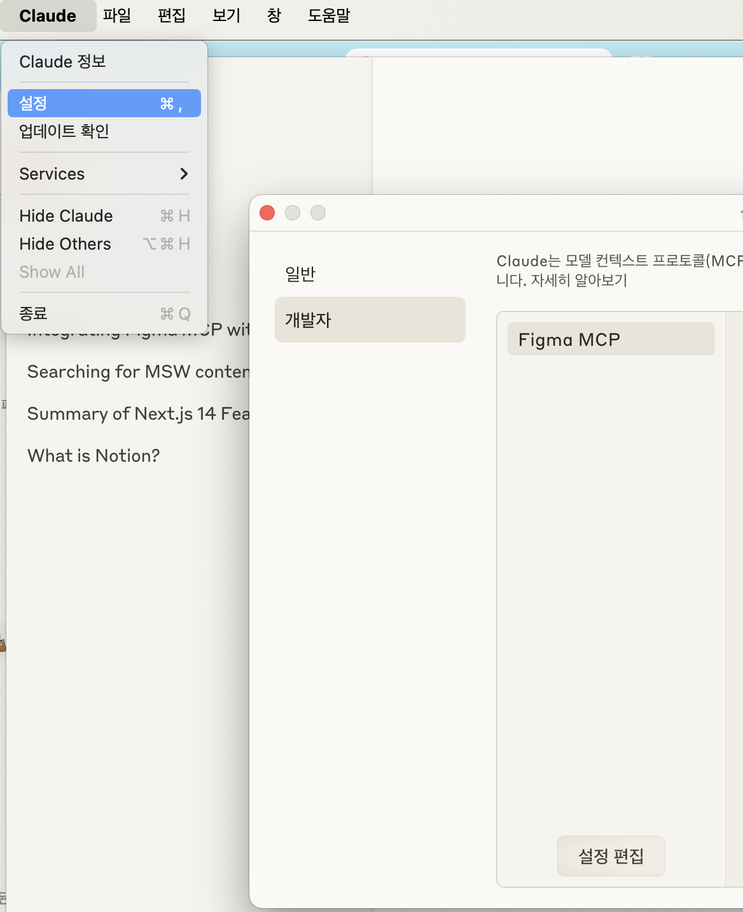
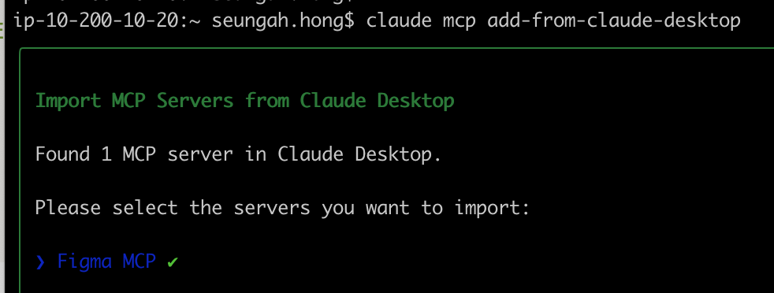

# 개발 환경

- VSCode 버전: 1.99 이상
- Copilot 계정 필요

# copilot 연동방법

### Figma API access token 발급

### **1단계: 전제 조건**

- **Node.js** (v16.0 이상)
- **npm** (v7.0 이상) 또는 pnpm (v8.0 이상)
- **Figma 계정:** 전문가 또는 기업 계획이 권장됩니다.
- **Figma API 액세스 토큰:** 읽기 권한이 있는 Figma API 액세스 토큰이 필요합니다.

### **2단계: Figma API 액세스 토큰 받는 방법**

MCP를 Figma와 통합하려면 API 액세스 토큰이 필요합니다. 이 토큰은 MCP가 Figma 계정과 상호작용할 수 있도록 하는 보안 키 역할을 합니다. Figma API 액세스 토큰을 생성하고 저장하는 단계별 가이드는 다음과 같습니다:

**Figma 계정 등록:**

1. **Figma 공식 웹사이트 방문:** [Figma 웹사이트](https://www.figma.com/)로 가세요.
2. **가입:** 계정이 없다면 새 계정을 만드세요.

**2단계: Figma 앱 다운로드:**

1. **운영 체제 선택:** 운영 체제(Windows, macOS 또는 Linux)와 호환되는 Figma 데스크탑 앱을 다운로드하세요.
2. **앱 설치:** 장치에 Figma를 설정하기 위한 간단한 설치 지침을 따르세요.

**Figma에 로그인:**

1. **앱 열기:** Figma 데스크탑 앱을 실행하세요.
2. **로그인:** Figma 자격 증명을 사용하여 로그인하세요.

**프로필 설정에 접근:**

1. **프로필 아이콘 클릭:** 사이드바에서 프로필 아이콘(보통 이름 또는 아바타)을 클릭하세요.
2. **드롭다운 메뉴 열기:** 메뉴가 나타나면 **설정**을 클릭하세요.



**보안 설정으로 이동:**

1. **보안으로 가기:** 설정 메뉴에서 **보안** 탭을 찾아 클릭하세요.
2. **개인 액세스 토큰 찾기:** **개인 액세스 토큰** 섹션으로 스크롤하세요.
3. **새 토큰 생성:**
   1. **“새 토큰 생성” 클릭:** 새 토큰을 생성하기 위한 프롬프트가 열립니다.
   2. **토큰 이름 지정:** `Figma_MCP`와 같이 목적을 쉽게 식별할 수 있는 설명적인 이름을 부여하세요.
   3. **토큰 생성:** **생성** 버튼을 클릭하여 API 액세스 토큰을 생성하세요.



.vscode > mcp.json 파일 설정 방법

- 기존에 mcp.json 파일이 없는 경우만 생성해주세요.
- copilot일 경우에만 servers 객체 속성명에 넣어주셔야합니다.

```bash

{
  "servers": {
    "Figma MCP": {
      "command": "npx",
      "args": [
        "-y",
        "figma-developer-mcp",
        "--figma-api-key=figd_xxxxxxxxxxxxxxxxxxxxxxxxxxxxxxxxxxxxxxx", -> figma 발급한 키 추가
        "--stdio"
      ],
      "env": {
        "NODE_TLS_REJECT_UNAUTHORIZED": "0" -> API 호출 시 인증여부(기본은 on임으로 꺼주세요. 안그러면 API 호출시 인증에러 발생해요)
      }
    },
  }

```

## MCP 서버 시작

1. CMD+Shift+P → MCP: List Servers
2. Figma MCP 선택
3. 서버 시작
4. 출력 확인
   1. 단, claude mcp 연동하고 같이 실행 시 API 호출 시 에러가 발생함으로 꼭 claude_desktop_config.json 파일은 빈 객체로 두세요.



## Copliot → Figma Mcp Server

1. 채팅 화면에서 Agent 모드로 변경해 주세요.

   1. 혹여 여러개의 mcp 서버를 실행 시 사용하고자 하는 mcp 실행 시켜주세요.
   2. 확인 방법: CMD+Shift+P > MCPL List Servers > Figma MCP 실행

   

   

   

1. 채팅 작성하기(dev 모드가 아닌 링크를 공유해주셔야합니다.)

```
https://www.figma.com/design/~~

피그마 링크를 바탕으로 리액트, 타입스크립트, module.scss로 작성해줘
```

# claude desktop 연동

## 설치

- [https://claude.ai/download](https://claude.ai/download) 링크에서 claude desktop 설치
- 참고: [https://docs.anthropic.com/en/docs/claude-code/tutorials#import-mcp-servers-from-claude-desktop](https://docs.anthropic.com/en/docs/claude-code/tutorials#import-mcp-servers-from-claude-desktop)

## 설정 파일

- 메뉴 > 설정 > 개발자 > 설정 편집



- claude_desktop_config.json 에 피그마 MCP 연동 설정 속성 추가

```bash
{
  "mcpServers": {
    "Figma MCP": {
      "command": "npx",
      "args": [
        "-y",
        "figma-developer-mcp",
        "--figma-api-key=figd_xxxxxxxxxxxxxxxxxxxxxxxxxxxxxxxxxxxxxxx", -> figma 발급한 키 추가
        "--stdio"
      ],
      "env": {
        "NODE_TLS_REJECT_UNAUTHORIZED": "0" -> API 호출 시 인증여부(기본은 on임으로 꺼주세요. 안그러면 API 호출시 인증에러 발생해요)
      }
    }
  }
}

```

## 실행

Import servers from Claude Desktop

```bash
claude mcp add-from-claude-desktop
```

Select which servers to import

- 선택하고자 하는 mcp 서버를 선택하시면 됩니다.



채팅 작성하기(dev 모드가 아닌 링크를 공유해주셔야합니다.)

```
https://www.figma.com/design/~~

피그마 링크를 바탕으로 리액트, 타입스크립트, module.scss로 작성해줘
```
