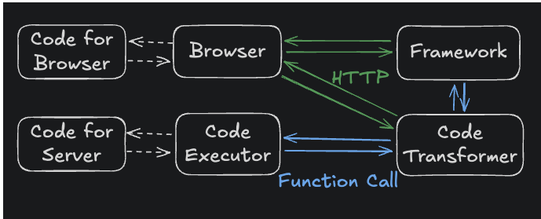
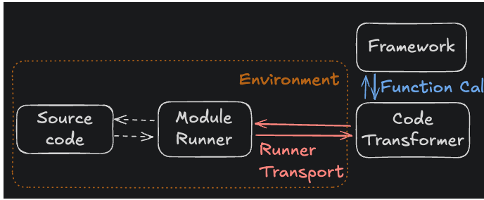
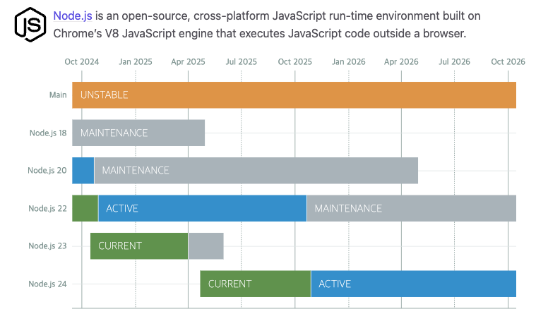
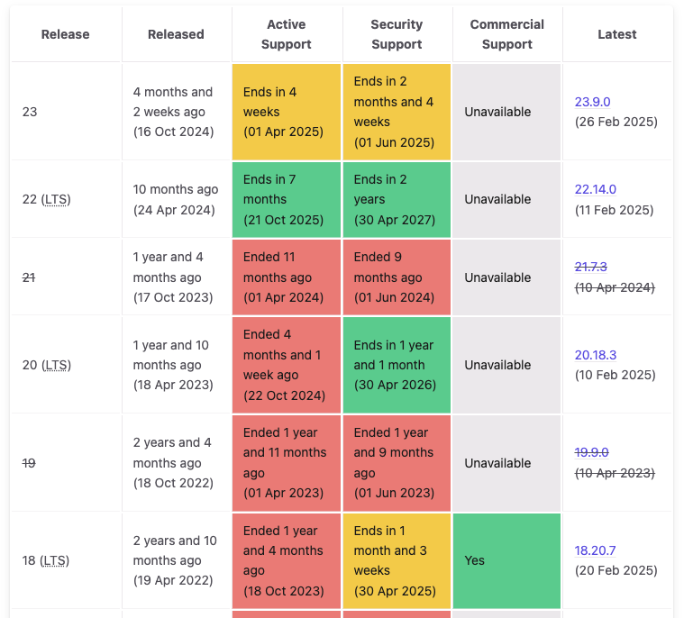

## Installing

```bash
- "@vitejs/plugin-react": "4.3.0",
- "vite": "5.2.11",
- "vite-tsconfig-paths": "4.3.2",

+ "@vitejs/plugin-react": "^4.4.1",
+ "vite": "^6.3.5",
+ "vite-tsconfig-paths": "^5.1.4",
```

## Changes

- Introduction of the Environment API

  - A new API designed to provide a development experience closer to production
  - Enhanced flexibility for framework and plugin authors
  - Guide: [Introducing the Environment API](https://green.sapphi.red/blog/increasing-vites-potential-with-the-environment-api)
  - 
  - ≤ v5
  - 
  - v6 ≥

- Node.js support updates

  - Support for Node.js 18, 20, and 22; support for 21 has ended
  - A new major release is planned for after Node.js 18 reaches EOL
  - 
  - 

- New features and changes

  - Template expansion: templates such as Solid, Deno, and SSR are supported via pnpm create vite-extra.
  - Sass and PostCSS:
    - The default Sass compilation mode changes from legacy → modern (dart-sass support)
    - In vite 7.0, the compilation mode that uses node-sass (legacy) is scheduled for removal
    - Modern API: the latest approach officially recommended by Sass (compileAsync, compile)
    - Legacy API: the older approach (render, renderSync) — an API compatible with the deprecated node-sass
  - Custom output file names for CSS libraries
  - Expanded support for asset references in HTML elements
  - Adjustment of the default array for resolve.conditions
  - JSON stringify

- Sass modern API used by default

  - The default Sass compilation mode changes from legacy → modern (dart-sass support)
  - In vite 7.0, the compilation mode that uses node-sass (legacy) is scheduled for removal
  - Modern API: the latest approach officially recommended by Sass (compileAsync, compile)
  - Legacy API: the older approach (render, renderSync) — an API compatible with the deprecated node-sass

- Expanded targets for asset references in HTML elements
  - Supported in vite 5.0

```typescript
 
 <link href="">
 <script src="">
```

- Additional support in vite 6.0
  | HTML element | Attribute | Description |
  | --- | --- | --- |
  | `<meta>` | `content` | Meta images such as `og:image` and `twitter:image` |
  | `<video>` | `poster` | Video poster image |
  | `<object>` | `data` | Embedded media |
  | `<input>` | `src` | Image path for `<input type="image">` |
  | `<audio>` | `src` | Audio file reference |
  | `<video>` | `src` | Video file reference |
  | `` | `srcset` | List of image paths for supporting various resolutions |

- Change to the default value of resolve.conditions
  - An array value that specifies which conditions to prioritize when resolving the conditional entries defined in the "exports" or "imports" fields of package.json while importing modules
  - Before the change (Vite 5):
    - resolve.conditions: [] (some conditions were added internally)
    - ssr.resolve.conditions: uses the value of resolve.conditions
  - After the change (Vite 6):
    - resolve.conditions: ['module', 'browser', 'development|production']
    - ssr.resolve.conditions: ['module', 'node', 'development|production']

## vite v5.0 → v6.0 Migration

Trouble Shooting

- Error [ERR_REQUIRE_ESM]: require() of ES Module

  - If your vite.config.ts configuration file uses import/export instead of require, add the type="module" property to package.json.

  ```bash
  {
    "private": true,
    + "type": "module"
  }
  ```

- ReferenceError: \_\_dirname is not defined

  - When upgrading to vite 6 and updating storybook from 7 → 8, the transition from CommonJS → ESM makes the \_\_dirname used in CommonJS unavailable.
  - If you need to use it, you can still obtain the current file path via fileURLToPath.

  ```typescript
  // 에러
  (node:1584) ExperimentalWarning: Type Stripping is an experimental feature and might change at any time
  (Use `node --trace-warnings ...` to show where the warning was created)
  info => Serving static files from ././public at /
  info => Starting manager..
  info => Starting preview..
  => Failed to build the preview
  ReferenceError: __dirname is not defined
      at Object.viteFinal (./.storybook/main.ts:28:36)
      at async createViteServer (./node_modules/@storybook/builder-vite/dist/index.js:80:5430)
      at async Module.start (./node_modules/@storybook/builder-vite/dist/index.js:80:6063)
      at async storybookDevServer (./node_modules/@storybook/core/dist/core-server/index.cjs:36413:79)
      at async buildOrThrow (./node_modules/@storybook/core/dist/core-server/index.cjs:35039:12)
      at async buildDevStandalone (./node_modules/@storybook/core/dist/core-server/index.cjs:37618:78)
      at async withTelemetry (./node_modules/@storybook/core/dist/core-server/index.cjs:35778:12)
      at async dev (./node_modules/@storybook/core/dist/cli/bin/index.cjs:2566:3)
      at async n.<anonymous> (./node_modules/@storybook/core/dist/cli/bin/index.cjs:2618:74)
  WARN Broken build, fix the error above.
  WARN You may need to refresh the browser.
  // 수정
  import { fileURLToPath } from 'url';
  const __filename = fileURLToPath(import.meta.url);
  const __dirname = path.dirname(__filename);
  ```

- [vite:css] [sass] Can't find stylesheet to import.
  - After the vite 6.0 update, internal path handling changed from relative paths to absolute paths.
  ```typescript
  css: {
      preprocessorOptions: {
        scss: {
          additionalData: `
            - @use './src/test.scss' as *;
            + @use '${path.resolve(__dirname, 'src/test.scss')}' as *;
          `,
        },
      },
    }
  ```
