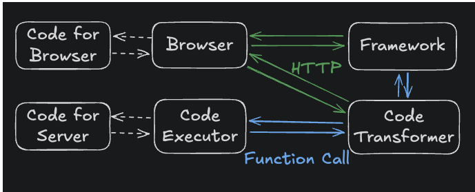
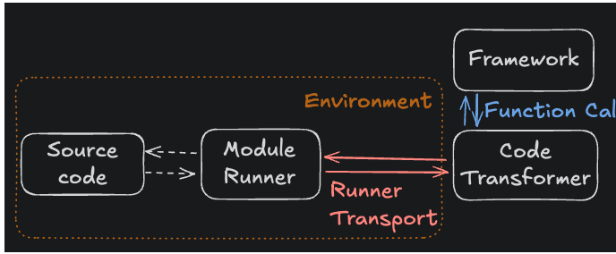
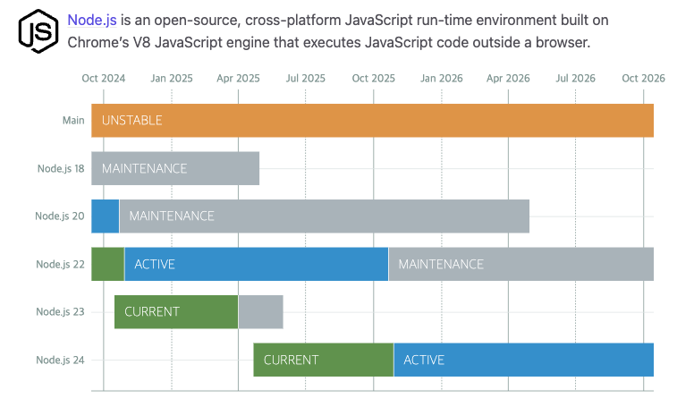
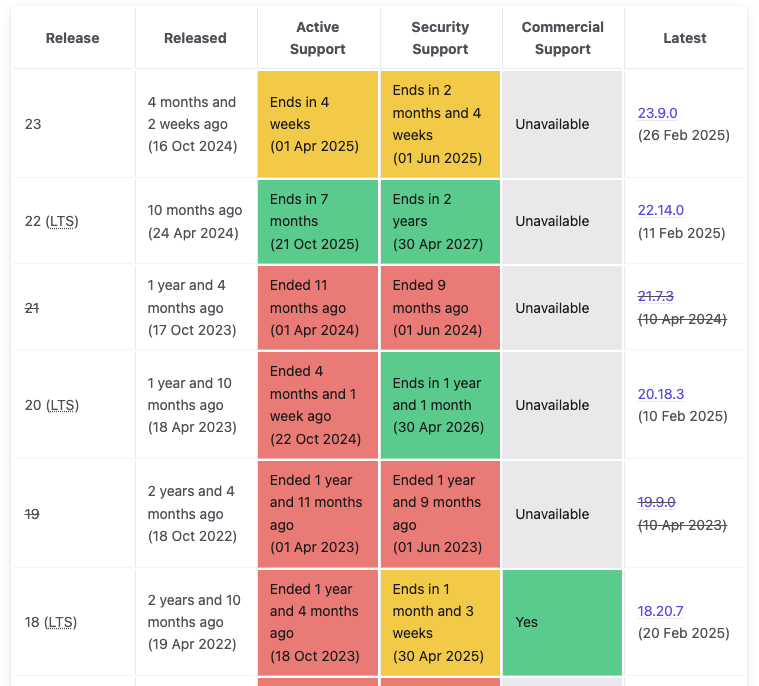

## Installing

```bash
- "@vitejs/plugin-react": "4.3.0",
- "vite": "5.2.11",
- "vite-tsconfig-paths": "4.3.2",

+ "@vitejs/plugin-react": "^4.4.1",
+ "vite": "^6.3.5",
+ "vite-tsconfig-paths": "^5.1.4",
```

## Changes

- 환경(Environment) API 도입

  - 프로덕션과 더 가까운 개발 경험을 제공하기 위한 새로운 API
  - 프레임워크 및 플러그인 작성자를 위한 유연성 강화
  - 가이드: [Environment API 소개](https://green.sapphi.red/blog/increasing-vites-potential-with-the-environment-api)
  - 
  - ≤ v5
  - 
  - v6 ≥

- Node.js 지원 업데이트

  - Node.js 18, 20, 22 지원, 21 지원 종료
  - 향후 Node.js 18 EOL 이후 신규 메이저 릴리스 계획
  - 
  - 

- 새로운 기능 및 변경

  - 템플릿 확장: pnpm create vite-extra로 Solid, Deno, SSR 등의 템플릿 지원.
  - Sass 및 PostCSS:
    - Sass 컴파일 방식에서 기본값이 legacy → modern (dart-sass 지원)
    - vite 7.0에서는 node-sass 사용하는 컴파일 방식(legacy) 제거 예정
    - 현대 API (Modern API): Sass 공식이 권장하는 최신 방식 (compileAsync, compile)
    - 레거시 API (Legacy API): 예전 방식 (render, renderSync) — 오래된 node-sass와 호환되는 API
  - CSS 라이브러리 출력 파일명 사용자 정의
  - HTML 요소의 에셋 참조 지원 확장
  - resolve.conditions의 디폴트 배열 조정
  - JSON stringify

- Sass의 현대 API 기본 사용

  - Sass 컴파일 방식에서 기본값이 legacy → modern (dart-sass 지원)
  - vite 7.0에서는 node-sass 사용하는 컴파일 방식(legacy) 제거 예정
  - 현대 API (Modern API): Sass 공식이 권장하는 최신 방식 (compileAsync, compile)
  - 레거시 API (Legacy API): 예전 방식 (render, renderSync) — 오래된 node-sass와 호환되는 API

- HTML 요소의 에셋 참조 대상이 확장
  - vite 5.0 지원

```typescript
 
 <link href="">
 <script src="">
```

- vite 6.0 추가지원
  | HTML 요소 | 속성 | 설명 |
  | --- | --- | --- |
  | `<meta>` | `content` | `og:image`, `twitter:image` 같은 메타 이미지 |
  | `<video>` | `poster` | 비디오 포스터 이미지 |
  | `<object>` | `data` | 임베디드 미디어 |
  | `<input>` | `src` | `<input type="image">`의 이미지 경로 |
  | `<audio>` | `src` | 오디오 파일 참조 |
  | `<video>` | `src` | 비디오 파일 참조 |
  | `` | `srcset` | 다양한 해상도 지원용 이미지 경로 리스트 |

- resolve.conditions 기본값 변경
  - 모듈을 가져올 때, package.json의 "exports" 혹은 "imports"에 지정된 조건부 엔트리를 해석할 때 어떤 조건들을 우선 적용할지를 지정하는 배열값
  - 변경 전 (Vite 5):
    - resolve.conditions: [] (일부 조건이 내부적으로 추가됨)
    - ssr.resolve.conditions: resolve.conditions의 값 사용
  - 변경 후 (Vite 6):
    - resolve.conditions: ['module', 'browser', 'development|production']
    - ssr.resolve.conditions: ['module', 'node', 'development|production']

## vite v5.0 → v6.0 Migration

Trouble Shooting

- Error [ERR_REQUIRE_ESM]: require() of ES Module

  - vite.config.ts 설정 파일에서 require가 아닌 import/export 방식을 사용할 경우 package.json type="module" 속성을 추가해주세요.

  ```bash
  {
    "private": true,
    + "type": "module"
  }
  ```

- ReferenceError: \_\_dirname is not defined

  - vite 6 버전 업로드하면서 storybook 7 → 8 버전 업데이트 시 CommonJS → ESM 방식으로 전환되면서 CommonJS에서 사용하는 \_\_dirname 사용이 불가합니다.
  - 사용을 해야할 경우 fileURLToPath로 현재 파일 패스를 얻어와서 사용은 가능합니다.

  ```typescript
  // 에러
  (node:1584) ExperimentalWarning: Type Stripping is an experimental feature and might change at any time
  (Use `node --trace-warnings ...` to show where the warning was created)
  info => Serving static files from ././public at /
  info => Starting manager..
  info => Starting preview..
  => Failed to build the preview
  ReferenceError: __dirname is not defined
      at Object.viteFinal (./.storybook/main.ts:28:36)
      at async createViteServer (./node_modules/@storybook/builder-vite/dist/index.js:80:5430)
      at async Module.start (./node_modules/@storybook/builder-vite/dist/index.js:80:6063)
      at async storybookDevServer (./node_modules/@storybook/core/dist/core-server/index.cjs:36413:79)
      at async buildOrThrow (./node_modules/@storybook/core/dist/core-server/index.cjs:35039:12)
      at async buildDevStandalone (./node_modules/@storybook/core/dist/core-server/index.cjs:37618:78)
      at async withTelemetry (./node_modules/@storybook/core/dist/core-server/index.cjs:35778:12)
      at async dev (./node_modules/@storybook/core/dist/cli/bin/index.cjs:2566:3)
      at async n.<anonymous> (./node_modules/@storybook/core/dist/cli/bin/index.cjs:2618:74)
  WARN Broken build, fix the error above.
  WARN You may need to refresh the browser.
  // 수정
  import { fileURLToPath } from 'url';
  const __filename = fileURLToPath(import.meta.url);
  const __dirname = path.dirname(__filename);
  ```

- [vite:css] [sass] Can't find stylesheet to import.
  - vite 6.0 업데이트 이후 내부 패스 처리가 상대 경로가 아닌 절대 경로 방식으로 변경되었습니다.
  ```typescript
  css: {
      preprocessorOptions: {
        scss: {
          additionalData: `
            - @use './src/test.scss' as *;
            + @use '${path.resolve(__dirname, 'src/test.scss')}' as *;
          `,
        },
      },
    }
  ```
