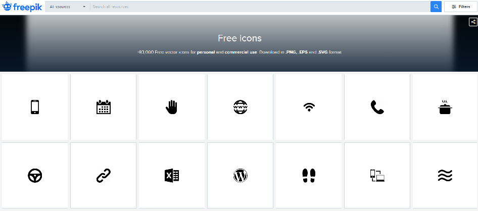
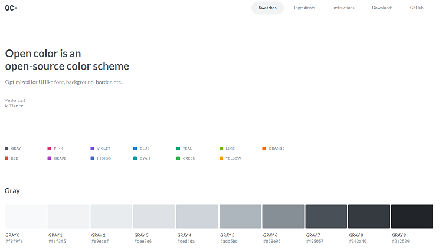

# Blog Theme

- Jekyll theme 테마를 이용한 개인 블로그 만들기

  - <a href="https://theorydb.github.io/envops/2019/05/21/envops-blog-how-to-use-git/" target="_blank" style="font-size=30px; color: #4dabf7; text-decoration:underline;">Blog Theme 1</a>
  - <a href="https://theorydb.github.io/envops/2019/05/02/envops-blog-theme/#clean-blog-%ED%85%8C%EB%A7%88%EB%A5%BC-%EC%84%A0%ED%83%9D%ED%95%9C-%EC%9D%B4%EC%9C%A0" target="_blank" style="font-size=30px; color: #4dabf7; text-decoration:underline;">Blog Theme 2</a>

# Open Icon

- 웹페이지 개발시 필요한 아이콘을 무료로 다운 받을 수 있는 페이지



- <a href="https://www.freepik.com/popular-icons" target="_blank" style="font-size=30px; color: #4dabf7; text-decoration:underline;">Icon 1</a>
- <a href="https://simpleicons.org/" target="_blank" style="font-size=30px; color: #4dabf7; text-decoration:underline;">Icon 2</a>

# Open Color

- 글꼴, 배경, 테두리 등과 같은 UI에서 사용하는 Color 집합체를 정리한 페이지



- <a href="https://yeun.github.io/open-color/" target="_blank" style="font-size=30px; color: #4dabf7; text-decoration:underline;">Open Color</a>
- <a href="https://www.npmjs.com/package/open-color" target="_blank" style="font-size=30px; color: #4dabf7; text-decoration:underline;">npm Open Color</a>

# Surge.sh 로 무료로 정적 웹 어플리케이션 배포


Surge.sh는 정적 웹 어플리케이션을 귀찮은 가입 과정 혹은 복잡한 설정 과정 없이 배포할 수 있는 프론트엔드를 위한 호스팅 서비스이다. 아주 큰 특징은 지금 코드를 작성하고 있는 IDE 혹은 터미널에서 벗어나지 않고, 커맨드라인에서 명령어 몇줄로 아주 간단하게 배포할 수 있다는 것이 특징이다. 그리고, 가격도 개인적인 프로젝트 수준에서는 무료 플랜을 사용해도 정말 무방하다. 별도의 서버가 필요없거나 API 서버가 따로 있는 경우의 정적 웹사이트, 웹 어플리케이션, SPA 등의 배포에 아주 최적화 되어있다. 이런 장점에도 의외로 국내자료가 매우 없기 때문에 직접 소개를 해보려 한다.

- <a href="https://hudi.kr/surge-sh-%EB%A1%9C-%EB%AC%B4%EB%A3%8C%EB%A1%9C-%EC%A0%95%EC%A0%81-%EC%9B%B9-%EC%96%B4%ED%94%8C%EB%A6%AC%EC%BC%80%EC%9D%B4%EC%85%98-%EB%B0%B0%ED%8F%AC%ED%95%98%EA%B8%B0/" target="_blank" style="font-size=30px; color: #4dabf7; text-decoration:underline;">참고사이트</a>

# Snippet

- 정형화된 코드를 prefix를 입력해서 바로 자동완성 시켜주는 기능을 snippert이라고 한다.

## intellij

- 사용법

* File-Setting-Live Templates-javascript
* abbreviation : prefix fc, Description : Function Componenets
* Template text : template 사용할 컴포넌트 작성

```javascript
define(function (require) {
  'use strict';

  /**
   * @param
   * @constructor
   */
  function $FILE_NAME$() {}

  return $FILE_NAME$;
});
```

- Edit validables 클릭 :
  - Template 등록($FILE_NAME$)
  - Expression : fileNameWithoutExtension() 선택

## vs code

- 사용법

* snippet text : 사용할 javascript 컴포넌트 작성

```javascript
define(function (require) {
	"use strict";

	/**
	 * @param
	 * @constructor
	 */
	function ${TM_FILENAME_BASE}() {
	}

    return ${TM_FILENAME_BASE};
});
```

- <a href="https://snippet-generator.app/" target="_blank" style="font-size=30px; color: #4dabf7; text-decoration:underline;">https://snippet-generator.app</a> 홈페이지에서 vscode에 맞는 snippet 변환
  - Description : Function Componenets
  - Tab trigger : fc
  - your snippet : snippet text 붙이기
- 아래 변환된 snippet 텍스트 복사
- File-Preferences-User Snippets-javascript.json
- 변환된 snippet 텍스트 붙이기
- js 파일 생성 후 fc tab할 시 등록한 snippet 사용

---
