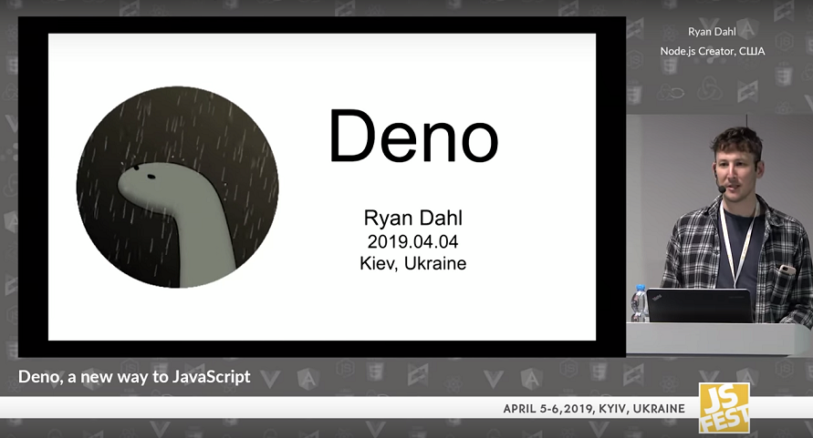
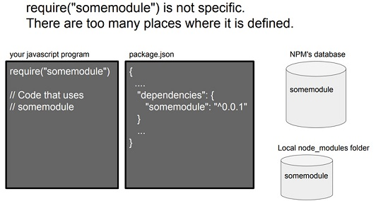

# deno

node.js를 만든 Ryan Dahl이 JS Fest 2019 Spring 컨퍼런스에서 새 프로젝트인 ‘Deno’를 소개했습니다. ‘A New Way to JavaScript’라는 제목의 이 발표에서 Ryan은 Deno가 node.js와 어떻게 다른지, 어떤 부분에서 새로워졌는지를 설명합니다. 도전적인 이 프로젝트에 관심 있으신 분들을 위해 축약, 정리해보았습니다.



<p>JSConf EU 2018에서 Node.js에 후회했던 10가지(10 Things I Regret About Node.js)를 발표하면서 새로운 서버사이드 언이인 Deno를 발표하였습니다.</p>

## Deno의 기반 기술

- V8 JavaScript Runtime
- Rust (C++를 대체)
- Tokio (이벤트 루프로 사용)
- TypeScript

## Node vs Deno Differnce

```javascript
// node.js
var http = require('http');
http
  .createServer(function (req, res) {
    res.write('Hello World\n');
    res.end();
  })
  .listen(8000, function () {
    console.log('http://localhost:8000/');
  });
```

```javascript
// deno.js
import { http } from 'https://deno.land/std@v0.12/http/server.ts';
const body = new TextEncoder().encode('Hello World\n');
const s = http(':8000');
window.onload = async () => {
  console.log('http://localhost:8000/');
  for await (const req of s) {
    req.respond({ body });
  }
};
```

### module URL reference:

- npm과 같은 중앙 집중형 패키지 관리자 대신 분산 기반으로 모듈을 호출한다. node에서는 npm 중앙서버로부터 외부 패키지를 가져와 node_modules/ 밑에 설치하여 사용하였다. 반면 deno에서는 위 코드에서 보는 바와 같이 코드 위치를 URL로 지정하면 실행 단계에서 자동으로 모듈을 다운로드하여 설치한다. 또한 모듈 시스템으로 ES 모듈만 사용한다.

### callback function vs. Promise (async, await):

- node.js 초기에는 callback 함수를 사용했지만 다들 아시다시피 callback 함수 지옥은 악명이 높았다. Javascript에 Promise가 도입되면서 node.js에서도 callback 함수 대신 async, await를 사용할 수 있었다. deno에서는 처음부터 Promise를 활용한다.

### browser compatibility (window):

- server-side에서 실행하던 코드를 추가 수정 없이 브라우저에서 실행할 수 있다.

## Node.js에 관한 10가지 후회

- Promises를 고집하지 않은 것(Not sticking with Promises)
  Node.js를 작업하는 대부분의 사람들은 이 말에 100% 공감할 겁니다. Node.js의 비동기 호출은 여전히 콜백 API를 기준으로 되어 있습니다. Promises는 Async, Await을 제공하기 위해서 필수였죠. 라이언 달은 2009년에 Promises를 추가했다가 2010년에 삭제한 것을 언급하면서 자신이 Promises를 계속 고집했다면 커뮤니티 소스가 더 빨리 Async Await으로 진보했을 것이라며 후회했습니다.

- 보안 문제에 더 신경 쓰지 못한 것(Security)
  V8에 대해서는 그 자체로 훌륭한 샌드박스 모델을 가지고 있다는 것을 언급하며 다만 Node 응용 프로그램이 어떻게 유지ᆞ발전될지를 고려했다면 다른 언어들이 갖지 못한 보안성을 갖출 수 있었을 거라는 후회를 남겼습니다. (V8은 Node.js의 JavaScript 엔진으로써 구글에서 만들어 크롬에도 사용됩니다.)

- 빌드시스템(GYP) 1
  처음 노드를 만들 때 크롬 브라우저가 GYP라는 메타 빌드 시스템을 사용하다가 GN으로 업그레이드한 반면, Node.js는 GN으로 변경하지 않아 이를 후회했습니다. 참고로, 구글의 GN이 GYP보다 20배 정도 빠르게 빌드 된다고 합니다. (GYP\_메타 빌드 시스템은 여러 플랫폼(윈도우즈, Mac, Linux)에서 소스코드를 빌드하기 위해 사용되는 빌드 시스템입니다.)

- 빌드시스템(GYP) 2
  GYP를 이용해 빌드 시스템을 만들면서 네이티브 콜을 하기 위해서 사용자가 필수적으로 C++ 바인딩을 하도록 했는데, FFI(Foreign Function Interface)를 제공했어야 했다는 아쉬움을 토로했습니다.

- 패키지 매니저 파일(package.json) 1
  Node.js는 모듈 시스템을 가지고 있습니다. 최근에 이 모듈 시스템이 go와 java에서 언어 자체적으로 구현이 되는 스펙들이 발표되었습니다. (go는 처음부터 구현됐습니다.) 이 모듈 시스템을 관리하는 프로그램은 3rd 파티 프로젝트로 떼어 놓는 것이 일반적이죠. 그런데 노드는 npm이라는 패키지 매니저가 관리하는 package.json. 파일이 main() 함수에서 찾도록 되어있어 npm에 의존적인 커뮤니티로 만들었다는 점을 스스로 비판했습니다. 최근 facebook에서 만든 yarn이라는 패키지 매니저가 npm을 대체하고 있지만 package.json은 그대로 사용하고 있습니다. 의도하진 않았지만 defacto(사실상의 표준)가 된 셈이죠.
  또, 이 package.json 파일은 모듈을 찾을 때 명시적이지 않다는 단점도 있습니다. 쉬운 이해를 위해 아래 그림을 참조하시기 바랍니다.


[그림3] somemodule을 찾아라! (출처: <a href="http://tinyclouds.org/jsconf2018.pdf" target="_blank" style="font-size=30px; color: #4dabf7; text-decoration:underline;">http://tinyclouds.org/jsconf2018.pdf</a>)

- 패키지 매니저 파일(package.json) 2
  package.json 파일의 모듈 시스템이 파일 디렉터리를 기준으로 잡히도록 만들어서 라이선스, 리포지터리, 설명 등 모듈 시스템 자체만으로는 필요 없는 정보까지 다 포함시켜 너무 무거워졌다고 합니다.

- 모듈 시스템(node_modules)
  위에서 언급한 파일 디렉터리 기반 모듈 시스템의 약점과 마찬가지로 모듈을 가져오는 알고리즘이 복잡해졌습니다. 또, 브라우저에서 가져오는 방법과도 맞지 않아 굉장히 어려워졌죠. 그럼에도 불구하고 돌이킬 수 없다는 사실에 커뮤니티에 미안함을 전했습니다.

- Require 문법을 쓸 때 js 확장자를 안 써도 되게 한 것
  브라우저 내 자바스크립트가 작동하는 것과 표준이 달라서 모듈 로더가 사용자의 의도를 파악하기 위해 많은 고민을 해야 한다는 점을 언급했습니다.

- index.js
  브라우저가 index.html을 default로 갖기 때문에 index.js를 지정한 것이 당시엔 괜찮은 생각 같았으나, 결과적으로 모듈 로딩 시스템을 더 복잡하게 만들었다고 합니다.

- deno
  라이언 달은 이상의 10가지 이야기를 마치고 나서 새로 만들고 있는 프로젝트를 공개했는데, 그게 바로 ‘deno’ 프로젝트입니다. (프로젝트 링크: <a href="https://github.com/ry/deno" target="_blank" style="font-size=30px; color: #4dabf7; text-decoration:underline;">https://github.com/ry/deno</a>)

- Youtube : <a href="https://www.youtube.com/watch?v=z6JRlx5NC9E&t=419s" target="_blank" style="font-size=30px; color: #4dabf7; text-decoration:underline;">https://bit.ly/2U0lQmZ</a>
- Presentation : <a href="https://bit.ly/2U0lQmZ" target="_blank" style="font-size=30px; color: #4dabf7; text-decoration:underline;">https://gocoder.tistory.com/1578</a>
- Facebook : <a href="https://www.facebook.com/JSFestua/" target="_blank" style="font-size=30px; color: #4dabf7; text-decoration:underline;">https://www.facebook.com/JSFestua/</a>

## 참조사이트

- <a href="https://www.devpools.kr/2018/06/21/deno/" target="_blank" style="font-size=30px; color: #4dabf7; text-decoration:underline;">https://www.devpools.kr/2018/06/21/deno/</a>
- <a href="https://gocoder.tistory.com/1578" target="_blank" style="font-size=30px; color: #4dabf7; text-decoration:underline;">https://gocoder.tistory.com/1578</a>
- <a href="https://blog.ull.im/engineering/2019/04/14/deno-ryan-dahl-2019-04-04.html" target="_blank" style="font-size=30px; color: #4dabf7; text-decoration:underline;">https://blog.ull.im/engineering/2019/04/14/deno-ryan-dahl-2019-04-04.html</a>
