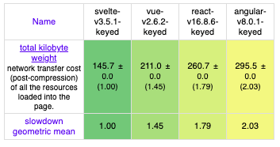

# SVELTE

Svelte(스벨트)는 Rich Harris가 제작한 새로운 접근 방식을 가지는 프론트엔드 프레임워크입니다.
Svelte는 자신을 ‘프레임워크가 없는 프레임워크’ 혹은 ‘컴파일러’라고 소개합니다.
이는 Virtual(가상) DOM이 없고, Runtime(런타임)에 로드할 프레임워크가 없음을 의미합니다.
기본적으로 빌드 단계에서 구성 요소를 컴파일하는 도구이므로 페이지에 단일 번들(bundle.js)을 로드하여 앱을 렌더링할 수 있습니다.

## SVELTE 특징

### Svelte는 빠르다

Svelte는 DOM의 변화가 있을 때 그 부분만 업데이트하므로 실행 속도가 매우 빠르다. React, Vue.js 같이 가상 DOM을 사용하는 프레임워크와 대조적으로 Svelte는 가상 DOM을 사용하지 않는다.

가상 DOM 프레임워크는 실제 DOM에 변경을 커밋하기 전 보이지 않는 트리에서 컴포넌트를 그리기 위한 시간을 소비하는 반면, Svelte는 이런 중간 단계를 뛰어넘고 바로 변경한다. DOM 업데이트가 느릴수는 있지만, Svelte는 어떤 요소에 변화가 일어났는지 정확하게 알고 있기 때문에 빠르게 처리할 수 있다.

또한, Svelte는 개발 속도를 매우 빠르게 할 수 있다. 일반적으로 같은 내용의 컴포넌트를 만들 때 Svelte 컴포넌트는 React보다 적은 코드로 생성할 수 있다.

```html
<script>
	export let name;
	let count = 1;
	$: double = count * 2;
</script>

<main>
	<h1 id="root">Hello {name}!</h1>
	<h1> count : {double}</h1>
	<button on:click={() => count += 1}>increase</button>
</main>
```

### 웹프레임워크 속도비교



## Svelte는 작다.

## Svelte는 컴파일된다.

번들 크기가 이렇게 작을 수 있는 이유는 Svelte는 프레임워크이자, 컴파일러이기 때문이다.

아마 당신은 React Project를 컴파일하기 위해 yarn build를 실행하는데 익숙할 것이다. Webpack과 Babel을 호출하여 프로젝트 파일을 번들링 한 뒤, 최소화(minify) 하고, react와 react-dom 라이브러리를 번들에 추가한 뒤, 그 파일을 최소화(minify)하고, 하나의 출력 파일을(혹은 몇 개의 chunk로 분리된 파일을) 생성한다.

반면 Svelte는, 자체적으로 컴포넌트를 컴파일할 수 있다. 결과는 (앱) + (Svelte 런타임 환경)이 아닌, (Svelte가 독자적으로 실행하는 방법을 알려준 앱) 이다. Svelte는 Rollup(혹은 Webpack)의 트리 쉐이킹 이점을 가져와 이용하여 내 코드에서 사용하는 프레임워크의 부분만을 포함해 자체적으로 만든다.

컴파일 된 앱은 여전히 작성한 컴포넌트를 구동시키기 위해 조금의 Svelte 코드를 갖게 된다. 마법처럼 그 코드는 전부 사라지지 않는다. 하지만 이런 부분은 다른 프레임워크들이 작동하는 방법과 반대이다. 대부분의 프레임워크는 실제로 앱을 실행하고, 나타내기 위해 존재해야한다.

## Svelte 설치

```bash
$ npx degit sveltejs/template svelte
$ cd svelte
$ npm install
$ npm run dev
```

## 예제코드

<a href="https://github.com/gmm117/svelte" target="_blank" style="font-size=30px; color: #4dabf7; text-decoration:underline;">https://github.com/gmm117/svelte</a>

## 참고사이트

- [https://heropy.blog/2019/09/29/svelte/](https://heropy.blog/2019/09/29/svelte/)
- [https://ui.toast.com/weekly-pick/ko_20191002/](https://ui.toast.com/weekly-pick/ko_20191002/)
